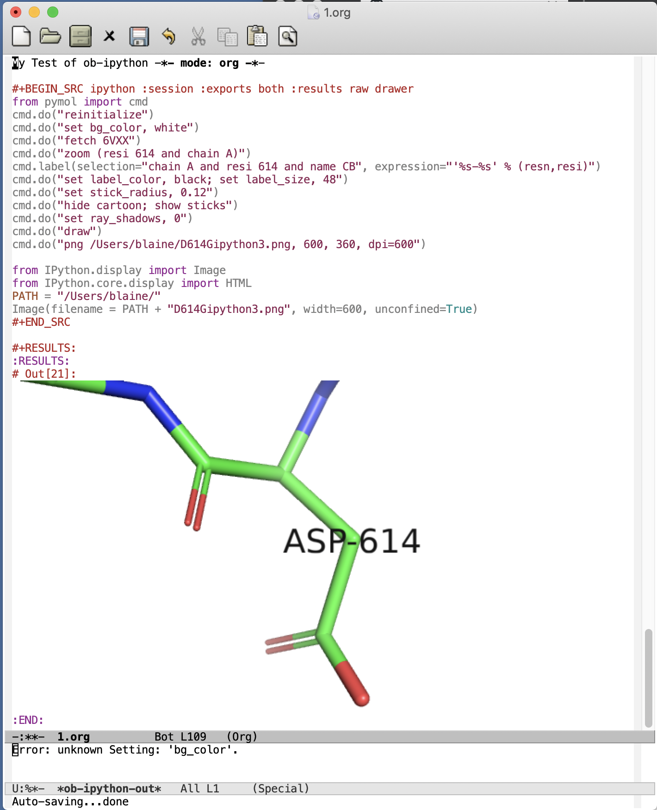

## **pymolsnipts** library to support literate programming with PyMOL


[PyMOL](https://pymol.org/2/) is a leading molecular graphics program for making images of proteins and nucleic acids for publication.
PyMOL's vast of array of parameters provide exquisite control over the appearance of the output.
PyMOL is often used to make cover images for [scientific journals](https://pymolwiki.org/index.php/Main_Page).
PyMOL is also popular for making movies of moving molecules.

The PyMOL GUI is useful for making the images of global scenes, but PyMOL rapidly becomes tedious to use to make images of detailed scenes.
The PyMOL macro language (pml) can be used to set parameter values and execute commands to make customized scenes of biomolecules in PyMOL's viewport.
These scenes can be made into static images for posters, seminars, and manuscripts, or they can serve as parts of molecular movies.
The macro language sends arguments to Python functions, but its syntax is simpler and more user-friendly for non-programmers than that of Python.

The number of lines of pml commands and settings required for more sophisticated images can exceed 100.
It is difficult to issue so many commands through PyMOL's graphical user interface (GUI) without making mistakes.
If the commands are not saved to an open script file with a `.pml` file extension, to an opened log file, or to a frequently saved session file, the work can be lost. 
(Use the **spse** function in the `pymolshortcuts.py` file in the <a href="https://github.com/MooersLab/pymolshortcuts">pymolshortcuts</a> repository to save session files with time stamps to avoid overwriting previously saved session files.)

Here are [examples](https://github.com/MooersLab/pymolsnips/blob/master/images/Gallery.png?raw=true "Gallery") of figures that are impossible or tedious to make via the GUI alone.

It is challenging to recall the pml syntax when you are not using PyMOL everyday, which is the case for most PyMOL users.
One solution to this problem is to use a library of code fragments, called **snippets** (or *live templates* in PyCharm), to build a script in a text editor.

### <A name="FASTLINKS">Quick links</A>

  * <a href="#gallery"> Gallery of snippets and their output </a>
  * <a href="#categories"> Snippet categories</a>
  * <a href="#install">Installing snippets for each editor</a>
  * <a href="#snippetList">List of snippets by category and tab trigger names</a>


**pymolsnips** is a library of pml code fragments that have been formatted for several popular **text editors, integrated development environments (IDEs), and electronic notebooks**.
Note the word processors (e.g., MS Word, Libre Office, Open Office) are not included here: ***word processors should never be used to store the computer code!***
In doing so, you can inadvertently pick up hidden characters that are hard to find and remove during debugging.

Text editors have tools for supporting the editing of computer code files.
Although these files have many different file extensions that map them to the programming language of the code that they contain, they are all simple plain text files.
One of the editing tools available in text editors is support for the retrieval and insertion of computer code fragments (i.e, snippets) to save time and reduce errors while assembling a new script file.

Text editors and IDEs can be distinguished by their appearance.
Text editors generally fire up with one main pane in the GUI, although extra ones can be opened.
IDEs are text editors plus extra features for debugging and testing computer code.
They are generally recommended for programmers working with large code bases that consist of many files.
IDEs are well suited from navigating between the files in a large code base.
IDEs generally open with three or four panes visible.

The boundary between text editors and IDEs is blurry because some text editors support code testing.
Because of space constraints, IDEs are best used on a large monitor.

Electronic notebooks such as Jupyter Notebook and Rnotebook can be edited and run on their own or from inside the more advanced IDEs (Juptyer Lab, PyCharm, Spyder) and some text editors (e.g., VSC, Atom, Sublime Text).
Below, we will use the term *text editor* as a collective term that refers to all three categories.

Protocols for snippet installation for each text editor are found <a href="#install"> below</a>.
Some editors take snippet libraries in one file while other editors require that each snippet reside in a separate file.
Most editors have their own format for snippets.
The user downloads the file or folder of snippet files for their text editor and then installs the snippets according to the requirements for a particular text editor.
The one exception is the CudaText editor.
The snippets come pre-installed with this editor.

Each code fragment has a unique name that also serves as a tab trigger.
The user enters the name of the code snippet and hits the `tab` key to insert the lines of code.
Tab stops exist at sites where parameters can be edited.
Tab stops are mirrored when the parameters are identical.
Mirroring enable the simultaneously editing of these sites to reduce the chance of overlooking a site that needed editing.

The animation below demonstrates the use of the `ao` tab trigger in *Visual Studio Code* to insert 16 lines of code for generating the ambient occlusion effect.
You can learn how this is done <a href="#VisualStudioCode"> here </a>.
Two-levels of a cascading menus appear.
The menu on the left shows the alternate tab triggers that contain the letters `a` and `o`.
The corresponding code for the selected tab trigger is displayed in the right window.
By entering these two letters, you have inserted 16 lines of code!

	 
<p align="center">
	
</p>

One thing to note when using tab stops is that the mirrored selections are very *fragile*:
Before you begin typing, make sure that the mirrored sections are all highlighted.
It is easy to exit the tab stop selections by the click of a mouse or even a keyboard movement!
Getting your selections re-highlighted is not difficult, but the required steps vary between text editors.
Find more information about mirrored tab stops in the installation instructions for each text editor.

The animation below demonstrates the use of mirrored tab stops where changed default values are mirrored at identical sites.
If mirrored tab stops are available for a text editor, you can learn more about them in the installation instructions of that text editor.

<p align="center">
	
</p>


<h2> <A name="gallery"> Gallery of snippet names and example output </A></h2>

<details>
<summary>See what you can make with snippets!</summary>
	

</details>

<h2>  <A name="categories"> Snippet categories: </A> </h2>
Each snippet is described below.
The snippets are grouped into categories.
Hyperlinks will take you to a particular category.


- <a href="#altloc"> Alternate locator </a>
- <a href="#analysis"> Analysis </a>
- <a href="#changeOrientation"> Change orientation </a>
- <a href="#colorScheme"> Color scheme </a>
- <a href="#coordCovalent"> Coordinate covalent bonds </a>
- <a href="#database">Database function</a>
- <a href="#electronDensity">Electron density</a>
- <a href="#fetchFile">Fetch file from PDB </a>
- <a href="#fileInput"> File Input</a>
- <a href="#fileOutput">File Output </a>
- <a href="#formatLabel">Format label </a>
- <a href="#hbonds">H-bond</a>
- <a href="#help">Help</a>
- <a href="#label">Label</a>
- <a href="#labelFormat">Label Format</a>
- <a href="#placement">Label placement</a>
- <a href="#measureSurfaceArea">measureSurfaceArea</a>
- <a href="#molecularRepresentation">Molecular representation</a>
- <a href="#printCoordinates">Print coordinaes of selection</a>
- <a href="#printSequence">Print sequence</a>
- <a href="#pymolrc">PyMOLRC</a>
- <a href="#timestamp">Save output file with time stamp</a>
- <a href="#selection">Selections</a>
- <a href="#specializedFigure">Specialized figure</a>
- <a href="#stereo">Stereo images</a>
- <a href="#supercell">Unit cell display</a>
- <a href="#waterPentagon">Water pentagon</a>
- <a href="#saltBridge">Selection</a>
- <a href="#selection">Selection</a>
- <a href="#workshop">Workshop</a>

<A href=#FASTLINKS>Return to quick links section at top</A>


<hr>
<h2>  <A name="FASTLINKS2">Supported coding platforms:</A> </h2>

PyMOL scripts can e coded in electornic notebook, integrated development environments, and text editors.
All three types of coding platforms support the use of snippets to varying degrees. 


Note that some text editors use the same library of snippets.
For example, *emacs* and *spacemacs* can use the same snippet library that is managed by the yasnippets package.
Likewise, Vim and neovim share some of the same plugin managers and snippet libraries. 
There are at least kinds of snippet systems available for Vim and neovim.


  * <a href="#atom"> Atom </a>
  * <a href="#bbedit"> BBEdit (limited to Mac OS)</a>
  * <a href="#brackets"> Brackets </a>
  * <a href="#emacs"> emacs (uses <a href="#yasnippets">yasnippets</a> package)
  * <a href="#espresso"> Espresso </a>
  * <a href="#geany"> Geany </a>
  * <a href="#gedit"> Gedit </a>
  * <a href="#jupyterlab"> JupyterLab </a>
  * <a href="#jupyternotebook"> Jupyter Notebook</a> 
  * <a href="#kate"> Kate </a>
  * <a href="#komodo"> Komodo Edit </a>
  * <a href="#LightTable"> Light Table </a>
  * <a href="#micro"> Micro </a>
  * <a href="#Neovim"> Neovim (uses the <a href="#Ultisnips">Ultisnips</a>, <a href="#Neosnippets">Neosnippets</a>, or <a href="#Snipmate">Snipmate</a> plugins to manage snippets) </a>
  * <a href="#nteract"> Nteract Notebook </a>
  * <a href="#orgmode"> org-mode </a>
  * <a href="#PyCharm"> PyCharm (Universal)</a>
  * <a href="#PyDev"> PyDev (Universal)</a>
  * <a href="#rstudio"> RStudio</a>
  * <a href="#spacemacs"> Spacemacs (uses yasnippets)</a>
  * <a href="#spyder"> Sypder</a>
  * <a href="#SublimeText3"> Sublime Text 3 </a>
  * <a href="#TextMate"> TextMate (limited to Mac OS)</a>
  * <a href="#Vim"> Vim (uses Ultisnips, Neosnippets, or Snipmate plugins to manage snippets) </a>
  * <a href="#VisualStudioCode"> Visual Studio Code </a>
  * <a href="#wings"> Wings </a>


If you are considering switching editors, we recommend giving PyCharm serious consideration. 
Although PyCharm is a massive IDE, it comes with most of the plugins that you would ever want to use already installed, so it is very `plug-and-play.
Our second choice would be Visual Studio Code (VSC). 
You do have to install plugins, but the process of doing so is quite painless.
Our third tier would be Sublime Text, Textmate, Atom, and Spyder.

You might also consider *Geany*.
It is very lightweight, very fast, and very easily configurable.
It is good editor if you care about agility.  
See the following for second opinions on the best Python editor [beginners](https://www.slant.co/topics/18408/~python-ides-or-editors-for-beginners) and for all [users](https://www.slant.co/topics/366/~best-python-ides-or-editors). 
Note that the **thonny** editor that was recommended for beginners is more of a training tool than a productive tool.
It does not support code snippets, yet.

The Jupyter Notebook is a popular platform for **literate programming** in the support of **rigorous and reproducible research**, even though it is a not a full-featured text editor.
The Jupyter Notebook provides instant gratification by interleaving output in between blocks of code.
Warning: too much instant gratification will alter your brain: Jupyter Notebook will become your platform of first choice.
**Jupyter Notebook makes coding fun**.
Jupyter Notebooks have been used to assemble tutorials, manuscripts, and books.

We demonstrate below how to use PyMOL's Python interpreter inside a Jupyter Notebook.
To bring to bear the full power of a text editor onto a Jupyter Notebook, you can edit and run blocks of code from a Jupyter Notebook inside PyCharm, Atom, Sublime Text, Spyder, Vim, VSC, Emacs and other text editors. 
We recommend using PyCharm, Spyder or VSC for the best experience.
Spyder stand out is still allowing access to notebook extension from inside of Spyder.

For a rapid examination of Jupyter Notebook, we recommend the stand-alone application **nteract**.
It does not use your web-browser.
It can be set as the default application for opening notebooks by double clicking on the notebook's file icon.

If your favorite editor is not listed, please post an issue [here](https://github.com/MooersLab/pymolsnips/issues).
I will be notified immediately by e-mail and will try to develop a snippet library for the requested editor.

Support is planned for the following editors:

  - [Bluefish](http://bluefish.openoffice.nl/download.html)
  - [Coda 2](https://panic.com/coda)
  - [Editra](http://www.editra.org://www.editra.org)
  - [JED](http://jedmodes.sourceforge.net)
  - [jEdit](https://github.com/afeld/jeditable-railshttp:///www.jedit.org)
  - [Howl](https://howl.io/getit.html)
  - [Kakoune](http://kakoune.org)
  - [Notepad++](https://github.com/awashValley/editor_Notepadpphttps://notepad-plus-plus.org)
  - [Oni 2](https://www.onivim.io/)
  - [Pydev]()
  - [SciTE](https://scintilla.org/SciTE.html)
  - [Textadept](https://foicica.com/textadept)
  - [Zeppelin](https://zeppelin.apache.org/)

Note that we wanted to support the Rodeo IDE, which is like Rstudio for Python.
However, its developer, Yhat, has abandoned this project. 
It seem is a waste of time to invest in abandoned software when so many excellent alternatives are available. 

Note that some editors that are available as binaries only for Windows like *Notepad++* can be run on Mac OS or Linux by using wine or wine bottler.

Some of these text editors can take hours to customize to fit your needs; however, you only need to know about 5% of the options to become productive with these editors.

<h2> <A name="install">Installing and using snippets by coding platform</A></h2>
 
 
<h3 name="atom" > Atom (Universal) </h3>

[*Atom*](https://atom.io) is a favorite of professional programmers because it is easily extended and customized.
Atom advertises to be the "hackable text editor".
It integrates with GitHub nicely, and the GUI is very attractive.
	
*Atom's* startup speed bogs down as more plugins are added.
The work-around is to always keep *Atom* open.
	
There is a very extensive collection of plugins available for *Atom*.
The installation and updating of plugins can be slow compared to other editors.

<details>
<summary><b>Installing and using snippets with Atom</b></summary>
	
You will need the `snippets` package to be able to use the pymolpy snippets.  
The package installer is very intuitive.
Go to `Packages --> Settings View --> Install packages/themes`.
Search for **snippets** and click the install button.
It may already be installed, but you must make sure that the snippets package is enabled (green bar along the button).

Shown below is an enabled `snippets` package.

<p align="center">
	
</p>

Others have developed a PyMOL lexer for *Atom* so that you can enjoy syntax highlighting.
Go to `Packages --> Settings View --> Install packages/theme` and search for **language-pymol**.
Click install.

<p align="center">
	
</p>

The snippets for all programming languages are stored in a single file that is called `snippets.cson`.
The snippets for different lanaguages are separated by the first line of a snippet library for a specific language.
This line contains a spefication of the scope.
That is, the kinds of script files to which a set of snippets applies.
The `snippets.cson` file is stored in a hidden folder on your home directory called `~.atom/snippets.cson`.

You can concatenate [this](https://github.com/MooersLab/pymolsnips/tree/master/atompymolsnips) file of PyMOL snippets for *Atom* to your existing `snippets.cson` file.

To do this, Mac users enter:

```bash
$ cp -a ~/pymolsnips/atompymolsnips/pymolsnippets.cson ~/.atom/snippets.cson
```

You can also access the `snippets.cson` file via the *Welcome Guide* of *Atom*, under the section called `<>Add a Snippet --> Open your snippets`. 
Or, you can access the `snippets.cson` file through `Atom (menu) --> Snippets...`.

For windows users, it might be easiest to access the `snippets.cson` file via the *Welcome Guide*. Paste the `snippets.cson` provided [here](https://github.com/MooersLab/pymolsnips/tree/master/atompymolsnips) into this file. 

A third option available for windows users, is to navigate to the `.atom` folder through the GUI of **File Explorer** and open the `snippets.cson` file. 

Below is an example of the *threeMaps* snippet and a demonstration of its mirrored tab stops. 

<p align="center">
	  
</p>
</details>


<details>
<summary><b>Running a PyMOL inside a jupyter notebook running inside of Atom via the plugin Hydrogen</b></summary>

The plugin Hydrogen enables the running of Juptyer Notebooks inside of Atom.


#### I need to replace this gif.

<p align="center">
     
</p>


</details>	
<A href=#FASTLINKS2 >Return to list of editors above.</A>


<h3 name="bbedit"> BBEdit (Mac only) </h3>

[*BBEdit*](https://www.barebones.com/products/bbedit/index.html) requires a license and a one-time fee.
Major upgrades require additional fees. You will need macOS 10.14.2 or later. 

The snippet system for *BBedit* is simple and elegant.
The snippets are stored as clippings with one snippet or clipping per file.
The PyMOL pml snippets end with the file extension `*.pml`.
The clippings can be stored in folders by language.

<details>
<summary><b>Installing and using snippets with BBEdit</b></summary>

Users can create nested subfolders for groups of related snippets.
The clippings are selected via the pulldown labeled `C` (circled). 
The folders of clippings are stored in `~/Library/Application\ Support/BBEdit/Clippings`. 
You will need to add [this](https://github.com/MooersLab/pymolsnips/tree/master/bbeditpymolsnips) snippets folder to your BBEdit clippings.


To do this, enter:

```bash
$ cp -a ~/pymolsnips/bbeditpymolsnips ~/Library/Application\ Support/BBEdit/Clippings/
```

The disadvantages of these clippings include the lack of tab triggers and tab stops.
There is also presently the lack of a PyMOL lexer for syntax highlighting.

<A href=#FASTLINKS2>Return to list of editors above.</A>
</details>


<h3 name="brackets"> Brackets (Universal) </h3>

The development of [*Brackets*](http://brackets.io) is lead by a team at Adobe.
*Brackets* is designed for web developers with a focus on HTML, CSS, and JavaScript.
However, *Brackets* now has support for a large number of languages.
*Brackets* provides a Quick Edit and Live Preview mode, that run simultaneously, so changes in the pml code are deployed immediately in the preview.
*Brackets* uses icons, located on the right panel, that navigate you to interactive settings on the application.
The zig-zag line launches Live Preview.
The lego piece launches the extension manager.
Once you install an extension, a light bulb icon will appear which launches the **Snippets Manager**.

<details>
<summary><b>Installing and using snippets with Brackets</b></summary>
	
Go to `File --> Extension Manager` or press the lego piece on the right panel.
Search for the `Brackets Snippets (by edc)` and install it.
This is snippet manager that has a GUI that enables the manual creation of user defined snippets.

<p align="center">
	
</p>

It should automatically refresh, but if not, close and reopen *Brackets*.
The light bulb icon will now appear in the right panel.
Click on the light bulb to open the **Snippets Manager**.

The `settings` tab opens a menu with an import button.
Click import and choose the [`bracketspymolsnips.yml`](https://github.com/MooersLab/pymolsnips/tree/master/bracketspymolsnips) file that is available at the top of this page.
You will have to first download the file to your computer.

All of the snippets for PyMOL are in this single file.
The next step is to choose the import scheme. I chose the recommended setting to skip snippets with the same trigger.

<p align="center">
	
</p>

Until the PyMOL language is available for *Brackets*, use Python to get syntax highlighting.
This means that the PyMOL file needs a file extension of `.py` while it is being edited in *Brackets*.
When finished, save this file with the `.pml` extension to be able to use it in PyMOL.

In the example of snippet use below, notice how all snippets that begin with **a** are suggested.
Only when I press `o` do the suggestions narrow.
This is helpful when you cannot remember the short-hand for a snippet.

<p align="center">
	
</p>

Unfortunately, *Brackets* does not currently support tab stops.

</details>
<A href=#FASTLINKS2>Return to list of editors above.</A>


<h3 name="cudatext"> CudaText (Universal) </h3>

[*CudaText*](http://uvviewsoft.com/cudatext/) is a free, cross-platform editor that is written in Lazarus, a variant of Pascal.
*Cudatext* is open source.
Its predecessor was *SynWrite*, which is no longer supported. 
*CudaText* has numerous plugins available to it.
A PyMOL lexer and PyMOL snippets are available through the *CudaText* add-ons manger (thank you Alexey T.!).
The documentation for *CudaText* is located [here](http://wiki.freepascal.org/CudaText).

<details>
<summary><b>Installing and using snippets with CudaText</b></summary>
	
*CudaText* uses Python3 based plugins. 
*CudaText* expects to find the Python3.* from [Python.org](https://www.python.org/downloads/release/python-374/).
I downloaded the 64-bit version of Python3.7.4 from Python.org and used the installer to install the binary in about five minutes.
This Python is installed in the `/Applications` directory on the Mac. 
When I started *CudaText*, I did not have to edit any configuration files.

The snippets are stored one per file.
The files have the extensions of `.cuda-snippet`. 
*CudaText* snippets have names (i.e., descriptions), ids (i.e., tab triggers), and markers (i.e., tab stops).
*CudaText* snippets are stored in the user's Library on the Mac: `./Library/Application\ Support/CudaText/data/snippets/Std.PML` folder.

You may have to create the `Std.PML` folder by giving the following bash command:

```bash
$ mkdir ./Library/Application\ Support/CudaText/data/snippets/Std.PML/
```

When executing *CudaText* for the first time on Windows it will prompt you with the need for extraction of files. 
Proceed with extraction and choose where you want the files to be extracted to. 
I chose to store it under `C:\Users\YOURUSERNAME\AppData\Roaming\CudaText` where I created the folder CudaText. 

Create the **Std.PML** sub directory under `C:\Users\YOURUSERNAME\AppData\Roaming\CudaText\data\snippets`

Any snippet add-on will automatically be installed in this directory.

Past the files (not the folder) of `cudatextpymolsnips` into the **Std.PML** folder. 

After starting *CudaText*, install the snippets plugin by navigating to the `Plugins --> Addons Manager --> Install` and search for *plugin: Snippets* and select it.
A pop-up window will appear asking you if you would like to install, click OK.
I could not screen capture this pop-up window.

<p align="center">
	
</p>

You will also need to use the same pull-down to install the *lexer: PyMOL* and the *snippets: PyMOL*.
Restart *CudaText* to see the changes. When editing snippets or plugins in *CudaText* you can also update them by going to `Plugins --> Addons Manager --> Update`.

*CudaText* allows you to edit mirrored sites for uniform editing. 
Below you can see how to edit one mirror location and travel through other mirror sites using the Tab key.

<p align="center">
	
</p>

</details>
<A href=#FASTLINKS2>Return to list of editors above.</A>


<h3 name="emacs"> Emacs (universal) </h3>

[*emacs*](http://uvviewsoft.com/cudatext/) is a free, open-source, cross-platform editor that is written in emacs lisp (elisp), a variant of LISP.
LISP was developed in the early 1960s to support work on artificial intelligence.
Emacs was initiated in 1976 by Richard M. Stallman and others.
There is a succession plan in action.
Richard Stallman stepped away from the project in 2008 and others took over the maintenance of the core program.

Emacs has been around for 45 years. 
According to the Lindy's Law (the future life expectancy of a technology is proportional to their current age, so every additional period of survival implies a longer remaining life expectancy), it should be around for another 45 years.
Here we are referring to GNU Emacs. 
About other variants of Emacs are available.
Gnu Emacs is the base Emacs that some of the variants are built on top of.
These include doom Emacs, preclude Emacs, spacemacs, and scimax. 

Like PyMOL, Emacs was designed to be highly extensible.
This is large part of its popularity.
Over 4600 packages have been developed by users over the years.
Several package managers, including the [melpa](https://melpa.org), greatly ease package installation.

The interface to Emacs is either a X-terminal window or a simple GUI that can be made complex by opening many *buffers*, which are like windows.
The management and navigation of buffers is a skill that the beginner needs to master early.

Emacs is designed to enable mouse free work although some buffers require that selections be made by using the mouse.
Emacs is infamous for having 1800 key bindings involving heavy use of the alt or meta key.
However, there is in-line documentation and autosuggestion that greatly ease the discovery of new key bindings. 
You only really need to memorize several dozen key bindings to be productive in Emacs.

Vim users can quickly become productive in Emacs because the vim key bindings are available through the add-on package called evil-mode.
Mastery of the vim key bindings is initially painful because it is like learning how to type for the first time.
However, Vim key bindings are more efficient for editing text, so the ability to use them in emacs lead to a powerful combination.
The evil-mode in Emacs enables the use of Vim bindings inside of Emacs.
The availability of the evil-mode means that vim-users can retain their vim skills. Made m

Modes are states of Emacs where a subset of commands are available.
Modes avoid clashes due to functions of the same name in different packages.
They are analogous to scopes in other text editors.
Example, there is a python-mode for working with python script files.

Some modes are multilingual and have many additional non-editing functions like org-mode.
Org-mode was originally designed to be a planning and outlining tool, but it has been extended to support literate programming. 
Org-mode is large package that in of itself has over 100 add-on pages.
For example, the org-ref package greatly eases the retrieval of pdfs, and the creation of bibtex libraries.
The latter is done in an automated fashion by using the metadata in the pdf file.


The .emacs.d configuration directory is a hidden directory in the home directory.
It is the home of the installed packages and plugins. 
The main configuration file called *init.el* resides here.
The *init.el* file is analog of vim's *vimrc* file.
The commands in the *init.el* file written in elisp, but it is relatively easy to edit and augment without mastering elisp.


<details>
<summary><b>Installing emacs</b></summary>

	
Like *vim*, *Emacs* can be installed as a stand-a-lone application or via a software repository.
There are several flavors of *Emacs*.
*Spacemacs* is a version that has a gentler learning curve.
Vim key bindings can be used in it.
It does have its own keybinding to be masteed.
This leads to the problem of needing to translate Spacemacs to Gnu Emacs.

Doom Emacs and *Prelude Emacs* are additional off-shoots that is suppose to be easier to adopt.
They are similar to Spacemacs.

Emacs can be downloaded from \url{} and insalled with a platform specific installer.
Emacs comes pre-installed on Mac OS, but you may want a more recent version.
As of 2020, version 26 is recent enough. 
Emacs is also available for a number of software repositories.
The homebrew repository for Mac OS is popular.
The brew command is \mintinline{bash}{}. 
The resulting binary needs to be linked to an application in the Applications folder. 


<details>
<summary><b>Installing and using snippets with emacs</b></summary>

The package yasnippets is one the most popular packages in emacs for managing snippets.
This package provides for the display of the snippets in a table that opens in a separate buffer. 
The user can navigate the table find a relevant snippet.
This table is redundant with ls snippet. 


The [*yasnippets*](https://www.emacswiki.org/emacs/Yasnippet) package is used to manage snippets in *emacs*.
This package is installed with a builtin package manager.

Each snippet is stored in a single file. 
The files are stored in a subfolder in the hidden folder `~.eamcs.d/plugins/` in the home directory.

</details>


<details>
<summary><b>Support for running and editing Jupyter in emacs </b></summary>


### EIN: emacs ipython notebook

The oldest package for this purpose [EIN](), Emacs Ipython notebook.
It was started shortly after the Ipython Notebook became available in 2012.
It was evolved to keep up with changes in the notebook.
It cannot provide access to the widgets nor the notebook extensions.
You will have to use the yasnippet library to access the PyMOL snippets.

```emacs
M-x p-r-c RET ;; this refreshes the package list. RET refers to the RETURN key.
M-x p-ins RET ein RET
```

In the mini-buffer at the bottom of the GUI, enter the ```M-x ein:notebooklist-login``` to start up a Jupyter server.
Alternatively, enter the shorthand with ```M-x ein:n-l RET```.

You will be asked to enter the port for the server.
Enter `8888` to use the local server.
You will probably have to enter a password for the Jupyter server.
You can disable this requirement in a Jupyter configuration file.

You will be asked to select a kernel from a list of kernels with checkboxes.
Use the left mouse button to select a kernel.

You can create a new notebook or open an existing notebook.


### emacs-jupyter

The [emacs-jupyter](https://github.com/dzop/emacs-jupyter) project is newer.
it is an ''... interface to communicate with Jupyter kernels in Emacs''. 
It is different from *ein* in that it promises to interact with Jupyter widgets.

```emacs
M-x p-r-c RET ;; this refreshes the package list. RET refers to the RETURN key.
M-x p-ins RET jupyter RET
```

### ob-ipython

See the section below on org-mode.

</details>


<details>
<summary><b>Support for running PyMOL through R from emacs </b></summary>

The ESS package enables the editing and running of several statistical packages from inside of emacs.
ESS stands for emacs speaks statistics. 
The supported packages include R, BUGS, JAGS, and STATA.
Note the absence of Stan and pymc3.
There is a separate stan-mode, but stan can also be run inside of R via either the rstan or rstanarm packages.
The bio3d R-package can be installed and used analyze data from structures loaded in PyMOL. 

This mode enables the editing of R-markdown documents. 
It should be possible to run PyMOL via the reticulate from inside a R markdown document, has the file extension of 'Rmd'.
There is a poly-R that also has to installed to turn on the recognition of R-markdown packages.

</details>


<details>
<summary><b>Variants of emacs to consider</b></summary>

These variants might be suitable for the impatient who do not want to master GNU Emacs.

### Spacemacs

[Spacemacs](https://www.spacemacs.org) (see below) is built ontop of GNU Emacs.
It is designed to be easier to use than Emacs.
It can be operated with vim, Emacs, or a hybrid of key bindings.
You enable layers to extend its functionality.
It can edit Jupyter Notebooks via the Ipython-layer.


### SciMax

[SciMax](http://kitchingroup.cheme.cmu.edu/scimax) is a being developed by the chemical engineer John Kitchin at Carnegie Mellon University.
This variant of Emacs is being optimized for supporting the preparation of scientific manuscripts.
Several YouTube videos of John talking about SciMax are available.
This editor is on the to-be-added later list because the documentation for this project is lagging so the user has be more self-reliant.
</details>


### Prelude emacs


### Doom Emacs


<A href=#FASTLINKS2>Return to list of editors above.</A>


<h3 name="espresso"> Espresso (Mac only) </h3>
	
[*Espresso*](https://espressoapp.com/) is a proprietary test editor for the Mac.
It is for those users who desire a text editor that has a GUI that looks like a native Mac app.
The snippets are stored in a single `.xml` file.

<A href=#FASTLINKS2>Return to list of editors above.</A>


<h3 name="geany"> Geany (Universal) </h3>
	
[*Geany*](https://www.geany.org) is a free and lightweight GUI-based text editor that has been under development since 2005.
*Geany* is written in C and C++.
Binaries are  available for Mac OS, Linux, and Windows.
The source code is also available.
*Geany* has a plugin manager, and it is very easy to configure.

<details>
<summary><b>Installing and using snippets with Geany</b></summary>
This [webpage](https://www.geany.org/download/releases/) has links to installers for each operating system. https://www.geany.org/download/releases/
</details>


<details>
<summary><b>Installing snippet library in Geany</b></summary>
	
Make sure that the `.pml` filetype is defined as `#~ PyMOL=*.pml;` by going to `Tools --> Configuration files --> filetype_extensions.conf`.
You will also need to add PyMOL as a group in that same file configuration.  
It should read `#~ None=PyMOL` under Groups.

<p align="center">
	
</p>

In addition, you need to edit the keybinding preferences `Move cursor in snippet` for under `Edit --> Preferences --> Keybindings` because it is blank by default.
I used **Tab**.
Press `enter` and then click "Allow" when the override window pops up.
Without making this edit, you will not be able to advance to the second and later tab stops.

The snippets for all languages are stored in groups in single file `~/.config/geany/snippets.conf`.
The snippets in this file can be edited by using the pulldown `Tools --> Configuration files --> snippets.conf`, but it might be easier to use a text editor.

Copy and paste the contents of the above `geanypymolsnippets.conf` file into the snippets.conf file.  
Make sure that there is only one section with the heading `[pymol]`. 
This heading is case sensitive.
</details>


<details>
<summary><b>Using the snippet library in Geany</b></summary>
The snippets are invoked with a tab trigger.
The snippets have tab stops, but there is no support for the mirroring of tab stops.

Here is an example of the `ao` snippet being used in *geany*:
<p align="center">
	
</p>

A to-be-developed pml language file is needed to enable syntax highlighting of `pml` files.

</details>
<A href=#FASTLINKS2>Return to list of editors above.</A>


<h3 name="gedit"> gedit (Universal) </h3>

[*gedit*](https://wiki.gnome.org/Apps/Gedit) is often available on the computers running Linux OS at national labs.
*gedit* provides an uncluttered GUI with access to the snippets through a pulldown menu or by a tab trigger.

<A href=#FASTLINKS2>Return to list of editors above.</A>
<details>
<summary><b>Installing and using snippets with gedit</b></summary>


The pymol.lang file has to be installed first. 
Download it form the geditpymolsnips folder.

```bash
mkdir -p ~/.local/share/gtksourceview-3.0/language-specs
```

The snippets are stored in a single file called `pymol.xml`.

This file is stored in the home directory in a hidden folder called `.config`.
The full path is `~.config/gedit/snippets/pymol.xml`.

This file is stored in the home directory in a hidden folder called `.config`. 
The full path is `~/.config/gedit/snippets/pymol.xml`.

You may need to create this directory.
To do this:
```bash
$ mkdir ~/.config/gedit/snippets/pymol.xml
```
Then to copy `pymol.xml` into that directory, do:
```bash
$ cp ~/pymolsnips/geditpymolsnips/pymol.xml ~/.config/gedit/snippets/.
```
<A href=#FASTLINKS2>Return to list of editors above.</A>
</details>

****************    JupyterLab    *******************************************

<h3 name="jupyterlab"> Jupyter Lab (Universal) </h3>

Jupyter Lab is an integrated development environment (IDE) that runs in your web browser.
It can read in Jupyter Notebooks.
It supports several kinds of windows including one for text editing. 
It is similar to the RStudio, Rodeo, and Spyder IDEs.
Its first stable release was in 2018.
I 

The Jupyter Notebook is an electronic notebook for interactive programming in Python.
It can be extended for use with scores of other programming languages via kernels.
It was released initially in the fall of 2014.

The Jupyter Notebook descended from the IPython Notebook project, which started in 2011.
The IPython Notebook project emerged out of the IPython project which was started in 2001 by Fernando Perez when he was a graduate student in Physics as the U of Colorado.

The Jupyter Notebook is composed of cells.
Code cells can be edited.
They contain blocks of code that generally do one thing.
All of the code in a cell is run at once.
The use of executable blocks of code eases debugging.

PyMOL can be import into an active notebook as a module.

Jupyter Notebooks are very fun to use when developing new code because the interleaved output in the form of beautiful figures provides instant gratification. 

Jupyter Notebooks are also effective for providing training in the classroom and workshops.
It is designed to support reproducible research and literate programming.
The main gotcha is that you have to be aware of the state of the computer.
That is, you have to be mindful of the order in which the cells were executed.

Jupyter Notebook and Jupyter Lab have extensions that extend their capabilities, 
but their extensions are not interchangeable.
Both have extensions for vim keybindings which will appeal to vim users.


<h4 name="jupyterlabsnippets"> JupyterLab Snippets</h4>

[JupuyterLab](https://jupyter.org/) aims to be an Integrated Development Environment that can edit Jupyter Notebooks side-by-side with a markdown or LaTeX document in a text editor.
*JupyterLab* has multiple windows like *Rstudio*: a code console, terminal shells, Jupyter Notebook editor, a text editor, and the Jupyter Notebook editor.
In this fashion, JupyterLab has much stronger support for literate programming than the classic *Jupyter Notebook*.

Like *Rstudio*, *JupyterLab* can open and edit a variety of markup documents like markdown, html, and latex files.
The code console can run code interactively and shows the order in which the code was executed.
Tab completion and tooltips work in the code console as they do in Jupyter Notebook.
Selected codes chunks in markdown and latex documents can be connected to a code console.
The tex editor supports vim key bindings.
Some documents can be opened with one of several alternate editors.
Edits of markdown and LaTeX documents are rendered immediately.

*JuputerLab* has several extensions for snippet libraries that is not backward compatible with the *Jupyter Notebook*.
The snippet extension is 
The snippets are accessible from sub-menus, and it is easy to add new snippets.
Snippets in a category are accessible from a sub-menu.
There is no support for tab triggers and tab stops are this time.


<A href=#jupyternotebook>Jupyter Notebook, classic</A>has two extensions for snippet management.
These store the snippets in a JavaScript file, and the snippets are accessed from a pull-down menu.
Jupyter Notebook and JupyterLab also allow the use of clippings as snippets via the `%load` magic.

Jupyter Notebook can be used with ipymol to send commands to PyMOL and to import output from 
PyMOL into cells in the notebook. 
This module enables literate programming with PyMOL.
See below for more information.


Like Jupyter Notebook extensions, *JupyterLab* extensions are written in JavaScript, but the extensions for *Jupyter Notebooks* have not been ported to *JupyterLab*.
The corresponding functionalities are being rebuilt by many volunteer developers.
The extensions include support for vim keybindings in the text editor as well as in the editor of Jupyter Notebooks.
The latter functionality enables rapid navigation of the notebook cells without using the mouse.
There are two different extensions that support snippet libraries.
They format for these libraries differs from that for the Jupyter Notebook as described below.
The good news is that required format is similar to the clippings for BBEdit, so it is trivial for the user to add new snippets as described below.
The bad news is that there is no support for tab triggers and tab stops.

All-in-all, new Jupyter users should start with JupyterLab, and veteran Jupyter Notebook users should switch to JupyterLab.
<details>
<summary><b>More reasons to switch to JupyterLab</b></summary>

The *JupyterLab* provides many enhancements for the editing of *Jupyter Notebook*.
First, the cells can be dragged and dropped to rearrange them in the notebook.
Second, the cells can be dragged between notebooks to copy the contents. 
Third, multiple views of a single notebook can be opened. Changes in one notebook are synchronized with the remaining notebooks.
Fourth, a blue bar on the blue side of the cell eases the folding and unfolding of the cell.
Fifth, longer outputs are easier to scroll.
Sixth, the cells output can be viewed from additional synchronized views.
Seventh, tab completion includes more information about the matched items.
Eighth, the tooltip, activated with shift-tab, shows information about selected objects.

*JupyterLab* can support manuscript writing of tex or markdown files more directly than *Jupyter Notebook*.
This is the main reason that I would consider using *JupyterLab*.
If you are writing manuscripts that describe computer work, it may be worth the trouble to write the part of the manuscript that refers to that code by editing it JupyterLab. 
There is a LaTeX *JupyterLab* extension that supports the writing and compiling of latex documents.
With this extension enabled, the tex editor supports the generation of bibliographies using a BibtTeX file.
With a wide computer screen, you can display in parallel the tex document, a preview of the pdf, and the Jupyter Notebook that you may be describing. 
This parallel visualization supports the accurate transfer from of code listings, output tables, and figures from the Jupyter Notebook to the manuscript.
</details>


<details>
<summary><b>Installation of JupyterLab</b></summary>
[*JupyterLab*](https://jupyterlab.readthedocs.io/en/stable/getting_started/installation.html) can be installed with `conda`, `pip`,`pipenv`, or `docker`.
To install using `conda`, enter the follow command in the bash command line:

```bash
$ conda install -c conda-forge jupyterlab
```

Once installed, enter `jupyter lab` to launch. 
*JupyterLab* uses your browser to run and a log of your activity is recorded.

There are no package installers for *JupyterLab*.
However, *JupyterLab* is pre-installed in the full Anaconda Python package.
It is available in the base environment, but Jupyter has to be installed in new environments.
With the Anaconda system installed, activate the desired environment where you want to install *JupyterLab* with `conda activate <env>` and then `conda install jupyter`.
This command will install both *JupyterLab* and the Jupyter Notebook.

Outside of Anaconda, *JupyterLab* is installed with a package manager like any other Python module. 
With pip, the install command is simply  `pip install --user jupyter` to install in Jupyter in a local library rather than the system library.
The command for users of MacPorts is `port install py38-jupyterlab`. 
Change the version number from Python3.8 to whatever is your current version of Python.

The command for users of Homebrew is `brew install jupyter`.

The command for he user of fink is `fink install jupyter`.
The command for the users of cygwin on Windows is `To be determined`.
The command for the users of Ubuntu is `To be determined`. 
The command for the users fo Centos is  `To be determined`.
</details>


<details>
<summary><b>Installation of *jupyterlab-snippets* for JupyterLab</b></summary>

The kernels are easily installed for a particular python interpreter.
Briefly, the python interpreter for which you want to make a kernel is used as follows to install ipykernel and then install the kernel:

```bash
/Applications/PyMOL.app/Contents/bin/python -m pip install ipykernel 
/Applications/PyMOL.app/Contents/bin/python -m ipykernel install
```

On Mac OS, the kernels are stored in `~/Library/jupyter/kernels`.
A python kernel as a separate folder with three files in it.
Two of the files are images of the python logo.
The third file is a JavaScript file, `kernel.json`, that is created by the above ipykernel install operation.
However, it is trivial to manually create a copy of the folder and its contents to create a new kernel for a new Python interpreter.
One has to to edit the path in the kernel.json to the Python interpreter on the third line (see code listing below) and change the `display_name` of the kernel on the ninth line.
The display name can have any format.
There is no need to include a period between PyMOL and python as in the example.
The kernel.json file is a plain text file that can be edited with any text editor.
(JSON represents JavaScript Object Notation.)
The kernel.json file for the Python interpreter inside the PyMOL.app on the Mac is shown below.


```javascript
{
 "argv": [
  "/Applications/7PyMOL.app/Contents/bin/python",
  "-m",
  "ipykernel_launcher",
  "-f",
  "{connection_file}"
 ],
 "display_name": "pymol.python",
 "language": "python"
}
\end{bashcode}
}
}

```

The addition of kernels for non-python programs requires different protocols than the one given above.
</details>


<details>
<summary><b>Documentation about using JupyterLab</b></summary>

### Documentation about using JupyterLab<
</details>


<details>
<summary><b>Installation of *jupyterlab-snippets* for JupyterLab</b></summary>

*JupyterLab* has a completely different snippet system enabled with the *JupyterLab* extension called *jupyterlab-snippets*. 
The snippets are in individual files in analogy to the code clippings of BBEdit.
The snippets are stored with the appropriate file extension in the directory `./Library/Jupyter/snippets` on the Mac.
Nested submenus are created by making subfolders within the snippets folder.
These nested submenus will appear under the menu pulldown labeled `snippets` between the `Kernel` and `Tabs`.
You have to use the mouse to select the snippet.
There is no support for *MathJax* rendering of LaTeX in the label of snippet, unlike in the classical Jupyter Notebook.


When the jupyterlab-snippets extension is in synch with the current version of *JupyterLab*, the built in *JupyterLab* extension manager eases installation.
First, install node.js.
If you are using Anaconda, you can install node.js with the command `conda install -c conda-forge nodejs`
On the Mac OS, use `brew install node` with homebrew or `port install nodejs14` with macports (or at least nodejs10).
Start Jupyter Lab (e.g., `python3.8 -m jupyter-lab`).
Click on the extension manager button in the left margin.
It looks like a painter's palette.
Then select the enable button to activate the extensions. 


Enter `snip` to get a list of the snippet related extensions.
Select ` ` and then click on the install button.
If the install fails, the extension can be installed manually in the terminal with these commands.

If the above commands fail because the version of the extension in PyPi is not available yet for the current version of *JupyterLab*, you might get lucky by installing the development version of the extension. 
The current instructions are found on the GitHub page for this project.
This issues tab on the GitHub page can be used to resolve any further difficulties.

This project has three related web pages.
The first page is linked to the notebook extension and is a JavaScript site for the project. 
This web page is two years out of date. 
The original developer of the extension is no longer supporting it.
Two other developers have taken over the project because it is so valuable.
There is a PyPi web page for the project that has access to a wheel file for the nbextension and a tar file of the source code.
This page also includes a link to the GitHub page for this project.
The GitHub page has the current information about installation trouble shooting.

You should beware that the upgrading of *JupyterLab* in the future could lead to the breaking of your various *JupyterLab*extensions. 
It may be best to delay the *JupyterLab* upgrade until the extensions have been upgraded. 
</details>


<details>
<summary><b>Documentation about using JupyterLab</b></summary>

The official documentation for *JupyterLab*is the found on Read the docs.
This documentation can be viewed as html file in a browser, or it can be downloaded as a pdf for printing. 
There is a tiny icon in the lower left of the home page for the JupyterLab read-the-docs.
Click on this icon to gain access to the pdf version.

In addition to the books about Jupyter Notebook mentioned in the section about Jupyter notebooks, books have been written about *JupyterLab* exclusively (e.g., *JupyterLab Quick Start Guide*) or describe JupyterLab in detail in context of another topic (e.g., * *).
The book  *JupyterLab Quick Start Guide* has it code available on a dedicated [github site](https://github.com/PacktPublishing/Jupyterlab-Quick-Start-Guide). 


```bibtex
@book{Richman2019JupyterLabQuickStartGuide,
  title={JupyterLab Quick Start Guide},
  author={Richman, Lindsay and Ferrari, Melissa and Oladokun, Joseph and Banfield, Wesley and Toomey, Dan },
  year={2019},
  publisher={Packt Publishing Ltd}
}

@Book{Galea2018AppliedDataScienceWithPythonAndJupyter,
  author    = {Galea, Alex},
  publisher = {Packt Publishing Ltd},
  title     = {Applied Data Science with Python and Jupyter},
  year      = {2018},
}

@Book{2018AppliedDataScienceWithPythonAndJupyterUsePowerfulIndustryStandardToolsToUnlockNewActionableInsightsFromYourData,
  publisher = {Packt Publishing Ltd},
  title     = {Applied Data Science with Python and Jupyter: Use powerful industry-standard tools to unlock new, actionable insights from your data},
  year      = {2018},
}
```

As mentioned above, several [JupyterCon](https://conferences.oreilly.com/jupyter/jup-ny) conventions have been held.
The [2020 JupyterCon](https://jupytercon.com) convention is on hold due to the COVID19 pandemic.
</details>


<h3 name="jupyternotebook"> Jupyter Notebook, Classic</h3>

The classic *Jupyter Notebook* is very useful for the interactive testing and development of chunks of code like the functions that reside in separate cells in the notebook.
*Juptyer Notebook* evolved from the *IPython Notebook*, which, in turn, was inspired by the *Mathematica Notebook*.
*JuptyerLab* is an IDE that can read the classic *Jupyter Notebook* while enabling writing in text documents in parallel windows.
See above.
*JupyterLab* has been around for several week and has not displaced the popularity of *Jupyter Notebook* because they are so darn fun to use.
The Joy of *Jupyter Notebook* has discouraged veterans from switching, so we decided to support the *Jupyter Notebook* because diehards will be using them for another five years.
The one advantage of the *Jupyter Notebook* over *Jupyter Lab* is the support for embedding in notebook cells static or interactive images from PyMOL or nglview respectively.


*Jupyter Notebook* has two extensions for snippet management.
These notebook extensions have to be installed first.
The snippets are stored in JSON files so they are not so easy to edit because of the nested braces.

A crude alternate approach is to store the snippets one per file, each with the `*.pml` file extension.
The these snippets can be loaded as need by using the load magic.

```jupyter
%load filePath/<snippetName>.pml
```
The animation below demonstrates the insertion of a snippet with the load magic.

<p align="center">
        
</p>

</details>


<details>
<summary><b>Installing and using ipymol</b></summary>

The *ipymol* module was developed by Carlos Hernandez: https://github.com/cxhernandez/ipymol.
It enables the sending of commands to PyMOL and the return of data and images from PyMOL to notebook cells.
It facilitates literate programming with PyMOL.

The pre-requisites for installing ipymol are as follows:

1. Make a Jupyter Notebook kernel for Python interpreter inside of the Schrodinger PyMOL. See the PyMOL Snippets GitHub Page for a description of how to make one.
2. Install the following build of ipymol at the PyMOL prompt. You need to log into your GitHub account first.
pip install git+pip install git+https://github.com/cxhernandez/ipymol. git@2a30d6ec1588434e6f0f72a1d572444f89ff535b
3. Make a bash alias to this PyMOL app file.
4. Launch the Jupyter Notebook and select the pymol.python kernel.
5. Open a terminal instance from the File pull-down in Jupyter Notebook.
6. Enter `pymol -Rq` to launch an interactive instance of PyMOL.
7. Enter the following code to load ipymol and connect to PyMOL

```python
from ipymol import viewer as ipv 
ipv.start() # Start PyMOL RPC server
```

Now you can change the scene manually and send the display as static image to a cell in the Jupyter Notebook.
It is assumed that the viewer class of the ipymol model has been imported as ipv.

I made the following modifications of roundview.py to return to the notebook the current settings of the scene in PyMOL. 
The cmd.get_view was replaced with ipv.get_view.
The cmd.extend was replaced with ipv.extend.
The myRoundedList was returned for further processing.
The new function is called `rvj()' for roundview for Jupyter.

The snippet rvj will be in the snippet library eventually
It code is listed below:

```python
def rvj(StoredView=0, decimal_places=2, outname="roundedview.txt"):
   """MIT License
   Copyright:
   Blaine Mooers and the OU Board of Regents
   University of Oklahoma Health Sciences Center
   Oklahoma City, OK 73104
   29 April 2020
          """
    StoredView = int(StoredView) decimal_places = int(decimal_places)
    #call the get_view function
    m = ipv.get_view(StoredView)
    #Make a list of the elements in the orientation matrix.
    myList = [m[0], m[1], m[2], m[3], m[4], m[5], m[6],m[7], m[8], m[9], 
              m[10], m[11], m[12], m[13], m[14],m[15], m[16], m[17]]
              #Round off the matrix elements to two decimal places (two fractional places)
              #This rounding approach solved the problem of unwanted
              #whitespaces when I tried to use a string format statement
    myRoundedList = [round(elem, decimal_places) for elem in myList]
    #x is the string template for the output. The whitespace is required
    #between the "set_view" and "("
    x = 'set_view ({0},{1},{2},{3},{4},{5},{6},{7},{8},{9},{10},{11},{12},{13},{14},{15},{16},{17});'
    # Print to the command history window.
    print(x.format(*myRoundedList))
    #Write to a text file.
    myFile = open("roundedview.txt", "a") myFile.write(x.format(*myRoundedList) + "") myFile.close()
    return myRoundedList
ipv.extend("rv", rv)
```

</details>


<details>
<summary><b>Making a pymol.python kernel for JupyterLab and Jupyter Notebook</b></summary>

The following Jupyter kernel will work for both the notebook and Jupyterlab.
It is a simple JavaScript program.
Make a directory called 'pymol.python' the folder `~/Library/jupyter/kernels` on a Mac.
Paste the following code in new text file named `kernel.json`.
If needed, adjust the path to the Python interpreter inside of the PyMOL.app.

```javascript
{
 "argv": [
  "/Applications/PyMOL.app/Contents/bin/python",
  "-m",
  "ipykernel_launcher",
  "-f",
  "{connection_file}"
 ],
 "display_name": "pymol.python",
 "language": "python"
}
```
</details>


<details>
<summary><b>Installing and using snippets with the snippet notebook extensions</b></summary>
	
These snippet extensions do not support tab triggers or tab stops.
A simple alternative to the snippet extensions is to import individual snippets with the load magic.
The snippets are in individual files without tab stops and with the pml file extension.

The file finder system in *Jupyter Notebook* eases navigation to the correct file.
The above library of snippets includes a commented out *Sublime Text 3* snippet that has tab stops.
This commented out snippet is also printed to the cell so that it can serve as a guide to the sites in the clipping that should be considered for editing.

The `pml` code cannot be sent directly to PyMOL because a `.pml` kernel for the *Jupyter Notebook* has yet to be developed.
Instead, the *Jupyter Notebook* can be used to gather and edit code fragments.
The notebook cells can be merged, and the code can be copied and pasted into an external `.pml` script file.
In addition, the notebook can be used to document the cells of code with interleaved cells containing markdown code.
The markdown cells support LaTeX rendering of equations and the insertion of images and videos.
The notebook could provide an enhanced means of documenting and explaining a `.pml` script file.
</details>


<details>
<summary><b>Documentation and books about Jupyter Notebooks</b></summary>
```bibtex

```

Citation for roundview.py script

```bibtex
@Article{Mooers2016SimplifyingAndEnhancingTheUseOfPyMOLWithHorizontalScripts,
  author    = {Mooers, Blaine HM},
  journal   = {Protein Science},
  title     = {Simplifying and enhancing the use of PyMOL with horizontal scripts},
  year      = {2016},
  note      = {PubMed PMID: 27488983 PMCID: PMC5029532},
  number    = {10},
  pages     = {1873--1882},
  volume    = {25},
  doi       = {10.1002/pro.2996},
  pmcid     = {PMC5029532},
  pmid      = {27488983},
  publisher = {Wiley Online Library},
}
```
<A href=#FASTLINKS2>Return to list of editors above.</A>
</details>


<h3 name="kate"> Kate/Kwriter (Universal) </h3>
	
[*kate*](https://kate-editor.org/get-it/) is a free but kde dependent text editor that is now available for Mac and Windows as well as Linux.

<A href=#FASTLINKS2>Return to list of editors above.</A>

<details>
<summary><b>Installing and using snippets with kate</b></summary>
	
If installed with MacPorts, the app resides in `/Applications/macports/kate.app`.
The snippet plugin has to be turned on. *kate* requires macOS 10.14 or newer. 

The snippets are stored in a single `.xml` file. 
The storage location for this file is not in the documentation.
Try the following on Mac (last one of the four) and Linux (first three)**Be sure to change the folder from *YOURUSERNAME* to your username.**:

```bash
/Users/YOURUSERNAME/.local/share/ktexteditor_snippets/data/pml-kate.xml
/Users/YOURUSERNAME/.kde4/share/apps/ktexteditor_snippets/data/pml-kate.xml 
/Users/YOURUSERNAME/.kde/share/apps/ktexteditor_snippets/data/pml-kate.xml
/Users/YOURUSERNAME/Library/Application\ Support/kate/MySnippets/
```
May have to create the directory MySnippets on MacOS.


<A href=#FASTLINKS2>Return to list of editors above.</A>
</details>


<h3 name="komodo"> Komodo Edit (Universal) </h3>
	
[*Komodo Edit*](https://www.activestate.com/products/komodo-edit/) is a proprietary program with a community version that can be used for free.
The developers of *Komodo Edit* have merged with the developers of ActiveState Python.
The community version of *Komodo Edit* has enough features for the occasional writer of code for PyMOL. 
One fun aspect of *Komodo Edit* is the ability to use themes to customize your workspace. *Komodo Edit* was derived from the Mozilla Framework. The add-on, or extension, capabilities are the same. For *Komodo Edit* documentation, see [here](http://docs.activestate.com/komodo/11/). 

<A href=#FASTLINKS2>Return to list of editors above.</A>

<details>
<summary><b>Installing and using snippets with Komodo Edit</b></summary>

The snippets are treated as abbreviations and are stored as separate files in the tool box.
*Komodo Edit* will read the  `.pml` extension. 

Snippets are stored in a directory called `PML`, which has to be created.
For Mac users,
```bash
$ mkdir ~/Library/Application\ Support/KomodoEdit/11.1/tools/Abbreviations/PML
```
Then insert the snippets files from [here](https://github.com/marevebro/pymolsnips/tree/master/komodoeditpymolsnips) into this directory.
```bash
$ cp -a ~/pymolsnips/komodoeditpymolsnips ~/Library/Application\ Support/KomodoEdit/11.1/tools/Abbreviations/PML
```
For Windows users, select where you want *Komodo Edit* to be installed. I chose `C:\Users\MYUSERNAME\AppData\KomodoEdit`
From there, you'll need to create the `PML` directory in `...\KomodoEdit\lib\support\samples\tools\Abbreviations`.
Then copy and paste the `komodeditpymolsnips` files into the newly created `PML` directory. 

Here you can see snippet use in action:
<p align="center">
	
</p>

The snippet name works as a tab trigger. Unfortunately, snippets must be executed by memory as *Komodo Edit* does not have a suggestion window for snippets. 
<!-- The snippet file can also be selected through the GUI.
A pop-up menu displays the option to insert a snippet. -->
There are tab stops and highlighted default parameter values.
However, there is no mirroring of tab stops at this time.

</details>
<A href=#FASTLINKS2>Return to list of editors above.</A>


<h3 name="LightTable"> Light Table (Universal) </h3>
	
[*Light Table*](http://lighttable.com/) is a highly malleable text editor that is written in ClojureScript, a programming language for the web that is dialect of Lisp and that has a powerful macro system.
Those users who have dabbled in *Emacs* will recognize the syntax of the settings in behavior files which remind me of *Emacs* init files.
*Light Table* is like a GUI version of *Emacs*.
It has very an attractive, uncluttered GUI.

*Light Table* supports previews that enable interactive editing of code to change the output.
For example, code chunks for generating a plot is evaluated in-line and the plot is displayed in an adjacent window.
The plugin manager can be used to install plugins, update them, and gain access to the documentation for the plugin.
This documentation is on a GitHub website.

<A href=#FASTLINKS2>Return to list of editors above.</A>

<details>
<summary><b>Installing and using snippets with Light Table</b></summary>

The installation of plugins in *Light Table* is very fast.
The number of available plugins is not as extensive as for *Atom, Sublime Text, TextMate,* or *Visual Studio Code*.
You have to be prepared to do a bit of customization to get some of the plugins to work correctly.

The snippets are managed through one master file per programming language.
This central file has the file extension `.edn`.
This file is used to set the scope fo the snippets (the programming language) and call the snippets, especially ones with multiple lines and indenting, from individual files with the file extension `.snip`.

The snippets are stored in `~/.lighttable/User/snippets`.
You will have to create this series of nested directories.
Enter the following command in bash:

```bash
$ mkdir ~/.lighttable/User/snippets
```

Download the [`lighttablepymolsnips`](https://github.com/MooersLab/pymolsnips/tree/master/lighttablepymolsnips) folder from above.
Move the contents of this folder **(not the folder)** to `~/.lighttable/User/snippets`. 
To do this:

```bash
$ cp -a ~/pymolsnips/lighttablepymolsnips ~/.lighttable/User/snippets/.
```

Then, in *Light Table*, select from the menu in the toolbar at the top `File>Settings>User behaviors`.

This will open a new window with the `users.behaviors` file ready to be edited.
Paste inside the square brackets the following and change the path to your home directory:

This will open a new window with the `users.behaviors` file ready to be edited. 
Paste inside the square brackets the following and change the path to your Mac home directory **be sure to change YOURUSERNAME to your name**:

```ClojureScript
;; absolute path to where you would like your snippet root directory to be
[:snippets.loader :lt.plugins.snippets.loader/set-snippet-dir
"/Users/YOURUSERNAME/.lighttable/User/snippets"]
```

***For Windows***

Save this file.

Download the [`lighttablepymolsnips`](https://github.com/MooersLab/pymolsnips#cudatext) folder from above.
Move the contents of this folder (not the folder) to `~/.lighttable/User/snippets`.
Here is that in action!
<p align="center">
	
</p>	


There is not a `pml` language available yet for *Light Table*.
Python will have to do as the language for now.
Use `.py` as your file extension while editing your script file in *Light Table*,
and then save your script file with the `.pml` file extension.

<A href=#FASTLINKS2>Return to list of editors above.</A>
</details>


<h3 name="micro"> Micro (Universal) </h3>
	
[*Micro*](https://github.com/zyedidia/micro/releases/tag/v1.4.1) is an advance on the terminal-based editor *nano*.
Nonetheless, *Micro* is easier to use than *vim* or *emacs*.
Like *nano*, it uses keybindings between keyboard shortcuts and commands to get work done.
The collection of keybinding is defined in a `json` file.
[*Micro*](https://github.com/zyedidia/micro) has binaries available for Mac, Windows, Linux, and three flavors of BSD

<A href=#FASTLINKS2>Return to list of editors above.</A>

<details>
<summary><b>Installing and using snippets with Micro</b></summary>

*Micro* has a number of plugins available including one for snippets.
You need to have `Node.js` installed.

On the Mac, it is best to use *Micro* with the free iTerm terminal emulator.

Enter *Micro* on the command line to start the editor.
`Control-E` opens the command line at the bottom of the terminal window.
A list of key bindings are found [here](https://github.com/zyedidia/micro/blob/master/runtime/help/keybindings.md).

Install the `snippets` plugin by entering `control-E` in micro to open a command panel, and then enter:

```micro
plugin install snippets
```

All of the snippets for one language are in a single file with the `.snippets` file extension. 
In this case, the file is labeled `pml.snippets`.

The snippets are installed to be installed in the folder `.config/micro/plugins/snippets`.
In the *pymolsnips* directory enter:

```bash
$ cp pml.snippets ~/.config/micro/plugins/snippets/snippets/.
```

Snippets for other program languages are found [here](https://github.com/tommyshem/micro-snippets-plugin/tree/master/snippets).

`Alt-S` is mapped to the `snippet0insert` command which inserts the snippet specified by a tabtrigger name.
`Alt-W` advances the cursor to the next tab stop.
`Alt-A` ends the editing the snippet. 
`Alt-D` deletes the snippet that is being edited.

A lexer for syntax highlighting is in the file called `pml.yaml`.
This file can be downloaded from the [`micropymolsnips`](https://github.com/MooersLab/pymolsnips/tree/master/micropymolsnips) folder above.
This lexer is stored in the hidden folder `.config/micro/syntax` which you will need to create.

```bash
$ mkdir ~/.config/micro/syntax
```

Then in the `micropymolsnips` directory:

```bash
$ cp pml.yaml ~/.config/micro/syntax/.
```

Enter `Control-Q` and then enter `help color` to learn about the available color schemes and to learn about syntax highlighting.
I entered `set colorscheme bubblegum` to apply a light color scheme to *Micro* as shown below.
A PyMOL script file has been opened and is color highlighted.
You can make the tex larger for easier reading by entering `cmd-+` a number of times.

<p align="center"></p>

<A href=#FASTLINKS2>Return to list of editors above.</A>
</details>


<h3 name="nteract"> Nteract Notebook </h3>

[nteract](https://nteract.io/) is a highly intuitive, slimmed-down interface for viewing, running, and editing Jupyer Notebook.
We highly recommend **nteract** for beginning users of Jupyer Notebooks.
**nteract** is a stand-alone application that does not use the web-browser to view and edit Jupyter Notebooks.
The independence of **nteract** from the web makes it more secure.

**nteract** can be set as the default application for opening Jupyter Notebooks by double clicking on the icon for the notebook.
This feature is a big plus because it enables the rapid inspection of notebooks.

**nteract** has drop down menu for access to the installed kernels.
The kernels are installed for a particular python interpreter as described under the Jupyter Notebook above.
Briefly, the python interpreter for which you want to make a kernel is used as follows to install ipykernel and then install the kernel:

```bash
/Applications/PyMOL.app/Contents/bin/python -m pip install ipykernel 
/Applications/PyMOL.app/Contents/bin/python -m ipykernel install
```

The IPython magics are available.
The clippings snippet library can be loaded by using the **%%load** magic as described for the Jupyter Notebook above.
A set of keyboard shortcuts are also available.

<p align="center">
	
</p>

There are several major limitations to nteract compared to running Jupyter Notebook in the web-browser.
There are no notebook extensions.
The markdown cells recognize a smaller subset of LaTeX.
For example, the equation environment is not recognized.
This limits the optional code that can be used to render multi-line equations.

While the support for full-fledged literate programming is absent in **nteract**, even experienced Jupyter Notebook will enjoy using **nteract** for rapidly interrogating foreign notebooks and starting new notebooks.

<A href=#FASTLINKS2>Return to list of editors above.</A>


<h3 name="orgmode">Org-mode </h3>

[Org-mode](https://orgmode.org/manual/) is a well-established **literate programming** document that runs on top of Emacs.
The document's file extension is `org`.
Org-mode has many features that support planning and organizing hence that the `org` file extension.
It uses a simple markdown language designed for rendering by LaTeX into publication quality documents.
The [ob-ipython]](https://github.com/gregsexton/ob-ipython) extends org-mode documents by sending Python code to a Jupyter kernel and enabling the embedding of the results from Jupyter Kernels below the code block
Org-mode is more similar to the R Notebook than Juptyer Notebook.
We provide a version of the snippet library for org-mode the flanks the snippets with code that makes them into executable code blocks.


<details>
<summary><b>Installing and running ob-ipython </b></summary>

It is being developed by Greg Sexton who was a long-time user of EIN.
It can run the R kernel for Jupyter Notebooks as well as kernels for other languages.

Org-mode is a large suite of packages (100s) that support literate programming in Emacs via use of a feature rich markdown language that can be converted into pdf via LaTeX.
You will have to master org-mode on top of mastering Emacs to take advantage of this package.
You may need to install org-babel. 
Scimax also uses ob-ipython.

```emacs
M-x p-r-c RET ;; this refreshes the package list. RET refers to the RETURN key.
M-x p-ins RET ob-ipython RET
```

You may need to modify your .emacs or .emacs.d/init.el file by adding the following lines:

```emacs
;; Org-mode related settigs
(setq exec-path (append exec-path '("/opt/anaconda/envs/cctbx37/bin")))
(setq org-confirm-babel-evaluate nil)   ;don't prompt me to confirm everytime I want to evaluate a block
;;; display/update images in the buffer after I evaluate
(add-hook 'org-babel-after-execute-hook 'org-display-inline-images 'append)

(org-babel-do-load-languages
 'org-babel-load-languages
 '((ipython . t)
   ;; other languages..
   ))
```

The line starting with `;;` is a comment line.
Edit the file path in the second line to point to the Python interpreter that you what to use.
The Python interpreter that I selected had PyMOL 2.4.0 installed earlier.
The third line turns off an annoying prompt.
The fifth line updates images.

The following corrected org-mode code that will generate the image below. 

```emacs
My Test of ob-ipython -*- mode: org -*-

#+BEGIN_SRC ipython :session :exports both :results raw drawer
from pymol import cmd
cmd.do("reinitialize")
cmd.bg_color("white")
cmd.do("fetch 6VXX")
cmd.do("zoom (resi 614 and chain A)")
cmd.label(selection="chain A and resi 614 and name CB", expression="'%s-%s' % (resn,resi)")
cmd.do("set label_color, black; set label_size, 48")
cmd.do("set stick_radius, 0.12")
cmd.do("hide cartoon; show sticks")
cmd.do("set ray_shadows, 0")
cmd.do("draw")
cmd.do("png /Users/blaine/D614Gipython3.png, 600, 360, dpi=600")

from IPython.display import Image
from IPython.core.display import HTML
PATH = "/Users/blaine/"
Image(filename = PATH + "D614Gipython3.png", width=600, unconfined=True)
#+END_SRC
```


The first line above is required to tell emacs that that this is an org-mode document. 
The title can be edited but the `-*- mode: org -*-` must remain unchanged. 
A snapshot of the org-mode document is shown below after the code block was run.
The code is run by entering `C-c C-c` where the uppercase C represents the CNTRL key and the lowercase C frepresent the `C` key.
The file is saved by entering `C-x C-s` where the uppercase C represents the CNTRL key and the lowercase represent the `C` key.


Note that the bg_color command as coded as a setting.
An error message was written to a log file that appears in a second buffer below the large window. 
The code block above has been corrected.

</details>
<A href=#FASTLINKS2>Return to list of editors above.</A>


<h3 name="PyCharm">PyCharm </h3>

[PyCharm IDE](https://www.jetbrains.com/pycharm-edu/) is a commercial Integrated Development Environment (IDE) from JetBrains Inc.
JetBrains is a well-established Cezh firm that supplies a number of IDEs, mostly for webpage development.

PyCharm's selling points are strong support for autosuggestions and auto-completions to speed up the writing of code.
It also supports the interactive editing of Jupyter Notebooks.
It is easy to switch the python interpreter used in editing a Jupyter Notebook to the one side the PyMOL application.
Then PyMOL's **cmd** module can be imported into the Jupyter Notebook, and the function **cmd.do()** can be used to issue commands written in **pml**.
The pymol.xml file containing the snippet library will be available for use.

This feature can also be found in like VSC, Spyder and other editors.
This last feature has been spreading across text editors like wildfire due to the growing popularity of Jupyter Notebooks.

The PyCharm IDE is available in a Professional and a Community Edition.
The Professional Edition is available for free to academics working on open-source projects.
The software is issued with a license that expires after one year.


<details>
<summary><b>Installing and running PyCharm</b></summary>

The software can be installed on multiple devices.
It can be downloaded with platform specific installers that make the installation easy and uneventful.
The program requires about 1 GB of diskspace.

Most IDEs are top heavy with configurations that take many hours to setup.
One also often has to spend hours installing numerous plugins to make available must-have features.
Many of the more popular must-have features should really be incorporated into the base distribution.
PyCharm comes with such features already installed.
PyCharm leans more towards the plug-and-play end of the spectrum, so beginners in academia should consider using it.

For example, I wrote the first draft of this text in markdown on PyCharm as a *scratch file*.
The markdown file opened with a parallel window with a markdown previewer.
I did not have to install a markdown previewer plugin, as I did with other text editors.
Why would you want to write in markdown without a previewer?

PyCharm's startup time is slower than Textmate, Sublime Text, and VSC; similar to Spyder and Komodo Edit; and much faster than that of Atom.
Some people contend with slow startup time by keeping the application open all of the time.

The main competitor for Pycharm is the open source project Spyder.
Spyder's current production release does not directly support code snippets; however,
you can edit and run Jupyter Notebooks inside Spyder. 
While doing so, you can access the snippet library for PyMOL.
See the section on Spyder.

In the IDE PyCharm, the snippets are called *live templates*.
A concise introduction can be found [here](http://peter-hoffmann.com/2010/python-live-templates-for-pycharm.html).
PyCharm's on-line manual is very good at explaining the snippets.
The snippets are stored in a xml file.
The storage location on the above blog post is outdated.
This file is stored in one of these three locations:

 * Linux:
 * Mac OS: ~/Library/Application Support/JetBrains/PyCharm2020.1/templates
 * Windows OS:

All of the snippets are stored in one xml file called *pymol.xml*.
Each snippet has a unique tab trigger.
The tab trigger's name is autosuggested after typing the first several letters.
There is a also a description of the snippet displayed. 

<p align="center">
	
</p>

The snippet includes tab stops with default values.
The default enough need to be changed.
The cursor stops outside of the snippet when it hits that last tab stop.

You can also get a preview of a PyMOL function after typing its name.
This preview includes a listing of the code of the function: 


<p align="center">
	
</p>

PyCharm also supports the creation and editing of Jupyter Notebooks.
When a Jupyter Notebook file is opened, two panels are displayed in the editor.
On the left is a text file.
The code, markdown, and Raw NBconvert cells are written to this file.
The ```#%%``` marks the beginning of a code cell.
The ```#%% md``` marks the beginning of a markdown cell.
The ```#%% raw``` marks the beginning of a Raw NBconvert cell.
These cells are rendered and displayed with the interleaved output in a notebook on the right. 
 
<p align="center">
	
</p>

</details>
<A href=#FASTLINKS2>Return to list of editors above.</A>


<h3 name="rstudio">RStudio (Universal)</h3>
	
[RStudio](https://rstudio.com/products/rstudio/) is an IDE for the R statistical programming language.
It is available for all platforms.
Its GUI resemble a web-browser window but it does not run in the webbrower like JupyterLab and Jupyter Notebook.
There is community version and a professional version.
The latter version can interface with Jupyter Notebooks.
The RStudio Pro Server is available at some academic institutions.

RStudio supports [RNotebooks](https://bookdown.org/yihui/rmarkdown/notebook.html) written in R Markdown.
R Markdown supports literate programming.
R and its predecessor S have been used for literate programming for over two decades via Sweave, Rweave, and Knitr packages.
Many books have been assembled using Knitr.

There are several recent books about literate programming in R.

R also supports polyglot programming. 
R has been extended to accommodate over twenty programming languages.
There is a recent book about such extensions:


<details>
<summary><b>Installing and running RStudio</b></summary>

R has a package called *reticulate* that enables the running of Python inside of R and R Markdown.

</details>
<A href=#FASTLINKS2>Return to list of editors above.</A>


<h3 name="spacemacs">Spacemacs (Universal)</h3>
Spacemacs (pronounced *space macs*) is a *Vim* emulator that runs on top of Emacs.
Its command leader is the spacebar hence the word *space* in the name.
It is very different from running the *Emacs* in evil-mode (evil-mode enables the use of vim keybindings in *Emacs*).
As a result, it should be treated as a separate editor from *Emacs* and *Vim*.

Spacemacs has its own set of mnemonic commands that you need to master.
In other words, you will use vim, Emacs, and spacemacs commands in one editor.
It might be less intimidating if you have mastered some of the basics of vim and Emacs.
Spacemacs does not go as far as allowing you to use vim plugins and configurations although you do have full access to the emacs plugins which are known as packages.
</details>
<A href=#FASTLINKS2>Return to list of editors above.</A>


<details>
<summary><b>Installing and using snippets with spacemacs </b></summary>

Spacemacs comes with the package yasnippets installed, which is the engine for managing snippets.
Spacemacs use a layer concept to build up a specific configuration.
The layers are managed by editing the *.spacemacs* file.
A few suggested layers are listed under `dotspacemacs-configuration-layers`.
Most of them are initially commented out with two semicolons on the left.

Add yasnippet-snippets s is one of the defualt layers that are listed but are commented out with two semicolons on the left.
Remove the two semicolons.
Take care to use spaces and not a tab to indent yasnippet.

The snippets are installed by the *yasnippets-snippets* package.
You can use the following command in spacemacs to install this package.

```emacs
M-x package-install RETURM
yasnippet
```

Spacemacs may be more attractive to vi users rather than vim users who cannot part with their configuration in *Vim*.

</details>
<A href=#FASTLINKS2>Return to list of editors above.</A>


<h3 name="spyder">Spyder (Universal)</h3>

Spyder is an open source IDE for Python.
Spyder is distributed with the Anaconda Navigator which eases its installation.
The current production version is in the 4.X series.


<details>
<summary><b>Installing and using snippets with Spyder</b></summary>

The current and development versions of *Spyder* can be installed on the Mac OS with macports.
This 

```bash
sudo port install py38-spyder-devel
```

Spyder does not support snippets.
However, the Jupyter Notebook can be run and edited in Spyder after installing the Spyder-Notebook plugin.
This plugin imports a full instance of the notebook with the menu bar, toolbar, and code cells.
It can be faster to open a notebook in this fashion that via a web-browser.


The menu bar can include customized menus that can include pull-down access to collections of code snippets (see below).
The toolbar can include access to the functionality of various notebook extensions. 
[Source)(https://jupyter-notebook.readthedocs.io/en/stable/).

<p align="center">
	
</p>


In contrast, PyCharm only imports the cells.
The snippets from the notebook extension in Jupyter Notebooks are accessible to the code cells in the Jupyter Notebook in Spyder.

The Spyder-Notebook plugin can be installed with conda if you are using the Spyder from anaconda. 

```bash
conda install -c conda-forge spyder-notebook 
```


The plugin can alternately be installed using the desired Python interpreter (e.g., Python3.8 from MacPorts) and pip:

```bash
/opt/local/bin/python3.8 -m pip install spyder-notebook
```

Note that in this case, PyMOL was installed with MacPorts Python3.8 to ease accessing pymol from the Jupyter Notebook.
The notebook also had full access to all other modules installed for macports Python3.8.
PyMOL was installed with the following command. 

```bash
sudo port install pymol -python38
```

On June 25, 2020, this command installed pymol version 2.4.0.


The panes can the rearranged as you wish.
In the image below, a Jupyter Notebook was opened in the pane at the bottom of the GUI. 
This image shows the three default spyder panes opened at the top.

<p align="center">
	
</p>

</details>
<A href=#FASTLINKS2>Return to list of editors above.</A>


<h3 name="SublimeText3">Sublime Text 3 (Universal)</h3>
	
[*Sublime Text 3*](https://www.sublimetext.com/3) is a GUI-based editor.
The free trial period is infinite.
*Sublime Text 3* starts up much faster than the other text editors for programmers.
*Sublime Text 3* has strong support for snippets and the autocompletion of tab triggers.

<A href=#FASTLINKS2>Return to list of editors above.</A>
	

<details>
<summary><b>Installing and using snippets with Sublime Text 3</b></summary>
	
The snippets are stored in separate files with the file extension `.sublime-snippet`.

*Sublime Text 3* strongly supports writing in LaTeX. It provides previews of figures and math equations from within a tex document before compiling it to pdf.
Documents can be compiled on the fly and the bug reporting is more helpful than in most platforms.

For both all users (Mac, Windows, Linux), go to `Preferences-->Browse Packages...-->
User-->snippets`. You may need to create the subdirectory called **snippets**. Copy and paste `st3pymolsnips` into the **snippets** folder. 

For command line action on the Mac, create the `snippets` directory in the *Sublime Text3* folder:
```bash
$ mkdir ~/Library/Application\ Support/Sublime\ Text\ 3/Packages/User/snippets/
```

Add the snippet files to the *Sublime Text 3* folder:
```bash
$ cp -a ~/pymolsnips/st3pymolsnips ~/Library/Application\ Support/Sublime\ Text\ 3/Packages/User/snippets/
```

You can get around making the snippets subdirectory and just move `pymolsnips` to `~/Library/Application\ Support/Sublime\ Text\ 3/Packages/User/`, and it should still work. 

Restart *Sublime Text 3*, open a PyMOL script file, and then enter `ao` and  hit tab.
Sixteen lines of code should appear.

<p align="center">
	
</p>

*Sublime Text 3* also supports tab stops and mirrored tab stops! 
Below is an example of mirrored tab stop editing with the `threeMaps` snippet.
Notice how when I type *sugar* all instances of glycan are replaced with sugar.

<p align="center">
	
</p>

You may need to install a snippet manager package and add an autocompletion package to be able to get autocompletion of the tab triggers and a description of the snippet.

</details>
<A href=#FASTLINKS2>Return to list of editors above.</A>


<h3 name="TextMate">TextMate (Mac only)</h3>
	
[*TextMate*](https://macromates.com) is freely available but only for Mac OS.
It is a mature project with occasional updates.
There is a large library of plugins available.

The 2007 book *TextMate Power Editing for the Mac* by Edward Gray and the 2012 book *TextMate How-To* by Chris Mears provide supplemental reading to the on-line documentation.

*TextMate* was a pioneer application in the development of snippet libraries.
*TextMate's* approach to snippets has served as a role model for other text editors.
*TextMate* snippets can be ported to *Sublime Text 3* and *PyCharm*.
Chapter 6 in the book by Gray provides a good overview of the features of snippets in *TextMate*.

<details>
<summary><b>Installing and using snippets with TextMate</b></summary>

Each snippet is stored in a separate file with the file extension `.tmSnippet`.
Each snippet file has a unique uuid string.
The snippet files are stored in a subfolder called `Snippets`.
This folder is stored in a folder `PyMOL.tmbundle`.
This folder can be dragged and dropped into the user's `~/Library/Application\ Support/TextMate/Bundles` folder.
When installing an update of the library, it is best to delete the old `PyMOL.tmbundle` and then drop in the new `PyMOL.tmbundle`.


The `PyMOL.tmbundle` folder contains several files and folders in addition to the `Snippets` folder. 
Some of this other files include a lexer for PyMOL.
The one file is the `\url{dependencies.json}` file.
This file specifies the dependence on the pygments package.

The second file is the `\url{info.plist}` file.
This file has the developer's contact information, the name of the snippet collection for the Bundles pull-down menu in *TextMate*, and a unique uuid string.

The `PyMOL.tmbundle`  shows up in the Bundles pull-down as `PyMOL.pml`.
Select `PyMOL.pml` and then a new menu will appear with a list of the snippets.
The descriptions of the snippets are on the left and the corresponding tab trigger is on the right.
The snippet can be added to the current pml document by selecting the snippet with the GUI or by entering the tabtrigger name.

The bundle pull-down provides access to a bundle editor.
This editor can be used to view and change the code in the snippets.

<p align="center">
	
</p>

<A href=#FASTLINKS2>Return to list of editors above.</A>
</details>


<h3 name="vim">Vim (Universal)</h3>

[*vim*](https://vimawesome.com) is the improved terminal-based text editor *vi*.
Vim enables the addition of plugins to extend what Vim can do.
There are over 18,000 plugins available.
Vim is free.

A newer branch of *Vim* called *neovim* is also available.
Either are available from software repositories like MacPorts, fink, Homebrew, or as stand-a-lone applications.
Vim version 8.1.0 was not working on Mac OS X Catalina due to a bug in Xcode.
That bug has been fixed in version 8.1.2152.
I found that the MacPorts Vim was behind this version.
I tried to compile Vim version 8.2.12; I gave due to inference from conda in the Julia installed by Homebrew.
I installed Vim version 8.2.0 via Homebrew.
This version worked fine.

Vim focusing on the editing process where most of the time is spent thinking and not generating new text.
The *Vim* keybindings for text editing are so useful that the they are available for the rival text editor *Emacs* as well as many other text editors.
The secret to keeping your sanity while using *Vim* is to remember to escape from the insert mode to the normal mode as soon as you finish entering a chunk of text because the normal mode is where you issue editing commands.
Numerous blog posts have lists of ways to think about and use Vim to improve your productivity.
The consensus is to develop muscle memory of the commands that are useful to you by practicing their use at every opportunity.
Another tip is to focus on mastering the basic commands before getting mired in tweaking your *.vimrc* configuration file and playing with plugins; that is, focus on mastering the *vi* part of *Vim*.

*Vim* lacks native support for snippets.
We have to extend *Vim* with a plugin known as a snippet manager.
There are several plugins for managing snippets.
*Neosnippetsi*, *SnipMate*, and *UltiSnips* will be discussed here.

Versions of vim 8.0 and greater can use minpac to manage plugins on top the native support for plugins.
Versions of *vim* 7.X and earlier require the use of one of the plugin managers like Vundle to install plugins.
Most plugins have GitHub websites of their own.
These sites rarely mention minpac, but Vundle is always mentioned.

Vundle, which stands for *vim bundle*, is a plugin manager that configures your plugins directly in the `.vimrc` file.
It is in this file that you install and update plugins, as well as comment out unused plugins.

<A href=#FASTLINKS2>Return to list of editors above.</A>

<details>
<summary><b>Installing Vundle</b></summary>
	
To start adding a plugin to *vim* you will need to open and edit the `.vimrc` file.

To download Vundle enter the following into the bash command line:

```bash
git clone https://github.com/VundleVim/Vundle.vim.git ~/.vim/bundle/Vundle.vim
```

Paste the following minimal code at the top of your `.vimrc` file to allow the use of Vundle:

```vim 
if has('python3')
endif

"vundle
set nocompatible filetype off
set rtp+=~/.vim/bundle/Vundle.vim

" Add only comment lines and Plugin commands between
" call vundle#begin() and call vundle#end()

call vundle#begin()

Plugin 'VundleVim/Vundle.vim'

" Ultisnips requires vim installed with python. This is just the engine.
Plugin 'SirVer/ultisnips'

call vundle#end()

" Turn on filetype detection for plugins
filetype plugin on

" set path to Python3 interpreter that you used when installing vim
" let g:python3_host_prog = '/opt/local/bin/python3.7'
" This was the python used to install vim with homebrew.
let g:python3_host_prog = '/usr/local/Cellar/python/3.7.5/bin/python3'

" UltiSnips related commands
let g:UltiSnipsExpandTrigger = ''
let g:UltiSnipsJumpForwardTrigger = ''
let g:UltiSnipsJumpBackwardTrigger = ''
let g:UltiSnipsSnippetDirectories=[$HOME.'.vim/my-snippets/Ultisnips']
```

Now open Vim and run the following command:

```vim
:PluginInstall
```
</details>
<A href=#FASTLINKS2>Return to list of editors above.</A>


<details>
<summary><b>Minpac</b></summary>

Minpac is also a plugin manager for installing and managing plugins in *Vim*.
It requires *Vim* 8 or newer.
Unfortunately, minpac does not update itself.
Fortunately, there is a package you can add that will allow minpac to auto-update.
This is discussed below in the minpac installation section.
</details>

<details>
<summary><b>Installing minpac</b></summary>
	
To install minpac, you need to create a directory called `minpac` and install it as an optional plugin:
```bash
mkdir -p ~/.vim/pack/minpac/opt
cd ~/.vim/pack/minpac/opt
git clone https://github.com/k-takata/minpac.git
```
Then, add the following to your `.vimrc` file and write the file `:w`:
```vim
packadd minpac
call minpac#init()
```
To add a plugin using minpac you will need to add this command `call minpac#add('author/reponame')` to your `.vimrc` file.

For example, if you wanted to install snippets for *UltiSnips* you would add (this will not work at the moment) to the *.vimrc* file:

```vim
call minpac#add('MooersLab/pml_bhmm.snippets')
```

To allow minipac to update itself enter:

```vim
call minpac#add('k-takata/minpac',{'type':'opt'})
```

Then refresh *Vim* giving the `:source %` command and update minpac plugins with `:call minpac#update()`.
You will not be able to use these plugins until you exit and restart *vim* by entering `:qa!` and then opening another *vim* session.
</details>


<h4 name="neosnippets">Neosnippets(for Vim, universal) </h4>
	
[*Neosnippets*](https://github.com/Shougo/neosnippet.vim) is a snippet management plugin for the text editors *vim* and *neovim*.
*Neosnippets* is similar to *SnipMate* except with *Neosnippets*, there is the option to utilize [*deoplete*](https://github.com/Shougo/deoplete.nvim) interface to suggest in-line alternate snippets.
The use of *Neosnippets* does not require *deoplete*.
Experienced users may find *deoplete* pop-up menus to be distracting.
*Deoplete* may be useful as a training tool that can be dispensable when it is no longer needed.
*Deoplete* requires *neovim* or *Vim* versions greater than 8.0, and Python3.

<A href=#FASTLINKS2>Return to list of editors above.</A>

<details>
<summary><b>Installing and using snippets with Neosnippets</b></summary>

You have to enable the Python3 interface with pynvim which you can install with this command:

```bash
$ pip3 install --user pynvim
```

To be more precise, you can provide the full path to the Python interpreter used by Noevim and import pip as a module between installing pynvim.

```bash
$ sudo -H /opt/local/bin/python3.7 -m pip install pynvim
```

Check in *vim* or *neovim* if python3 is enabled by entering:

```vim
:echo has("python3")
```

If 1 is returned, you have python3 installed. If 0, you do not.

To install the plugins with Vundle, add the following to the Vundle plugin section of the  `.vimrc` file.

```vim
Plugin 'Shougo/deoplete.nvim'
Plugin 'roxma/nvim-yarp'
```

To use *deoplete*, add the following setting to your `.vimrc` file.

```vim
" Use deoplete.
let g:deoplete#enable_at_startup = 1
```

To install *Neosnippets*, add the following to the Vundle plugin section of the  `.vimrc` file.

```vim
Plugin 'Shougo/neosnippet.vim'
Plugin 'Shougo/neosnippet-snippets'
```

The last command is optional because installing default snippets is optional.
If you choose not to install them, you must deactivate them with the following command added to the `.vimrc` file.

```vim
g:neosnippet#disable_runtime_snippets
```

A minimal `.vimrc` file for installing and using *Neosnippets* is listed below **make sure to change YOURUSERNAME to your name**:

```vim
if has('python3')
endif

"vundle
set nocompatible
filetype off
set rtp+=~/.vim/bundle/Vundle.vim

" Add only comment lines and Plugin commands between
" call vundle#begin() and call vundle#end()
call vundle#begin()

Plugin 'VundleVim/Vundle.vim'

" neosnippets uses deoplete to suggest snippets
" This might be superior to ultisnips
Plugin 'roxma/nvim-yarp'
Plugin 'roxma/vim-hug-neovim-rpc'
Plugin 'Shougo/neosnippet.vim'
Plugin 'Shougo/neosnippet-snippets'

call vundle#end()

" Turn on filetype detection for plugins
filetype plugin on

let g:python3_host_prog = '/opt/local/bin/python3.7'
let g:pydiction_location = '/Users/YOURUSERNAME/.vim/bundle/pydiction/complete-dict'

" Use deoplete.
let g:deoplete#enable_at_startup = 1

" maximum width of deoplete window
call deoplete#custom#source('_', 'max_menu_width', 80)


" i for swichting to the insert mode from normal mode;
" ii for escape from insert mode to normal mode
:inoremap ii  <Esc>

" another means of escape to normal mode: Control-Carriage Return
:inoremap <C-CR>  <Esc>
```

</details>
<A href=#FASTLINKS2>Return to list of editors above.</A>


<h4 name="snipmate"> SnipMate (for vim, universal) </h4>

[*SnipMate*](https://github.com/garbas/vim-snipmate) is an early but stable plugin manager that rovides plugin support for snippets that are available in *vim*. 
It does not depend on Python.

<A href=#FASTLINKS2>Return to list of editors above.</A>

<details>
<summary><b>Installing and using snippets with SnipMate</b></summary>

To install SnipMate, add the following to your `.vimrc` file:
```vim
Plugin 'MarcWeber/vim-addon-mw-utils'
Plugin 'tomtom/tlib_vim'
Plugin 'garbas/vim-snipmate'

" Optional:
Plugin 'honza/vim-snippets'
```

Then run the following command in vim:

```vim
:PluginInstall
```

<A href=#FASTLINKS2>Return to list of editors above.</A>
</details>


<h4 name="UltiSnips"> UltiSnips (for Vim, universal) </h4>
	
[*UltiSnips*](https://github.com/SirVer/ultisnips) is a more recent plugin manager that depends on Python3.
*Vim* has to be installed with the option of using Python3 enabled to be able to use *UltiSnips*.
The *UltiSnips* plugin is the snippet handling engine providing a large number of advanced snippet features.
However, it does not come with libraries of snippets.
The snippets must be installed separately.
The *honza/vim-snippets* plugin contains snippets for many languages.
The pml.snippets file can be stored in a *my-snippets* subfolder of the hidden *.vim* directory as described below.

*UltinSnips* can read *SnipMate* snippets.


<details>
<summary><b>Installing and using snippets with UltiSnips</b></summary>

In the following setup, we use the Vundle plugin manager.

The `PyMOL.snippets` could be stored inside the *UltiSnips* directory, but they would be lost if you delete the *UltiSnips* directory.
To help make sure your snippets are not deleted if the *UltiSnips* directory ever gets deleted you will want to create a subdirectory called `myultisnips` at the top level of the `.vim` directory.
Move the `PyMOL.snippets` file to this subdirectory.
We will inform *vim* of this location when customizing the `.vimrc` file for *UltiSnips* a little further down.

```bash
$ cd .vim
$ mkdir myultisnips
```

In the `myultisnips` directory you can add your own snippets or add the *UltiSnips* snippets provided above in the `ultisnippymolsnips` folder.

```bash
$ cp ~/pymolsnips/ultisnippymolsnips/* .
```
[Insert GIF here?]

Because *UltiSnips* depends on Python3, you may have to install Python3 to be able to use it.
You can point *UltiSnips* to a particular Python3 interpreter with the following command in your `.vimrc` file.
At the top of the file, add:

```vim
if has('python3')
endif
```

In the Vundle plugin section of the `.vimrc` file, add the following lines:

```vim
" Ultisnips requires Vim installed with python.
Plugin 'SirVer/ultisnips'
```

Below the plugin section, add the following:

```vim
" Turn on filetype detection for plugins
filetype plugin on

let g:python3_host_prog = expand('/opt/local/bin/python3.7')

" UltiSnips related commands
let g:UltiSnipsExpandTrigger = '<tab>'
let g:UltiSnipsJumpForwardTrigger = '<tab>'
let g:UltiSnipsJumpBackwardTrigger = '<s-tab>'
let g:UltiSnipsSnippetDirectories=['/Users/blaine/.vim/my-snippets/Ultisnips','UltiSnips']
```

The following step is to define the `*.pml' file type inside a *pml.vim* file.
The *pml.vim* file is stored inside of a subfolder that contains the file type definition files.
This subfolder is called *ftdetect* which is stored inside of the *~/.vim/bundle/ultisnips* folder.
This step is not necessary if you install the *bioSyntax-vim* plugin because it contains a *pml.vim* in its ftdetect subfolder.
The *bioSyntax-vim* also provides color syntax highlighting for *.pml* files.

Make a `ftdetect` directory at the top level of the `.vim` directory.

```bash
$ mkdir -p ~/.vim/ftdetect/
$ cd ~/.vim/ftdetect/
```

Some *vim* plugins require that you add a flag to your `.vimrc` file to turn off file type detection.
You can set the file type for a `.pml` file with the command `:set filetype=pml`. 
To enable autodetection of the file type in this situation, we need to make a `pml.vim` file in the `ftdetect` subdirectory of the `ultisnips` directory.

```bash
$ cd ~/.vim/bundle/ultisnips/ftdetect/
$ touch PyMOL.vim
$ vim PyMOL.vim
```

Insert the single-line code fragment below into the file `pml.vim` and save it.
Press `i` to get into insert mode.
Then `escape` to return to normal mode.
To save and quit type `:wq` on the command line of normal mode.

```vim
au BufNewFile,BufRead *.pml set filetype=pml
```

Now, make a soft link to the `ftdetect` directory inside the `ultisnips` subdirectory to this new directory.

```bash
ln -s ~/.vim/bundle/ultisnips/ftdetect/* ~/.vim/ftdetect/
```

To test your set up, open a PyMOL script file.
Enter on the command line in Vim `:set filetype?`.
You should bet back `filetype=pml`.

Here is a minimal, no-frills vimrc file that uses Vundle and works with the `pml.snippets` file.
You may have to edit the path to the python3 binary.

```vim
if has('python3')
endif

"vundle
set nocompatible
filetype off
set rtp+=~/.vim/bundle/Vundle.vim

" Add only comment lines and Plugin commands between
" call vundle#begin() and call vundle#end()
call vundle#begin()

Plugin 'VundleVim/Vundle.vim'

" Ultisnips requires Vim installed with python. This is just the engine.
Plugin 'SirVer/ultisnips'

call vundle#end()

" Turn on filetype detection for plugins
filetype plugin on

let g:python3_host_prog = expand('/opt/local/bin/python3.7')

" UltiSnips related commands
let g:UltiSnipsExpandTrigger = '<tab>'
let g:UltiSnipsJumpForwardTrigger = '<tab>'
let g:UltiSnipsJumpBackwardTrigger = '<s-tab>'
let g:UltiSnipsSnippetDirectories=['/Users/blaine/.vim/my-snippets/Ultisnips','UltiSnips']

" i for swichting to the insert mode from normal mode;
" ii for escape from insert mode to normal mode
:inoremap ii  <Esc>

" another means of escape to normal mode: Control-Carriage Return
:inoremap <C-CR>  <Esc>
```
</details>


### jupyter-vim

[jupyter-vim]() is a vim plugin that runs the Jupyter Qt-console in a buffer (window) insie of vim.
This gives the 

<details>
<summary><b>Installing and using snippets with UltiSnips</b></summary>


/opt/local/Library/Frameworks/Python.framework/Versions/3.8/bin/jupyter-qtconsole


</details>


<A href=#FASTLINKS2>Return to list of editors above.</A>


<h3 name="VisualStudioCode"> Visual Studio Code (Universal)</h3>
	
[*Visual Studio Code*](https://code.visualstudio.com) (VSC) is a free editor from Microsoft. 
Its start-up speed is between that of *Sublime Text 3* and *Atom*.

The installation of plugins is painless.
There is a marketplace within *VSC* where you can search for extensions and easily install them. 

The *bioSyntax* plugin is free and includes a lexer for PyMOL, so it is a good idea to install this plugin.
The lexer will be activated when a `pml` file is opened. 
Autocompletion of the snippet tab triggers and previews of the snippet's code are very helpful for avoiding the insertion of the wrong snippet. 

<details>
<summary><b>Installing and using snippets with Visual Studio Code</b></summary>

Windows users will need to install the 'Remote - WSL' extension for the windows/Linux system. A prompt should pop-up during your first launch of *VSC*. Install this. 

From the above folder `vscpymolsnips`, download and move the file `pml.json` to `~/Library/Application\ Support/Code/User/snippets` on the Mac; on windows,`$HOME/APPDATA\Roaming\Code\User\snippets\pml.json`; on Linux, `$HOME/.config/Code/User/snippets/pml.json`.

For Mac users in the `vscpymolsnips` folder:
```bashOS
$ mv pml.json ~/Library/Application\ Support/Code/User/snippets
```
For Windows users, select the the settings button (gear icon) in the bottom left corner. Go to `Settings>User Snippets>pml`. If you already have a `pml` file for snippets, simply append the `pml.json` file to the existing file (by copying and pasting). 

Next, install *bioSyntax* via `View --> Extensions`.
Search for *bioSyntax* and hit the `Install` button.
You will be asked to select a theme, just select bioSyntax.

<p align="center">
	
</p>

Open a file with a `.pml` file extension.
You should see `pml` in the lower right on the bottom panel.
Type the tab trigger `ao` to try inserting the snippet for the ambient occlusion effect. You should see syntax highlighting.

<p align="center">
	
</p>

*VSC* also supports the use of mirrored tab stops. In the example shown below, I am using the snippet *threeMaps*.

<p align="center">
	
</p>

<A href=#FASTLINKS2>Return to list of editors above.</A>
</details>


<h3 name="wings">Wings</h3>
	
[Wings](https://wingware.com) is a commercail IDE focused on Python.
It is available for all platforms.

Wings is available to academics through a special license.
A free 30-day trial is available.

Wing supports snippets.
Wing has a snippet editor that eases the creation of new snippets.

Wing comes with GUI driven installers.

<A href=#FASTLINKS2>Return to list of editors above.</A>


<h3 name="zepplin">Zepplin (universal) </h3>
	
[Zepplin](https://zeppelin.apache.org) is an new IDE developed by Apache. 

<A href=#FASTLINKS2>Return to list of editors above.</A>


<!--
<h2>Text editors that are ready out of the box</h2>

<h2>Terminal based text editors</h2>
In this category, *vim* is the most powerful editor followed by *emacs* and distantly by nano.
-->


<h2> <A name="snippetList" >List of the snippets by their tab trigger name and description </A> </h2>


<h3 name="altloc"></h3>

### Alternate locators:
| Tab trigger   | Description                                                   |
|:--------------|:--------------------------------------------------------------|
| hidealtloc    | Hide alt loc., the alternate locator for disordered residues. |

<A href=#categories>Return to list of snippet categories near top.</A>


<h3 name="analysis"></h3>

### Analysis:
| Tab trigger    | Description                                                                          |
|:---------------|:-------------------------------------------------------------------------------------|
| averageB       | iFind the average B-value of a selection. Uses a regular list as opposed to PyMOL's stored list. Edit the selection as needed. |
| findHbonds     | Find hbonds around a residue.                                                        |
| printBs        | Print the B-factors of a residue.                                                    |
| printBs2digits | Print B-values for a residue with the B's rounded off to two decimal places.         |
| printBspartB   | Print B factors of part B of a disorderd residue.                                    |
| aveB4resiX                  | AveBResiX, prints the residue number and the average bfactor.                                                             |
|                             | Uses reduce and lambda, builtin Python functional programming functions.                                                  |
|                             | Note that you need to convert the length of the list of Bfactors from an integer to a float before division into the sum. |
| printNameB4ResiX            | Print name and b-factor for a residue.                                                                                    |
| printResiResnNameB4ResiX    | Print resn, resi, atom name, and b-factor.                                                                                |
| printResiResnNameB4ResiXNoH | Print name and b-factor for a residue or residue range (e.g. 81:120). The noH variant.                                    |


<A href=#categories>Return to list of snippet categories above.</A>


<h3 name="changeOrientation"></h3>

### Change orientation:
| Tab trigger   | Description                        |
|:--------------|:-----------------------------------|
| rotate        | Rotate about axis.                 |
| rv            | Return settings in a compact format on one line. |
| turnAboutAxis | Turn about axis.                   |

<A href=#categories>Return to list of snippet categories above.</A>


<h3 name="colorScheme"></h3>

### Color scheme:
| Tab trigger   | Description                                    |
|:--------------|:-----------------------------------------------|
| cblind        | Eanble color blind friendly colors.            |
| cribbon       | Color ribbon H red, strand yellow, loop green. |
| volumeRamp    | Volume ramp.                                   |

<A href=#categories>Return to list of snippet categories above.</A>


<h3 name="coordCovalent"></h3>

### Coordinate covalent bonds:
| Tab trigger   | Description                                                |
|:--------------|:-----------------------------------------------------------|
| coordinate    | Coordinate covalent bonds to metals. |

<A href=#categories>Return to list of snippet categories above.</A>


<h3 name="database"></h3>

### Database function:
| Tab trigger   | Description                                   |
|:--------------|:----------------------------------------------|
| lsSnips       | List all snips by tab trigger and description |

<A href=#categories>Return to list of snippet categories above.</A>


<h3 name="electronDensity"></h3>

### Electron density:
| Tab trigger   | Description              |
|:--------------|:-------------------------|
| carvedDensity | Carved electron density map. |
| fetch2FoFc    | Fetch 2FoFc map.         |
| threeMaps     | Three electron density maps.  |

<A href=#categories>Return to list of snippet categories above.</A>


<h3 name="fetchFile"></h3>

### Fetch file from PDB:
| Tab trigger   | Description     |
|:--------------|:----------------|
| fetchCIF      | Fetch cif file. |
| fetchFoFc     | Fetch fofc map. |

<A href=#categories>Return to list of snippet categories above.</A>


<h3 name="fileInput"></h3>

### File Input:
| Tab trigger   | Description                               |
|:--------------|:------------------------------------------|
| loadPDBfile   | Load a pdb file in the current directory. |

<A href=#categories>Return to list of snippet categories above.</A>


<h3 name="fileOutput"></h3>

### File output:
| Tab trigger   | Description                                                |
|:--------------|:-----------------------------------------------------------|
| savePNG       | Save a png file of current scene to the current directory. |

<A href=#categories>Return to list of editors above.</A>


<h3 name="formatLabel"></h3>

### Format label:
| Tab trigger   | Description                                         |
|:--------------|:----------------------------------------------------|
| labelResnResi | Label CA atom with residue name and residue number. |
| labelSS       | Label SS.                                           |
| oneLetter     | One letter amino acid.                              |

<A href=#categories>Return to list of snippet categories above.</A>


<h3 name="hbonds"></h3>

### H-bonds:
| Tab trigger   | Description       |
|:--------------|:------------------|
| distance      | H-bond distances. |
| drawHbonds    | Draw H-bonds.     |
| hbond         | H-bond setup.     |
| hbonddash     | H-bond dashes.    |

<A href=#categories>Return to list of snippet categories above.</A>


<h3 name="#help"></h3>

### Help:
| Tab trigger                | Description                                                                |
|:---------------------------|:---------------------------------------------------------------------------|
| printDoc                   | Print document string of a function.                                       |
| writeCommandReference2HTML | Write the command reference to html file in the present working directory. |

<A href=#categories>Return to list of snippet categories above.</A>


<h3 name="#label"></h3>

### Label:
| Tab trigger    | Description                                        |
|:---------------|:---------------------------------------------------|
| labelCAs       | Label the CA atoms with the Ala333 style format    |
| labelMainChain | Label the main chain atoms by resn,resi,atom name. |
| labelWatersHOH | Label waters HOH.                                  |
| labelWatersW   | Label waters W.                                    |

<A href=#categories>Return to list of snippet categories above.</A>


<h3 name="#labelFormat"></h3>

### Label format:
| Tab trigger   | Description                                   |
|:--------------|:----------------------------------------------|
| sigang        | Set angle labels to display 2 decimals places |
| sigdist       | Set distance labels to display 2 decimals     |

<A href=#categories>Return to list of snippet categories above.</A>>


<h3 name="#labelPlacement"></h3>

### Label placement:
| Tab trigger   | Description   |
|:--------------|:--------------|
| centerpi      | Center pi.    |
| pseudolabel   | Position label with pseudoatom. |

<A href=#categories>Return to list of snippet categories above.</A>


<h3 name="#measureSurfaceArea"></h3>

### Measurement surface area:
| Tab trigger   | Description           |
|:--------------|:----------------------|
| ms            | Measure surface area. |

<A href=#categories>Return to list of snippet categories above.</A>


<h3 name="#molecularRepresentation"></h3>

### Molecular representation:
| Tab trigger             | Description                                                                                    |
|:------------------------|:-----------------------------------------------------------------------------------------------|
| ao                      | Ambient occlussion.                                                                            |
| bs                      | Ball and stick representation.                                                                 |
| cspheres                | Colored spheres.                                                                               |
| discreteCartoonColoring | Turn on discrete colors between secondary structure elements.                                  |
| doubleBond              | Valence bond.                                                                                  |
| ellipcol                | Set thermal ellipsoid color.                                                                           |
| filledRing              | Filled rings in nucleic acids.                                                                 |
| fog                     | Blur the background atoms.                                                                     |
| loadPDBbs               | Load PDB ball-and-stick.                                                                       |
| loadPDBnb               | Load PDB nb spheres.                                                                           |
| molscriptRibbon         | Molscript ribbons.                                                                             |
| pearl                   | The pearl effect is made with two spheres with the outer sphere being transparent.             |
| puttyCartoon            | Create a putty cartoon.                                                                        |
| ringMode                | Set the ring mode to a value between 0  and 6 in cartoons of nucleic acids.                    |
| rmwater                 | Remove waters from molecular object.                                                           |
| saxsEnvelope            | Display SAXS envelope                                                                          |
| sc111                   | Display all symmetry mates in one unit cell. Uses supercell.py in $HOME/Scripts/PyMOLscripts/. |
| scaleRadiusColor        | Scale the radius and color of atoms as spheres by property in the B-value column.              |
| setcolor                | Set color name to a RGB code.                                                                  |
| sidehChainHelper        | In cartoons, hide the backbone atoms of selected residues when showing then as sticks.         |
| solventRadius           | Set radius of ball used to make solvent accessible surface.                                    |

<A href=#categories>Return to list of snippet categories above.</A>


<h3 name="#printCoordinates"></h3>

### Print coordinates of selection:
| Tab trigger    | Description      |
|:---------------|:-----------------|
| getCoordinates | Get coordinates. |

<A href=#categories>Return to list of snippet categories above.</A>


<h3 name="#printSequence"></h3>

### Print sequence:
| Tab trigger   | Description                |
|:--------------|:---------------------------|
| fasta         | Print Fasta from PDB file. |

<A href=#categories>Return to list of snippet categories above.</A>


<h3 name="#pymolrc"></h3>

### Pymolrc:
| Tab trigger   | Description                                               |
|:--------------|:----------------------------------------------------------|
| antialias     | Set antialias to get smooth edges                         |
| fetchPath     | Set path for location to save fetched pdb files.          |
| lspymolrc     | Print list of active pymolrc files.                       |
| setpath       | Set additional path for PyMOL to search on startup        |
| sigDigits     | Set number of decimals places to show in distance labels. |

<A href=#categories>Return to list of snippet categories above.</A>


<h3 name="#timestamp"></h3>

### Save png flle with timestamp:
| Tab trigger   | Description                  |
|:--------------|:-----------------------------|
| spng          | Save png flle with timestamp |
| spse          | Save pse flle with timestamp |

<A href=#categories>Return to list of snippet categories above.</A>


<h3 name="#selection"></h3>

### Selection:
| Tab trigger          | Description                                                  |
|:---------------------|:-------------------------------------------------------------|
| duplicateObject      | Duplicate object.                                            |
| extractPartObj       | Create a new object from part of an existing object.         |
| hideSelection        | Turn off magenta squares on current selection.               |
| selectAllBut         | Select all nitrogen atom in a selection except from lysine.  |
| selectAtomsAround    | Select atoms within a radius around a ligand.                |
| selectChain          | Select a chain.                                              |
| selectElement        | Select atoms by element.                                     |
| selectHelices        | Select atoms by alpha helices.                               |
| selectLoops          | Select atoms by beta loops.                                  |
| selectName           | Select atoms by name.                                        |
| selectResi           | Select residues by a range of residue id numbers separated by a colon.|
| selectResidues       | Select residues by name.                                     |
| selectResiduesAround | Select residues within a radius around a ligand.             |
| selectStrands        | Select atoms by beta strands.                                |
| undoSelection        | Undo a selection.                                            |

<A href=#categories>Return to list of snippet categories above.</A>


<h3 name="#specializedFigure"></h3>

### Specialized figure:
| Tab trigger   | Description           |
|:--------------|:----------------------|
| bu            | Biological unit.      |
| stack         | Base-stacking figure. |

<A href=#categories>Return to list of snippet categories above.</A>


<h3 name="#stereo"></h3>

### Stereo:
| Tab trigger   | Description   |
|:--------------|:--------------|
| stereoDraw    | Stereo draw.  |
| stereoRay     | Stereo ray.   |

<A href=#categories>Return to list of snippet categories above.</A>


<h3 name="#supercell"></h3>

### Unit cell display:
| Tab trigger   | Description                                                                  |
|:--------------|:-----------------------------------------------------------------------------|
|sc111     	   	|Make a lattice of 1 x 1 x 1 unit cells.  				                             |
|sc221      		|Make a lattice of 2 x 2 x 1 unit cells.                                       |
|sc112    	  	|Make a lattice of 1 x 1 x 2 unit cells.    				                           |
|sc222 		      |Make a lattice of 2 x 2 x 2 unit cells.            				                   |
|sc331    	    |Make a lattice of 3 x 3 x 1 unit cells.      				                         |
|sc313          |Make a lattice of 3 x 1 x 3 unit cells.            				                   |
|sc133          |Make a lattice of 1 x 3 x 3 unit cells.                            				   |
|sc333          |Make a lattice of 3 x 3 x 3 unit cells.                                       |

<A href=#categories>Return to list of snippet categories above.</A>


<h3 name="#waterPentagon"></h3>

### Water pentagon:
| Tab trigger   | Description            |
|:--------------|:-----------------------|
| waterTriple   | triple water pentagon. |


<A href=#categories>Return to list of snippet categories above.</A>


<h3 name="#saltBridge"></h3>

### salt-bridge:
| Tab trigger   | Description                               |
|:--------------|:------------------------------------------|
| his31asp70    | Asp70-His31 salt-bridge from T4 lysozyme. |

<A href=#categories>Return to list of snippet categories above.</A>


<h3 name="#selection"></h3>

### selection:
| Tab trigger   | Description                     |
|:--------------|:--------------------------------|
| ligandSelect  | Make selection of ligand atoms. |

<A href=#categories>Return to list of snippet categories above.</A>


<h3 name="#workshop"></h3>

### workshop:
| Tab trigger      | Description                        |
|:-----------------|:------------------------------------------------------------------------|
| internalGUImode2 | Make the background of the internal gui transparent to expand viewport. |
| internalGUIwidth | Set the width of the internal gui. |

<A href=#categories>Return to list of snippet categories above.</A>
