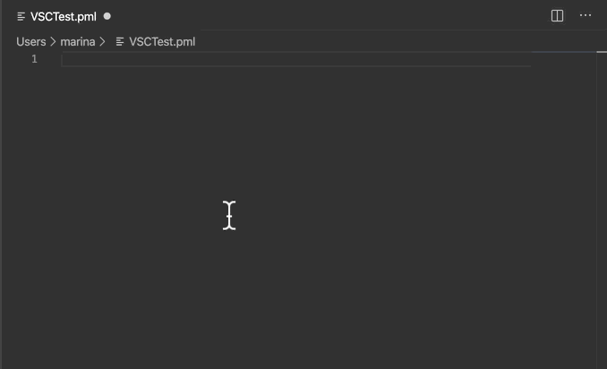

# pymolsnips: PyMOL Script Writing with Code Templates

[](https://opensource.org/licenses/MIT)

## GIF of the application (Demo)

<p>The animation below demonstrates the use of the <b>ao</b> tab trigger in the text editor <em>Visual Studio Code</em> to insert 16 lines of code for generating the ambient occlusion effect.
Two-levels of cascading menus appear.
The menu on the left shows the alternate tab triggers that contain the letters <b>a</b> and <b>o</b>.
The corresponding code for the selected tab trigger is displayed in the right window.
By entering these two letters, you have inserted 16 lines of code!
</p>

<p align="center"></p>

The result of applying a variant of the above code to a 27-nucleotide RNA hairpin is shown below.

<p align="center"></p>

There is not an option in a pulldown menu in PyMOL to make such an image: A script is required.
This code can be applied to molecule in PyMOL.


## Application Description

The pymolsnips library contains 256 code fragments (i.e, templates or snippets) written in the PyMOL macro language (pml) for eighteen text editors.
For more details on using the snippets, a gallery of output, the supported text editors, **library installation**, and the content of the library, please see the associated [GitHub Page](https://mooerslab.github.io/pymolsnips/). 
Give this page a few seconds to load  the images and gifs. The page has the content of the old README.md referred to in the associated manuscript. The migration to the webpage was made on 25 November 2020.


## Table of Contents

* [Tech Stack](#tech-stack)
* [Installation](#installation)
* [Configuration Setup](#configuration-setup)
* [Usage](#usage)
* [Testing](#testing)
* [Requests for new snippets and text editors](#requests)
* [Bug reports](#bugreports)
* [License](#license)
* [Contact Information](#contact-information)
* [How to cite](#citation)


## Technology Stack

| Technology | Description                               |
|------------|-------------------------------------------|
| PyMOL   2.4   | Molecular graphics program         | 
| Python  3.7     |  Programming language          |

Some of the snips have Python3 code.
If you are using an ancient version of PyMOL that relies on Python2, you can buy a license to the current version of PyMOL, install a free open-source version of PyMOL that depends on Python3 (See the PyMOL Wiki), or you can rewrite the code to be Python2 compliant. 
Note that multiple versions of PyMOL can operate side-by-side on a computer: You do not have to delete that ancient version of PyMOL.


## Installation

Download all of the libraries by git clone or as a zip file by clicking on the green *code* button above.
(Sorry, the download of individual libraries would have required 18 different repositories.)
See the [GitHub Page](https://mooerslab.github.io/pymolsnips/) for installation instructions for a specific text editor.

## Configuration Setup

The snippet libraries are independent of PyMOL. 
No modification of PyMOL is required. 
The configuring of text editors is found on the   [GitHub Page](https://mooerslab.github.io/pymolsnips/) .

## Usage

Examples of usage are found in gifs on the  [GitHub Page](https://mooerslab.github.io/pymolsnips/). 
These gifs convey the required knowledge in seconds 

## Testing

Try the **ao** snippet. You should get a result similar to the one should in the demo above.


## Requests for new snippets and text editors

Use the **Issues tab** above to request support for additional text editors and to suggest additional snippets. 
Questions about PyMOL should be directed to the [PyMOL Mailing List](https://pymolwiki.org/index.php/PyMOL_mailing_list).


## Bug reports

Use the **Issues tab** above to report bugs.
Refer bugs in the text editors to the developers of the text editors. 


## License

We use the permissive MIT license.
This license information for this project is found in the License.txt file above. 


## Contact Information 

I can be reached via the Issue tab or e-mail: `blaine-mooers at ouhsc.edu`.


## Citation

If you use this library to make figures for publication, please site the following publication:


```bibtex
@article{mooers2020templates,
  title={Templates for Writing PyMOL Scripts},
  author={Mooers, Blaine HM and Brown, Marina},
  journal={Protein Science},
  year={2020},
  publisher={Wiley Online Library},
  url={https://onlinelibrary.wiley.com/doi/abs/10.1002/pro.3997}
}
```

For ENDNOTE

```bash
%0 Journal Article
%T Templates for Writing PyMOL Scripts
%A Mooers, Blaine HM
%A Brown, Marina
%J Protein Science
%@ 0961-8368
%D 2020
%I Wiley Online Library
```

