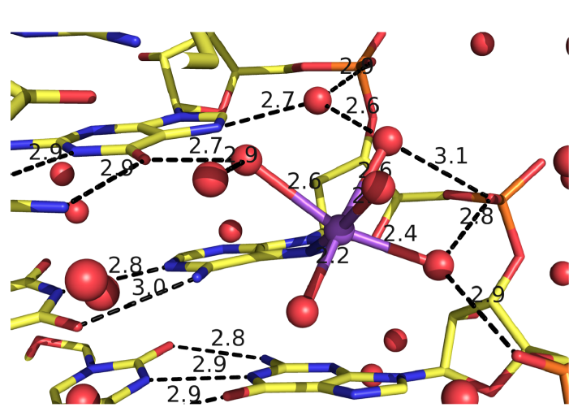
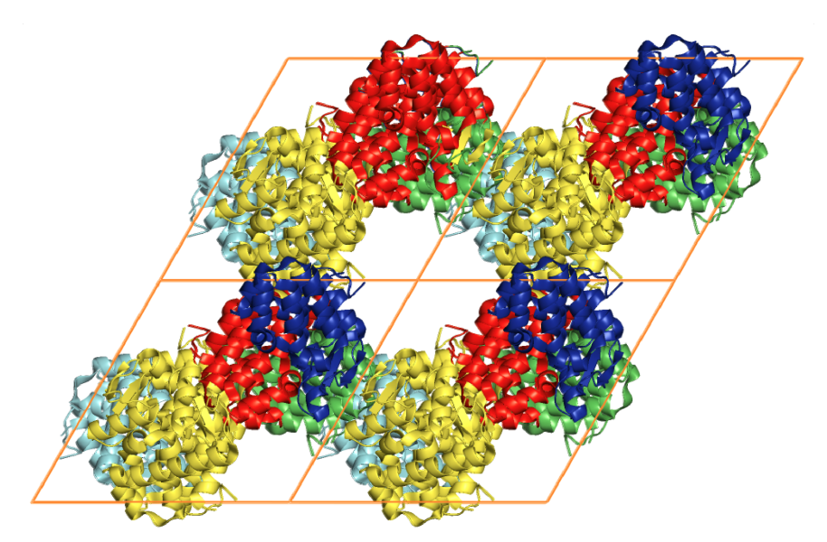

## **pymolsnips:** PyMOL Script Writing with Code Templates

[PyMOL](https://pymol.org/2/) is a leading molecular graphics program for making images of proteins and nucleic acids for publication.
PyMOL's vast array of parameters provides exquisite control over the appearance of the output.
PyMOL is often used to make cover images for [scientific journals](https://pymolwiki.org/index.php/Main_Page).
PyMOL is also popular for making movies of molecules.

The PyMOL GUI is useful for making the images of global scenes, but PyMOL rapidly becomes tedious to use to make images of detailed scenes.
The PyMOL macro language (pml) can be used to set parameter values and execute commands to make customized scenes of biomolecules in PyMOL's viewport.
These scenes can be made into static images for posters, seminars, and manuscripts, or they can serve as parts of molecular movies.
The macro language sends arguments to Python functions, but its syntax is simpler for non-programmers to understand than the syntax of Python code.

Over 100 lines of pml commands and settings are required to make more sophisticated images.
It is difficult to issue so many commands through PyMOL's graphical user interface (GUI) without making mistakes.
If the commands are not saved to an open script file with a `.pml` file extension, to an opened log file, or to a frequently saved session file, the work can be lost. 
(Use the **spse** function in the `pymolshortcuts.py` file in the <a href="https://github.com/MooersLab/pymolshortcuts">pymolshortcuts</a> repository to save session files with time stamps to avoid overwriting previously saved session files.)

Here are of some figures that are impossible or tedious to make via the PyMOL GUI alone.

<!--  -->

<link rel="stylesheet" href="style.css">
<h2>Gallery</h2>
    <table style='font-family:"Courier New", Courier, monospace; font-size:24'>
       <tr>
        <th align="style='text-align:left width:250px'">Tab trigger</th>
        <th align="style='text-align:left width:1500px">Output from code </th>
        <th align="left">Description </th>
      </tr>       
      <tr>
        <td align="style='text-align:center;vertical-align:middle width:130px'">ao</td>
        <td align="left"> </td>
        <td align="left"><h4>ambient occlusion</h4> <p>This code can be applied to any molecule in a sphere representation.</p> </td>
     </tr>
      <tr>
	<!-- pdb code 5d99, 27-mer RNA hairpin -->
        <td align="style='text-align:center;vertical-align:middle width:130px'">aod</td>
        <td align="left"> </td>
        <td align="left"><h4>ambient occlusion</h4> <p>This variant of ambient occulusion colors the carbon atoms black. This code can be applied to any molecule in the sphere representation.</p> </td>
     </tr>
     <tr>
	<!-- pdb code 5d99, 27-mer RNA hairpin -->
        <td align="style='text-align:center;vertical-align:middle width:130px'">aobw</td>
        <td align="left"> </td>
        <td align="left"><h4>ambient occlusion</h4> <p>This is the grayscale verison of ambient occlusions. Grayscale is not an option available through a pulldown in PyMOL. This code can be applied to any molecule in the sphere representation.</p> </td>
     </tr>
     <tr>
	<!-- pdb code 5d99, 27-mer RNA hairpin -->
        <td align="style='text-align:center;vertical-align:middle width:130px'">aodbw</td>
        <td align="left"> </td>
        <td align="left"><h4>ambient occlusion</h4> <p>This variant of ambient occulusion colors the carbon atoms black and then applies grayscale. Grayscale is not an option available through a pulldown in PyMOL. This code can be applied to any molecule in a sphere representation.</p> </td>
     </tr>
      <tr>
        <td align="style='text-align:center;vertical-align:middle width:130px'">bw</td>
        <td align="left"> </td>
        <td align="left"><h4>black and white cartoon</h4> <p>This code can be applied to any molecule in a sphere, surface, or cartoon representation.</p></td>
     </tr>
      <tr>
        <td align="style='text-align:center;vertical-align:middle width:130px'">carved</td>
        <td align="left"> </td>
        <td align="left"><h4>Carved electron density</h4> <p>A 2Fo-Fc electron density map is carved around a glycan. .</p></td>
     </tr>
      <tr>
        <td align="style='text-align:center;vertical-align:middle width:130px'">coordinate</td>
        <td align="left"> </td>
        <td align="left"><h4>Coordinate covalent bonds</h4> <p>Example of specifying coordinate covalent bonds between RNA and a sodium and H-bonds.</p> </td>
     </tr>
      <tr>
        <td align="style='text-align:center;vertical-align:middle width:130px'">filledring</td>
        <td align="left"> </td>
        <td align="left"><h4>Filled ring cartoon for nucleic acids</h4> <p>Filled ring cartoon for nucleic acids with the backbone highlighted by a flat ribbon.</p> </td>
     </tr>
      <tr>
        <td align="style='text-align:center;vertical-align:middle width:130px'">sc222</td>
        <td align="left"> </td>
        <td align="left"><h4>Generate 2 x 2 x 2 array of unit cells with symmetry mates.</h4> <p>Run Thomas Holder's script supercell.py to generate 2 x 2 x 2 array of unit cells with symmetry mates filling the unit cells.</p> </td>
     </tr>
      <tr>
        <td align="style='text-align:center;vertical-align:middle width:130px'">stack</td>
        <td align="left"> </td>
        <td align="left"><h4>Base stacking</h4> <p>Base stacking figure for a pair of base pairs with the top base pair colored dark to enhance the depth perception. The major groove is on the top.</p> </td>
     </tr>    
    </table>

It is challenging to recall the pml syntax when you are not using PyMOL every day, which is the situtation for most PyMOL users.
One solution to this problem is to use a library of code fragments, called **snippets** or **templates**, to build a script in a text editor.

<h3>Brief Notes on Installation and Updates</h3>

Users may want to update their copy of the library as new snippets are added to the library on GitHub.
The date of the last update and its nature are recorded in the GitHub repository.
GitHub has only experimental support for downloading part of a repository.
In the meantime, users must download the entire repository either as a zip file via the `code --> download zip` pull-down menu or by entering the command `git clone https://github.com/MooersLab/pymolsnips.git` if they have git on their computer.
The second option enables subsequent updating of the library via the `git pull origin master` command.

<h3>Navigating this document</h3>

This document has over 12,000 words.
You do not need to read much of it to get started.
Just go to the section below about your favorite text editor to learn how to learn the snippet library.

This long document has a large number of hyperlinks that enable rapid movement to desired sites below and the return to the menus at the top of the file.
The hyperlinks reduce the need to scroll through the document.
Some of the text is hidden from view and has to be toggled or unfolded to expose it.

If you are considering switching text editors or have never used one, then you should invest an hour in reading the synopses of the 18 supported text editors.
This can serve as a guide to selecting a text editor.

Yes, we know.
We have too much information here for a standard README.md file.
We plan to move much of the detailed information below to a GitHub Pages webpage shortly.

### <A name="FASTLINKS">Quick links</A>

  * <a href="#categories"> Snippet categories</a>
  * <a href="#install">Installing snippets for each editor</a>
  * <a href="#snippetList">List of snippets by category and tab trigger names</a>

**pymolsnips** is a library of pml code fragments that have been formatted for several popular **text editors**.
Note the word processors (e.g., MS Word, Libre Office, Open Office) are not included here: ***word processors should never be used to store computer code!***
If you do so, you can inadvertently pick up hidden characters that are hard to find and remove during debugging.
In addition, word processing documents are usually binary files that are difficult to put under version control.

Text editors have tools for supporting the editing of computer code files.
Although these files have many different file extensions that map them to the programming language of the code that they contain, they are all plain text files.
One of the editing tools available in text editors is support for the retrieval and insertion of computer code fragments (i.e, snippets) to save time and reduce errors while assembling a new script file.

Protocols for snippet installation for each text editor are found <a href="#install"> below</a>.
Some editors take snippet libraries in one file while other editors require that each snippet resides in a separate file.
Most editors have their own format for snippets.
The user downloads the file or folder of snippet files for their text editor and then installs the snippets according to the requirements for a particular text editor.
The one exception is the CudaText editor.
The snippets come pre-installed with this editor.

Each code fragment has a unique name that also serves as a tab trigger.
The user enters the name of the code snippet and hits the `tab` key to insert the lines of code.
Tab stops exist at sites where parameters can be edited.
Tab stops are mirrored when the parameters are identical.
Mirroring enable the simultaneous editing of these sites to reduce the chance of overlooking a site that needed editing.

The animation below demonstrates the use of the `ao` tab trigger in *Visual Studio Code* to insert 16 lines of code for generating the ambient occlusion effect.
You can learn how this is done <a href="#VisualStudioCode"> here </a>.
Two-levels of cascading menus appear.
The menu on the left shows the alternate tab triggers that contain the letters `a` and `o`.
The corresponding code for the selected tab trigger is displayed in the right window.
By entering these two letters, you have inserted 16 lines of code!

<p align="center"></p>

One thing to note when using tab stops is that the mirrored selections are very *fragile*:
Before you begin typing, make sure that the mirrored sections are all highlighted.
It is easy to exit the tab stop selections by the click of a mouse or even a keyboard movement!
Getting your selections re-highlighted is not difficult, but the required steps vary between text editors.
Find more information about mirrored tab stops in the installation instructions for each text editor.

The animation below demonstrates the use of mirrored tab stops where changed default values are mirrored at identical sites.
If mirrored tab stops are available for a text editor, you can learn more about them in the installation instructions of that text editor.

<p align="center"></p>

<h2>  <A name="categories"> Snippet categories: </A> </h2>
Each snippet is described below.
The snippets are grouped into categories.
Hyperlinks will take you to a particular category.

- <a href="#altloc"> Alternate locator </a>
- <a href="#analysis"> Analysis </a>
- <a href="#changeOrientation"> Change orientation </a>
- <a href="#colorScheme"> Color scheme </a>
- <a href="#coordCovalent"> Coordinate covalent bonds </a>
- <a href="#database">Database function</a>
- <a href="#electronDensity">Electron density</a>
- <a href="#fetchFile">Fetch file from PDB </a>
- <a href="#fileInput"> File Input</a>
- <a href="#fileOutput">File Output </a>
- <a href="#formatLabel">Format label </a>
- <a href="#hbonds">H-bond</a>
- <a href="#help">Help</a>
- <a href="#label">Label</a>
- <a href="#labelFormat">Label Format</a>
- <a href="#placement">Label placement</a>
- <a href="#measureSurfaceArea">measureSurfaceArea</a>
- <a href="#molecularRepresentation">Molecular representation</a>
- <a href="#printCoordinates">Print coordinaes of selection</a>
- <a href="#printSequence">Print sequence</a>
- <a href="#pymolrc">PyMOLRC</a>
- <a href="#timestamp">Save output file with time stamp</a>
- <a href="#selection">Selections</a>
- <a href="#specializedFigure">Specialized figure</a>
- <a href="#stereo">Stereo images</a>
- <a href="#supercell">Unit cell display</a>
- <a href="#waterPentagon">Water pentagon</a>
- <a href="#saltBridge">Selection</a>
- <a href="#selection">Selection</a>
- <a href="#workshop">Workshop</a>

<A href=#FASTLINKS>Return to quick links section at top</A>

<hr>
<h2>  <A name="FASTLINKS2">Supported text editors:</A> </h2>

PyMOL scripts can be coded in electronic notebook, integrated development environments, and text editors.
All three types of coding platforms support the use of snippets to varying degrees.
Here, we foucs only on text editors because the support for *pml* code is best with this category of coding environment.

Note that some text editors use the same library of snippets.
For example, *emacs* and *spacemacs* can use the same snippet library that is managed by the yasnippets package.
Likewise, Vim and neovim share some of the same plugin managers and snippet libraries.
There are at least three kinds of snippet systems available for Vim and neovim.

<ul>
<li> <a href="#atom"> Atom </a></li>
<li><a href="#bbedit"> BBEdit (limited to Mac OS)</a></li>
<li><a href="#brackets"> Brackets </a></li>
<li> <a href="#cudatext"> CudaText </a></li>
<li> <a href="#emacs"> Emacs (uses <a href="#yasnippets">yasnippets</a> package)</li>
<li> <a href="#espresso"> Espresso </a></li>
<li> <a href="#geany"> Geany </a></li>
<li> <a href="#gedit"> Gedit </a></li>
<li> <a href="#kate"> Kate </a></li>
<li> <a href="#komodo"> Komodo Edit </a></li>
<li> <a href="#LightTable"> Light Table </a></li>
<li> <a href="#micro"> Micro </a></li>
<li> <a href="#Neovim"> Neovim</a> uses the following to manage snippet plugins</li> 
  <ol>
    <li><a href="#Ultisnips">Ultisnips</a></li>
    <li><a href="#Neosnippets">Neosnippets</a></li>
    <li><a href="#Snipmate">Snipmate</a> plugins to manage snippets) </a></li>
  </ol>
<li> <a href="#spacemacs"> Spacemacs (uses yasnippets)</a></li>
<li> <a href="#SublimeText3"> Sublime Text 3 </a></li>
<li> <a href="#TextMate"> TextMate (limited to Mac OS)</a></li>
<li> <a href="#Vim"> Vim </a>(uses Ultisnips, Neosnippets, or Snipmate plugins to manage snippets)</li>
  <ol>
    <li><a href="#Ultisnips">Ultisnips</a></li>
    <li><a href="#Neosnippets">Neosnippets</a></li>
    <li><a href="#Snipmate">Snipmate</a> plugins to manage snippets) </a></li>
  </ol>
<li> <a href="#VisualStudioCode"> Visual Studio Code </a></li>
</ul>

If you are considering switching editors, we recommend Visual Studio Code (VSC).
You do have to install plugins, but the process of doing so is quite painless.
Our second tier of text editors includes would be Sublime Text, Textmate, and Atom.

You might also consider *Geany*.
It is very lightweight, very fast, and very easily configurable.
It is a good editor if you care about agility.  
See the following for second opinions on the best Python editor [beginners](https://www.slant.co/topics/18408/~python-ides-or-editors-for-beginners) and for all [users](https://www.slant.co/topics/366/~best-python-ides-or-editors). 
Note that the **thonny** editor that was recommended for beginners is more of a training tool than a productive tool.
It does not support code snippets, yet.

If your favorite editor is not listed, please post an issue [here](https://github.com/MooersLab/pymolsnips/issues).
I will be notified immediately by e-mail and will try to develop a snippet library for the requested editor.

Note that some editors that are available as binaries only for Windows like *Notepad++* can be run on Mac OS or Linux by using wine or wine bottler.

Some of these text editors can take hours to customize to fit your needs; however, you only need to know about 5% of the options to become productive with these editors.

<h1> <a name="install">Installing and using snippets by text editor</a></h1>
 
<h2 name="atom"> Atom (Universal) </h2>

[*Atom*](https://atom.io) is a favorite of professional programmers because it is easily extended and customized.
Atom advertises itself to be the "hackable text editor".
It integrates with GitHub nicely, and the GUI is attractive.

*Atom's* startup speed bogs down as more plugins are added.
The work-around is to keep *Atom* open all of the time.

There is an extensive collection of plugins available for *Atom*.
The installation and updating of plugins can be slow compared to other editors.

<h3>Installing and using snippets with Atom</h3>

You will need the `snippets` package to be able to use the pymolpy snippets.  
The package installer is very intuitive.
Go to `Packages --> Settings View --> Install packages/themes`.
Search for **snippets** and click the install button.
It may already be installed, but you must make sure that the snippets package is enabled (green bar along the button).

Shown below is an enabled `snippets` package.

<p align="center"></p>

Others have developed a PyMOL lexer for *Atom* so that you can enjoy syntax highlighting.
Go to `Packages --> Settings View --> Install packages/theme` and search for **language-pymol**.
Click install.

<p align="center"></p>

The snippets for all programming languages are stored in a single file that is called `snippets.cson`.
The snippets for different lanaguages are separated by the first line of a snippet library for a specific language.
This line contains a spefication of the scope.
That is, the kinds of script files to which a set of snippets applies.
The `snippets.cson` file is stored in a hidden folder on your home directory called `~.atom/snippets.cson`.

You can concatenate [this](https://github.com/MooersLab/pymolsnips/tree/master/atompymolsnips) file of PyMOL snippets for *Atom* to your existing `snippets.cson` file.

To do this, Mac users enter:

<code>$ cp -a ~/pymolsnips/atompymolsnips/pymolsnippets.cson ~/.atom/snippets.cson</code>

You can also access the `snippets.cson` file via the *Welcome Guide* of *Atom*, under the section called `<>Add a Snippet --> Open your snippets`.
Or, you can access the `snippets.cson` file through `Atom (menu) --> Snippets...`.

For windows users, it might be easiest to access the `snippets.cson` file via the *Welcome Guide*. Paste the `snippets.cson` provided [here](https://github.com/MooersLab/pymolsnips/tree/master/atompymolsnips) into this file. 

A third option available for windows users, is to navigate to the `.atom` folder through the GUI of **File Explorer** and open the `snippets.cson` file.

Below is an example of the *threeMaps* snippet and a demonstration of its mirrored tab stops.

<p align="center"></p>

<A href=#FASTLINKS2>Return to list of editors above.</A>


<h2 name="bbedit"> BBEdit (Mac only) </h2>

[*BBEdit*](https://www.barebones.com/products/bbedit/index.html) requires a license and a one-time fee.
Major upgrades require additional fees. You will need macOS 10.14.2 or later. 

The snippet system for *BBedit* is simple and elegant.
The snippets are stored as clippings with one snippet or clipping per file.
The PyMOL pml snippets end with the file extension `*.pml`.
The clippings can be stored in folders by language.

<h3>Installing and using snippets with BBEdit</h3>

Users can create nested subfolders for groups of related snippets.
The folders of clippings are stored in `~/Library/Application\ Support/BBEdit/Clippings`. 
You will need to add [this](https://github.com/MooersLab/pymolsnips/tree/master/bbeditpymolsnips) snippets folder to your BBEdit clippings.

To do this, enter:

```bash
$ cp -a ~/pymolsnips/bbeditpymolsnips ~/Library/Application\ Support/BBEdit/Clippings/
```

The disadvantages of these clippings include the lack of tab triggers and tab stops.
There is also presently the lack of a PyMOL lexer for syntax highlighting.

<A href=#FASTLINKS2>Return to list of editors above.</A>


<h2 name="brackets"> Brackets (Universal) </h2>

The development of [*Brackets*](http://brackets.io) is lead by a team at Adobe.
*Brackets* was designed for web developers with a focus on HTML, CSS, and JavaScript.
However, *Brackets* now has support for a large number of languages.
*Brackets* provides a Quick Edit and Live Preview mode that run simultaneously, so changes in the pml code are dispayed immediately in the preview window.

*Brackets* has icons, located on the right panel, for navigating to the interactive settings on the application.
The zig-zag line launches the Live Preview.
The lego piece launches the extension manager.
Once you install an extension, a light bulb icon will appear that launches the **Snippets Manager**.

<h3>Installing and using snippets with Brackets</h3>

Go to `File --> Extension Manager` or press the lego piece in the right panel.
Search for `Brackets Snippets (by edc)` and install it.
This is the snippet manager.
It has a GUI that enables the manual creation of user-defined snippets.

<p align="center"></p>

The GUI should automatically refresh, but if not, close and reopen *Brackets*.
The light bulb icon will now appear in the right panel.
Click on the light bulb to open the **Snippets Manager**.

The `settings` tab opens a menu with an import button.
Click import and choose the [`bracketspymolsnips.yml`](https://github.com/MooersLab/pymolsnips/tree/master/bracketspymolsnips) file that is available at the top of this page.
You have to download the file to your computer.

All of the snippets for PyMOL are in this single file.
The next step is to choose the import scheme.
I chose the recommended option to skip snippets with the same tab trigger name.

<p align="center"></p>

Until the PyMOL language is available via a lexer for *Brackets*, use Python for the scope of the pml files.
The Python lexer will provide some syntax highlighting.
This means that the PyMOL file needs to have a file extension of `.py` while it is being edited in *Brackets*.
When finished, save this file with the `.pml` extension to be able to use it in PyMOL.
</details>

In the example of snippet use shown below, notice how all snippets that begin with **a** are suggested.
Only when I press `o` do the suggestions narrow.
This is helpful when you cannot remember the short-hand for a snippet.

<p align="center"></p>

Unfortunately, *Brackets* does not currently support tab stops.

<A href=#FASTLINKS2>Return to list of editors above.</A>


<h2 name="cudatext"> CudaText (Universal)</h2>

[*CudaText*](http://uvviewsoft.com/cudatext/) is a free, cross-platform editor that is written in Lazarus, a variant of Pascal.
*Cudatext* is open source.
Its predecessor was *SynWrite*, which is no longer supported.
*CudaText* has numerous plugins available to it.
A PyMOL lexer and PyMOL snippets are available through the *CudaText* add-ons manger (thank you Alexey T.!).
The documentation for *CudaText* is located [here](http://wiki.freepascal.org/CudaText).

<h3>Installing and using snippets with CudaText</h3>

*CudaText* uses Python3 based plugins. 
*CudaText* expects to find the Python3.* from [Python.org](https://www.python.org/downloads/release/python-374/).
I downloaded the 64-bit version of Python3.7.4 from Python.org and used the installer to install the binary in about five minutes.
This Python interpreter is installed in the `/Applications` directory on the Mac. 
When I started *CudaText*, I did not have to edit any configuration files.

The snippets are stored one per file.
The files have the extensions of `.cuda-snippet`. 
*CudaText* snippets have names (i.e., descriptions), ids (i.e., tab triggers), and markers (i.e., tab stops).
*CudaText* snippets are stored in the user's Library on the Mac: `./Library/Application\ Support/CudaText/data/snippets/Std.PML` folder.

You may have to create the `Std.PML` folder by giving the following bash command:

<code>$ mkdir ./Library/Application\ Support/CudaText/data/snippets/Std.PML/</code>

When executing *CudaText* for the first time on Windows, it will prompt you with the need for the extraction of files.
Proceed with the extraction and choose where you want the files to be extracted to.
I chose to store it under `C:\Users\YOURUSERNAME\AppData\Roaming\CudaText` where I created the folder CudaText.

Create the **Std.PML** sub directory under <code>C:\Users\YOURUSERNAME\AppData\Roaming\CudaText\data\snippets</code>.

Any snippet add-on will automatically be installed in this directory.

Paste the files (not the folder) of <em>cudatextpymolsnips</em> into the **Std.PML** folder.

After starting *CudaText*, install the snippets plugin by navigating to the <b>Plugins --> Addons Manager --> Install</b> and search for <b>plugin: Snippets</b> and select it.
A pop-up window will appear asking you if you would like to install, click OK.
I could not screen capture this pop-up window.

<p align="center"></p>

You will also need to use the same pull-down to install the <em>lexer: PyMOL</em> and the <em>snippets: PyMOL</em>.
Restart *CudaText* to see the changes. When editing snippets or plugins in <b>CudaText</b> you can also update them by going to <b>Plugins --> Addons Manager --> Update</b>.


*CudaText* allows you to edit mirrored sites for uniform editing.
The animation below shows how to edit one mirror location and travel to the other mirrored sites by hitting the Tab key.

<p align="center"></p>

<A href=#FASTLINKS2>Return to list of editors above.</A>


<h2 name="emacs"> Emacs (universal) </h2>

[*emacs*](http://uvviewsoft.com/cudatext/) is a free, open-source, cross-platform editor that is written in *Emacs* lisp (elisp), a variant of LISP.
LISP was developed in the early 1960s to support work on artificial intelligence.
*Emacs* was initiated in 1976 by Richard M. Stallman and others.
*Emacs* has a leadership succession plan that has been put into action.
Richard Stallman stepped away from the project in 2008, and others took over the maintenance of the core program.
This plan will greatly extend the lifetime of this software project.

*Emacs* has been around for 45 years.
According to Lindy's Law, the future life expectancy of a technology is proportional to its current age, so every additional period of survival implies a longer remaining life expectancy.
This law suggests that *Emacs* should be around for another 45 years.

Over 100 other variants of *Emacs* are available.
*Spacemacs* is a version that has a gentler learning curve in part because it can be driven by a menu of commands that is readily accessible.
*Spacemacs* allows the use of Vim key bindings, *Emacs* key bindings, or both.
*Spacemacs* does have its own keybindings that have to be mastered.
This leads to the problem of needing to translate *Spacemacs* to Gnu *Emacs* and back again when tapping into external *Emacs* resources.

*Doom Emacs* and *Prelude Emacs* are additional off-shoots of *Emacs* that are suppose to be easier to adopt.
They are similar to *Spacemacs*.

*SciMax* is a variant of *Emacs* that is being optimized to support scientific publication and literate programming.

For several reasons, we recommend becoming productive in GNU *Emacs* first before trying the *Emacs* variants.
First, the on-line resources that support mastery of GNU *Emacs* are far greater than the resources that support the variants.
Second, the documentation for the variants assume a significant amount of prior knowledge of GNU *Emacs*.
Third, these variants run on top of GNU *Emacs*.

It takes one to two weeks of nibbling away at *Emacs* tutorials to become productive at text editing in *Emacs*.
There is a built-in tutorial in *Emacs* as well as many on-line tutorials.
Visually appealing tutorial is available here https://www.gnu.org/software/emacs/tour/.

It takes several months to become competent in *Emacs*.
It takes a life-time to master *Emacs* hence *Emacs* is known as a **life-time editor**.

The one danger of *Emacs* is that it is easy to spend countless of hours configuring the *init.el* file and adding additional packages.
Many beginners spend too much time adding too many packages, most of which they never use.
As a beginner, you should ease off editing your *init.el* file if it has grown to 500 lines in the first several weeks of using *Emacs*.
A good practice is to add one package at a time and master each added package before adding another new package.

I find that editing of *init.el* file occurs in widely spaced bouts.
Once everything is working to your satisfication, there may be long periods of productivity during which there is no compelling need to fiddle with the *init.el* file.

Many *Emacs* users have shared their *init.el* files on GitHub.
These can provide inspiration for the beginner.
Some have complex configurations that are often too complex to be copied and applied by the beginner.

Many of the add-on packages add functionalities that are not available in other text editors or that become available years later.
The vast group of active contributors to *Emacs* will probably keep it in the lead for a long time into the future.

Like PyMOL, GNU *Emacs* was designed to be highly extensible.
This is large part of its popularity.
Over 4600 packages have been developed by users over the years.
Several package managers, including the [melpa](https://melpa.org), greatly ease package installation.
However, manual installation is often quite simple.

The interface to *Emacs* is either a X-terminal window or a simple GUI that can be made complex by opening many *buffers*, which are like windows.
The management and navigation of buffers is a skill that the beginner needs to master early.

*Emacs* is designed to enable mouse free work although some buffers require that selections be made by using the mouse.
*Emacs* is infamous for having 1800 key bindings involving multiple keys.
The key bindings make heavy use of the alt or meta key.
However, there is in-line documentation, and some packages provide autosuggestions that greatly ease the discovery of new key bindings.
You only really need to memorize several dozen key bindings to become productive in *Emacs*.
The remaining knowledge is easy to acquire on an *as-needed* basis.

Vim users can quickly become productive in *Emacs* because the Vim key bindings are available through the add-on package called evil-mode.
Mastery of the Vim key bindings in Vim is initially painful because it is like learning how to type for the first time.
Here again, mastery of a few dozen key bindings will enable you to be productive in Vim and in Evil-mode in *Emacs*.
Vim key bindings are thought to bear more efficient for editing text than *Emacs* key-bindings, so their availability in *Emacs* greatly enhances a Vim user's productivity in E-macs.

Mastery of Vim key-bindings is a wise investment because they are available in many text editors and IDEs.
They are even available in Jupyter Notebooks!
In addition, Vim is more widely distributed than *Emacs*.

If you are a user of national laboratory computer systems, be cautious with your fantasy of being able to transfer your init.el file and reestablish your *Emacs* computing environment.
Many national facilities use Centos Linux and are unable or unwilling to make available the most recent stable version of *Emacs*.
I have found that the available versions are several years out of date and hence difficult to install all of my favorite packages.
It may take an hour of removing calls to install incompatible packages before you can establish a subset of your favorite packages.
Hence, it is good to have the ability to tolerate getting by for short periods of time with older versions of *Emacs* without all of your favorite packages.

Modes in *Emacs* are states of *Emacs* where a subset of commands are available.
Modes avoid clashes due to functions of the same name in different packages.
Modes are analogous to scopes in other text editors.
For example, there is a python-mode for working with Python script files.

Some modes are multilingual and have many additional non-editing functions.
One such mode is org-mode.
Org-mode was originally designed to be a planning and outlining tool.
Its ease of use for outlining lead to its extension to support literate programming in numerous programming languages. 

Org-mode has over 100 add-on packages.
For example, the org-ref package greatly eases the retrieval of pdfs, and the creation of bibtex entries.
The latter is done in an automated fashion by using the metadata in the pdf files.

The *.emacs.d* configuration directory is a hidden directory in the home directory.
It is the home of the installed packages and plugins.

The main configuration file resides is this directory and is named *init.el*.
The *init.el* file is the analog of Vim's *.vimrc* configuration file.
The commands in the *init.el* file are written in elisp.
Fortunately, elisp is easy to edit and augment without knowing much about how to program with elisp.

I store my configuration in a config.el file (see file listing at top of page).

<h3>Installing *Emacs*</h3>

Like *Vim*, *Emacs* can be installed as a stand-a-lone application or via a software management tool and a software repository.

*Emacs* can be downloaded from https://www.gnu.org/software/emacs/ and insalled with a platform specific installer.
Older versions of *Emacs* comes pre-installed on Mac OS, but you may want a more recent version.
You should remove the old version with the commands <code>sudo rm /usr/bin/emacs</code> and <code>sudo rm -rf /usr/share/emacs</code>.
Binaries for the Mac are [available](https://emacsformacosx.com).
As of August 2020, version 27.1-1 is the stable release.

*Emacs* is also available for a number of software repositories.
It can be installed on the Mac with macports using the command <code>sudo port install emacs </code>.
A GUI based version can be installed with the command <code>sudo port install emacs-app </code>.
The Homebrew repository for Mac OS is popular.
The brew command is <code>brew update && brew install emacs --with-cocoa && brew linkapps emacs <\code>.

You may want to create an alias for starting *Emacs*.
For the development version of the binary in installed in Applications with the above package installer for the make use, <code>e28='open /Applications/Emacs2805.app $1'</code>.
For the app version installed by macports, use <code>e27='open -a /Applications/MacPorts/Emacs.app/Contents/MacOS/Emacs'<\code>.
For Homebrew installed *Emacs*, use <code>alias emacs="/usr/local/Cellar/emacs/24.x/Emacs.app/Contents/MacOS/Emacs -nw"</code>.


<h3>Installing and using snippets with <em>Emacs</em></h3>

The package yasnippets is one of the most popular packages in *Emacs* for managing snippets.
This package provides for the display of the snippets in a table that opens in a separate buffer. 
The user can navigate the table to find a relevant snippet.
This table is redundant with the ls snippet.

The [*yasnippets*](https://www.emacswiki.org/emacs/Yasnippet) package is used to manage snippets in *Emacs*.
This package is installed with a builtin package manager.

Each snippet is stored in a single file.
The files are stored in a subfolder in the hidden folder `~.eamcs.d/plugins/` in the home directory.

<h1>Variants of <em>Emacs</em> to consider</h1>

These variants might be suitable for the impatient who do not want to master *GNU Emacs*.

<h2>Spacemacs</h2>

[Spacemacs](https://www.spacemacs.org) (see below) is built ontop of GNU *Emacs*.
It is designed to be easier to use than *Emacs*.
It can be operated with *Vim*, *Emacs*, or a hybrid of key bindings.
You enable layers to extend its functionality.
*Spacemacs* can be used to edit *Jupyter Notebooks* via the Ipython-layer.

<h2>*SciMax*</h2>

[SciMax](http://kitchingroup.cheme.cmu.edu/scimax) is a being developed by the chemical engineer John Kitchin at Carnegie Mellon University.
This variant of *Emacs* is being optimized for supporting the preparation of scientific manuscripts.
Several YouTube videos of Professor Kitchin talking about SciMax are available.
SciMax is on the to-be-added later list because the documentation for this project is lagging so the user has be more self-reliant.
Hence, our recommendation to become competent with Gnu *Emacs* before diving into SciMax.

<h2><em>Prelude Emacs</em></h2>

This variant of *Emacs* is *GNU Emacs* bundled with what the developer thinks are the essential, no-frills add-on packages.
It does not ship with evil-mode. 
This variant might be appropriate for beginners.
You need to install *GNU Emacs* version 26.3 first.
The [documentation](https://prelude.emacsredux.com/en/latest/modules/python/) is on-line.
The github page is found [here](https://github.com/bbatsov/prelude).

<h2><em>*Doom Emacs</em></h2>

*Doom Emacs* appears to provide more advanced features than *Prelude Emacs*.
It may be useful to study to learn about packages or features to add to a basic *GNU Emacs* configuration.
I learned about moving much of the code in the init.el file to code blocks in a config.org file, which can be rendered on GitHib like a markdown file.
The code blocks can be flanked by explanatory text, hyperlinks, tables, and figures.
The is a great way to document and share one's *Emacs* configuration.

*Emacs* reads an abbreviated init.el file which calls the config.org file.
The code in the code blocks in the config.org file are copied to a config.el file and then executed. 

See the file section at the top for an example of a working init.el and config.org file.

<a href=#FASTLINKS2>Return to list of editors above.</a>


<h2 name="espresso"> Espresso (Mac only) </h2>

[*Espresso*](https://espressoapp.com/) is a proprietary test editor for the Mac.
It is for those users who desire a text editor that has a GUI that looks like a native Mac app.
The snippets are stored in a single `.xml` file.

<A href=#FASTLINKS2>Return to list of editors above.</A>


<h2 name="geany"> Geany (Universal)</h2>

[*Geany*](https://www.geany.org) is a free and lightweight GUI-based text editor that has been under development since 2005.
*Geany* is written in C and C++.
Binaries are  available for Mac OS, Linux, and Windows.
The source code is also available.
*Geany* has a plugin manager, and it is very easy to configure.


<h3>Installing snippets in Geany</h3>

This [webpage](https://www.geany.org/download/releases/) has links to installers for each operating system.

Make sure that the <b>pml</b> filetype is defined as <em>#~ PyMOL=*.pml;</em> by going to <b>Tools --> Configuration files --> filetype_extensions.conf</b>.
You will also need to add PyMOL as a group in that same file configuration.
It should read <b>#~ None=PyMOL</b> under Groups.

<p align="center"></p>

In addition, you need to edit the keybinding preferences <em>Move cursor in snippet</em> for under <b>Edit --> Preferences --> Keybindings</b> because it is blank by default.
I used <b>Tab</b>.
Press <b>enter</b> and then click <em>Allow</em> when the override window pops up.
Without making this edit, you will not be able to advance to the second and later tab stops.

The snippets for all languages are stored in groups in single file <em>~/.config/geany/snippets.conf</em>.
The snippets in this file can be edited by using the pulldown <b>Tools --> Configuration files --> snippets.conf</b>, but it might be easier to use a text editor.

Copy and paste the contents of the above <b>geanypymolsnippets.conf</b> file into the <b>snippets.conf</b> file.  
Make sure that there is only one section with the heading <b>[pymol]</b>.
This heading is case sensitive.


<h3>Using the snippet library in Geany</h3>
The snippets are invoked with a tab trigger.
The snippets have tab stops, but there is no support for the mirroring of tab stops.

Here is an example of the `ao` snippet being used in *geany*:
<p align="center"></p>

A to-be-developed pml language file is needed to enable syntax highlighting of `pml` files.

<a href=#FASTLINKS2>Return to list of editors above.</a>


<h2 name="gedit"> Gedit (Universal) </h2>

[*Gedit*](https://wiki.gnome.org/Apps/Gedit) is the GUI-based text editor developed by the GNU project.
It is commonly found on Linux operating systems.
It is often available on the computers running Linux OS at national labs.
<em>Gedit</em> provides an uncluttered GUI with access to the snippets through a pulldown menu or by a tab trigger.

<a href=#FASTLINKS2>Return to list of editors above.</a>


<h3>Installing and using snippets with <em>gedit</em></h3>

The pymol.lang file has to be installed first.
Download it form the geditpymolsnips folder.


<code>mkdir -p ~/.local/share/gtksourceview-3.0/language-specs</code>


The snippets are stored in a file called <em>pymol.xml</em>.
This file is stored in the home directory in a hidden folder called <em>.config</em>.
The full path is <code>~.config/gedit/snippets/pymol.xml</code>.
You may need to create this directory.

To do this:

<code>$ mkdir ~/.config/gedit/snippets/pymol.xml</code>

Then to copy <em>pymol.xml</em> into that directory, do:

<code>$ cp ~/pymolsnips/geditpymolsnips/pymol.xml ~/.config/gedit/snippets/.</code>

<a href=#FASTLINKS2>Return to list of editors above.</a>


<h2 name="kate"> Kate/Kwriter (Universal)</h2>
	
[*kate*](https://kate-editor.org/get-it/) is a free but kde dependent text editor for Linux that is now available for Mac and Windows.

<A href=#FASTLINKS2>Return to list of editors above.</A>

<h3>Installing and using snippets with <em>Kate</em></h3>

If installed with MacPorts, the app resides in <code>/Applications/macports/kate.app</code>.
The snippet plugin has to be turned on.
*kate* requires MacOS 10.14 or newer.

The snippets are stored in a single <em>.xml</em> file.
The storage location for this file is not in the documentation.
Try the following on Mac (last one of the four) and Linux (first three). <b>Be sure to change the folder from <em>YOURUSERNAME</em> to your username.</b>:

<code>
/Users/YOURUSERNAME/.local/share/ktexteditor_snippets/data/pml-kate.xml<br>
/Users/YOURUSERNAME/.kde4/share/apps/ktexteditor_snippets/data/pml-kate.xm<br>
/Users/YOURUSERNAME/.kde/share/apps/ktexteditor_snippets/data/pml-kate.xm<br>
/Users/YOURUSERNAME/Library/Application\ Support/kate/MySnippets/
</code>

May have to create the directory MySnippets on MacOS.

<a href=#FASTLINKS2>Return to list of editors above.</a>


<h2 name="komodo"> Komodo Edit (Universal) </h2>

[*Komodo Edit*](https://www.activestate.com/products/komodo-edit/) is a proprietary program with a community version that can be used for free.
The developers of *Komodo Edit* have merged with the developers of ActiveState Python.
The community version of *Komodo Edit* has enough features for the occasional writer of code for PyMOL.
One fun aspect of *Komodo Edit* is the ability to use themes to customize your workspace.
*Komodo Edit* was derived from the Mozilla Framework.
The add-on, or extension, capabilities are the same.
For *Komodo Edit* documentation, see [here](http://docs.activestate.com/komodo/11/).

<A href=#FASTLINKS2>Return to list of editors above.</A>


<h3>Installing and using snippets with <em>Komodo Edit</em></h3>

The snippets are treated as abbreviations and are stored as separate files in the tool box.
<em>Komodo Edit</em> will read the  <em>.pml</em> extension.

Snippets are stored in a directory called <em>PML</em>, which has to be created.
For Mac users,

<code>$ mkdir ~/Library/Application\ Support/KomodoEdit/11.1/tools/Abbreviations/PML</code>

Then insert the snippets files from [here](https://github.com/marevebro/pymolsnips/tree/master/komodoeditpymolsnips) into this directory.

<code>$ cp -a ~/pymolsnips/komodoeditpymolsnips ~/Library/Application\ Support/KomodoEdit/11.1/tools/Abbreviations/PML</code>

For Windows users, select where you want *Komodo Edit* to be installed.
I chose <code>C:\Users\MYUSERNAME\AppData\KomodoEdit</code>.
From there, you'll need to create the `PML` directory in <code>...\KomodoEdit\lib\support\samples\tools\Abbreviations</code>.
Then copy and paste the <em>komodeditpymolsnips</em> files into the newly created `PML` directory. 

Here, you can see snippet use in action:
<p align="center"></p>

The snippet name works as a tab trigger.
Unfortunately, snippets must be executed by memory as <em>Komodo Edit</em> does not have a suggestion window for snippets.
The snippet file can also be selected through the GUI.
A pop-up menu displays the option to insert a snippet.
There are tab stops and highlighted default parameter values.
However, there is no mirroring of tab stops at this time.

<a href=#FASTLINKS2>Return to list of editors above.</a>


<h2 name="LightTable"> Light Table (Universal) </h2>
	
[*Light Table*](http://lighttable.com/) is a highly malleable text editor that is written in ClojureScript, a programming language for the web that is dialect of Lisp and that has a powerful macro system.
Those users who have dabbled in <em>Emacs</em> will recognize the syntax of the settings in behavior files which remind me of <em>Emacs</em> init files.
<em>Light Table</em> is like a GUI version of <em>Emacs</em>.
It has very an attractive, uncluttered GUI.

<em>Light Table</em> supports previews that enable interactive editing of code to change the output.
For example,the  code chunk for generating a plot is evaluated in-line and the plot is displayed in an adjacent window.
The plugin manager can be used to install plugins, update them, and gain access to the documentation for the plugin.
This documentation is on a GitHub website.

<a href=#FASTLINKS2>Return to list of editors above.</a>

<h3>Installing and using snippets with Light Table</h3>

The installation of plugins in *Light Table* is very fast.
The number of available plugins is not as extensive as for *Atom, Sublime Text, TextMate,* or *Visual Studio Code*.
You have to be prepared to do a bit of customization to get some of the plugins to work correctly.

The snippets are managed through one master file per programming language.
This central file has the file extension <em>.edn</em>.
This file is used to set the scope fo the snippets (the programming language) and call the snippets, especially ones with multiple lines and indenting, from individual files with the file extension <em>.snip</em>.

The snippets are stored in <code>~/.lighttable/User/snippets</code>.
You will have to create this series of nested directories.
Enter the following command in bash:

<code>$ mkdir ~/.lighttable/User/snippets</code>

Download the [`lighttablepymolsnips`](https://github.com/MooersLab/pymolsnips/tree/master/lighttablepymolsnips) folder from above.
Move the contents of this folder **(not the folder)** to `~/.lighttable/User/snippets`.
To do this:

<code>$ cp -a ~/pymolsnips/lighttablepymolsnips ~/.lighttable/User/snippets/.</code>

Then, in <em>Light Table</em>, select from the menu in the toolbar at the top <b>File>Settings>User behaviors</b>.
This will open a new window with the <b>users.behaviors</b> file ready to be edited.
Paste inside the square brackets the following and change the path to your home directory:

This will open a new window with the <b>users.behaviors</b> file ready to be edited.
Paste inside the square brackets the following and change the path to your Mac home directory <b>be sure to change YOURUSERNAME to your name</b>:

<code>
;; absolute path to where you would like your snippet root directory to be <br>
[:snippets.loader :lt.plugins.snippets.loader/set-snippet-dir <br>
"/Users/YOURUSERNAME/.lighttable/User/snippets"]
</code>

<em><h3>For Windows</h3></em>

Save this file.

Download the [`lighttablepymolsnips`](https://github.com/MooersLab/pymolsnips#cudatext) folder from above.
Move the contents of this folder (not the folder) to <code>~/.lighttable/User/snippets</code>.

Here is that in action!
<p align="center"></p>	


There is not a <em>pml</em> language available yet for <em>Light Table</em>.
Python will have to do as the language for now.
Use <em>.py</em> as your file extension while editing your script file in <em>Light Table</em>, and then save your script file with the <em>.pml</em> file extension.

<A href=#FASTLINKS2>Return to list of editors above.</A>


<h2 name="micro"> Micro (Universal) </h2>

[*Micro*](https://github.com/zyedidia/micro/releases/tag/v1.4.1) is an advance on the terminal-based editor *nano*.
Nonetheless, <em>Micro</em> is easier to use than *Vim* or <em>Emacs</em>.
Like <em>nano</em>, it uses keybindings between keyboard shortcuts and commands to get work done.
The collection of keybinding is defined in a <em>json</em> file.
[*Micro*](https://github.com/zyedidia/micro) has binaries available for Mac, Windows, Linux, and three flavors of BSD.

<A href=#FASTLINKS2>Return to list of editors above.</A>

<h3>Installing and using snippets with Micro</h3>

<em>Micro</em> has a number of plugins available including one for snippets.
You need to have <em>Node.js</em> installed.

On the Mac, it is best to use <em>Micro</em> with the free iTerm terminal emulator.

Enter <em>Micro</em> on the command line to start the editor.
<em>Control-E</em> opens the command line at the bottom of the terminal window.
A list of key bindings are found [here](https://github.com/zyedidia/micro/blob/master/runtime/help/keybindings.md).

Install the <em>snippets</em> plugin by entering <em>control-E</em> in micro to open a command panel, and then enter:

<code>plugin install snippets</code>

All of the snippets for one language are in a single file with the <em>.snippets</em> file extension.
In this case, the file is labeled <em>pml.snippets</em>.

The snippets are installed in the folder <code>.config/micro/plugins/snippets</code>.
In the *pymolsnips* directory, enter:

<code>$ cp pml.snippets ~/.config/micro/plugins/snippets/snippets/.</code>

Snippets for other program languages are found [here](https://github.com/tommyshem/micro-snippets-plugin/tree/master/snippets).

<ul>
<li><b>Alt-S</b> is mapped to the <b>snippet0insert</b> command which inserts the snippet specified by a tabtrigger name.</li>
<li><b>Alt-W</b> advances the cursor to the next tab stop.</li>
<li><b>Alt-A</b> ends the editing the snippet.</li>
<li><b>Alt-D</b> deletes the snippet that is being edited.</li>
</ul>

A lexer for syntax highlighting is in the file called <em>pml.yaml</em>.
This file can be downloaded from the [<em>micropymolsnips</em>](https://github.com/MooersLab/pymolsnips/tree/master/micropymolsnips) folder above.
This lexer is stored in the hidden folder <code>.config/micro/syntax</code>, which you will need to create.

<code>mkdir ~/.config/micro/syntax</code>

Then in the <em>micropymolsnips</em> directory:

<code>cp pml.yaml ~/.config/micro/syntax/.</code>

Enter <b>Control-Q</b> and then enter <code>help color</code> to learn about the available color schemes and to learn about syntax highlighting.
I entered <code>set colorscheme bubblegum</code> to apply a light color scheme to <em>Micro</em> as shown below.
A PyMOL script file has been opened and is color highlighted.
You can make the tex larger for easier reading by entering <code>cmd-+</code> a number of times.

<p align="center"></p>

<A href=#FASTLINKS2>Return to list of editors above.</A>


<h2 name="spacemacs">Spacemacs (Universal)</h2>

Spacemacs (pronounced *space macs*) is a *Vim* emulator that runs on top of *Emacs*.
Its command leader is the spacebar hence the word *space* in the name.
It is very different from running the *Emacs* in evil-mode (evil-mode enables the use of Vim keybindings in *Emacs*).
As a result, it should be treated as a separate editor from *Emacs* and *Vim*.

*Spacemacs* has its own set of mnemonic commands that you need to master.
In other words, you will use *Vim*, *Emacs*, and *Spacemacs* commands in one editor.
It might be less intimidating if you have mastered some of the basics of *Vim* and *Emacs*.
*Spacemacs* does not go as far as allowing you to use Vim plugins and configurations although you do have full access to the emacs plugins which are known as packages.


<h3>Installing and using snippets with Spacemacs</h3>

<em>Spacemacs</em> comes with the package yasnippets installed, which is the engine for managing snippets.
<em>Spacemacs</em> use a layer concept to build up a specific configuration.
The layers are managed by editing the <b>*.spacemacs</b> file.
A few suggested layers are listed under <em>dotspacemacs-configuration-layers</em>.
Most of them are initially commented out with two semicolons on the left.

Add <em>yasnippet-snippets</em> to one of the defualt layers that are listed but are commented out with two semicolons on the left.
Remove the two semicolons.
Take care to use spaces and not a tab to indent yasnippet.

The snippets are installed by the <em>yasnippets-snippets</em> package.
You can use the following command in <em>Spacemacs</em> to install this package.

<code>
M-x package-install RETURM<br>
yasnippet
</code>

<em>Spacemacs</em> may be more attractive to <em>vi</em> users rather than <em>Vim</em> users who cannot part with their configuration in <em>Vim</em>.

<a href=#FASTLINKS2>Return to list of editors above.</a>


<h2 name="SublimeText3">Sublime Text 3 (Universal)</h2>
	
[<em>Sublime Text 3</em>](https://www.sublimetext.com/3) is a GUI-based editor.
The free trial period is infinite.
<em>Sublime Text 3</em> starts up much faster than the other text editors for programmers.
<em>Sublime Text 3</em> has strong support for snippets and the autocompletion of tab triggers.

<a href=#FASTLINKS2>Return to list of editors above.</a>

<h3>Installing and using snippets with Sublime Text 3</h3>

The snippets are stored in separate files with the file extension <em>.sublime-snippet</em>.

<em>Sublime Text 3</em> strongly supports writing in LaTeX.
It provides previews of figures and math equations from within a tex document before compiling it to pdf.
Documents can be compiled on the fly and the bug reporting is more helpful than in most platforms.

For both all users (Mac, Windows, Linux), go to <code>Preferences-->Browse Packages...-->User-->snippets</code>.
You may need to create the subdirectory called <em>snippets</em>.
Copy and paste <em>st3pymolsnips</em> into the <em>snippets</em> folder.

For command line action on the Mac, create the <em>snippets</em> directory in the <em>Sublime Text3</em> folder:

<code>mkdir ~/Library/Application\ Support/Sublime\ Text\ 3/Packages/User/snippets/</code>

Add the snippet files to the <em>Sublime Text 3</em> folder:

<code>cp -a ~/pymolsnips/st3pymolsnips ~/Library/Application\ Support/Sublime\ Text\ 3/Packages/User/snippets/</code>

You can get around making the snippets subdirectory and just move <em>pymolsnips</em> to <code>~/Library/Application\ Support/Sublime\ Text\ 3/Packages/User/</code>, and it should still work.

Restart <em>Sublime Text 3</em>, open a <em>PyMOL</em> script file, and then enter <b>ao</b> and  hit tab.
Sixteen lines of code should appear.

<p align="center"></p>

<em>Sublime Text 3</em> also supports tab stops and mirrored tab stops!
Below is an example of mirrored tab stop editing with the <b>threeMaps</b> snippet.
Notice how when I type <em>sugar</em> all instances of glycan are replaced with sugar.

<p align="center"></p>

You may need to install a snippet manager package and add an autocompletion package to be able to get autocompletion of the tab triggers and a description of the snippet.

<A href=#FASTLINKS2>Return to list of editors above.</A>


<h2 name="TextMate">TextMate (Mac only)</h2>
	
[<em>TextMate</em>](https://macromates.com) is freely available but only for Mac OS.
It is a mature project with occasional updates.
There is a large library of plugins available.
I found it to be quite intutitive to use, fast to start-up, and very robust.
It is the editor that I use most frequently.

The 2007 book [<em>TextMate Power Editing for the Mac</em>](https://www.amazon.com/Textmate-James-Edward-II-Gray/dp/097873923X) by Edward Gray and the 2012 book [<em>TextMate How-To</em>](https://www.amazon.com/TextMate-How-Chris-Mears-ebook/dp/B009XB55PW/ref=sr_1_2?dchild=1&keywords=TextMate+How-To&qid=1606051948&s=books&sr=1-2) by Chris Mears provide supplemental reading to the on-line documentation.

<em>TextMate</em>'s approach to snippets has served as a role model for other text editors.
<em>TextMate</em> snippets can be ported to <em>Sublime Text 3</em> and <em>PyCharm</em>.
Chapter 6 in the book by Edward Gray provides a good overview of the features of snippets in <em>TextMate</em>.

<h3>Installing and using snippets with TextMate</h3>

Each snippet is stored in a separate file with the file extension <em>.tmSnippet</em>.
Each snippet file has a unique uuid string.
The snippet files are stored in a subfolder called <em>Snippets</em>.
This folder is stored in a folder <em>PyMOL.tmbundle</em>.
This folder can be dragged and dropped into the user's <code>~/Library/Application\ Support/TextMate/Bundles</code> folder.
When installing an update of the library, it is best to delete the old <em>PyMOL.tmbundle</em> and then drop in the new <em>PyMOL.tmbundle</em>.

The <em>PyMOL.tmbundle</em> folder contains several files and folders in addition to the <em>Snippets</em> folder. 
Some of this other files include a lexer for <em>PyMOL</em>.
The one file is the <em>dependencies.json</em> file.
This file specifies the dependence on the pygments package.

The second file is the <em>info.plist</em> file.
This file has the developer's contact information, the name of the snippet collection for the <em>Bundles</em> pull-down menu in <em>TextMate</em>, and a unique uuid string.

The <em>PyMOL.tmbundle</em>  shows up in the Bundles pull-down as <em>PyMOL.pml</em>.
Select <em>PyMOL.pml</em> and then a new menu will appear with a list of the snippets.
The descriptions of the snippets are on the left, and the corresponding tab trigger is on the right.
The snippet can be added to the current <em>.pml</em> document by selecting the snippet with the GUI or by entering the tab-trigger name.

The bundle pull-down provides access to a bundle editor.
This editor can be used to view and change the code in the snippets.

<p align="center"></p>

<A href=#FASTLINKS2>Return to list of editors above.</A>


<h3 name="vim">Vim (Universal)</h3>

[<em>Vim</em>](https://vimawesome.com) is the improved terminal-based text editor <em>vi</em>.
<em>Vi</em> is very ubquitious.
It is probably already installed on your computer.
<em>Vim</em> enables the addition of plugins to extend what the base <em>Vim</em> can do.
There are over 19,000 [plugins available](https://vimawesome.com/).
<em>Vim</em> is free.

A newer branch of <em>Vim</em>called <em>neovim</em> is also available.
<em>Vim</em> and <em>neovim</em> are available from software managers like MacPorts, fink, Homebrew, Anaconda, or it can be downloaded as a [stand-alone application](https://www.vim.org/download.php).
The standard versions of both run in the terminal.
MacVim provides a GIU version of <em>Vim</em>.
This version of <em>Vim</em> is integrated with Mac OS.
Unless you a developer of GUI applications for the Mac, you probably want to stick to the terminal version

It is useful to be conversant with several of the above package managers because one of them is bound to have a working version of <em>Vim</em>.
<em>Vim</em>  version 8.1.0 was not working on Mac OS X Catalina due to a bug in <em>Xcode</em>.
That bug has been fixed in version 8.1.2152.
I found that the MacPorts Vim was behind this version.
I tried to compile <em>Vim</em>  version 8.2.12; I gave up due to inference with the conda in the <em>Julia</em> installed by <em>Homebrew</em>.
So I gave up my approach using macports, and I installed Vim version 8.2.0 via <em>Homebrew</em>.
This version worked fine.
It has been automatically updated to 8.2.1950 when running <em>brew update</em>.

If you have [Anaconda](https://anaconda.org/) or [Miniconda](https://docs.conda.io/en/latest/miniconda.html) installed, you can install <em>Vim</em> with conda as follows:

<code>conda install -c conda-forge vim</code>

<em>Vim</em> focuses on the editing process.
This process is where you spend most of your time thinking about what you have written.
Most of the time spent *writing* is usually spent on *rewriting*.

The <em>Vim</em> keybindings for text editing are so useful that have been ported to many [other applications](https://www.reddit.com/r/vim/comments/3tluqr/my_list_of_applications_with_vi_keybindings/) where text is edited.
For example, vim key bindings are available for the rival text editors <em>Emacs</em> as well as many other text editors including *VSC* and even in the on-line LaTeX editor [<em>Overleaf</em>](https://www.overleaf).
There is a <em>Vim</em> keybinding extension for <em>MS Word</em> on Windows but not on Mac OS.
This is one of many reasons why I do most of my writing in <em>Overleaf</em>.

The secret to keeping your sanity while using <em>Vim</em> is to remember to escape from the insert mode to the normal mode as soon as you finish entering a chunk of text because the normal mode is where you issue editing commands.
Numerous blog posts have lists of ways to think about and use <em>Vim</em> to improve your productivity.
The consensus is to develop muscle memory of the commands that are useful to you by practicing their use at every opportunity.
Another tip is to focus on mastering the basic commands before getting mired in tweaking your <em>.vimrc</em> configuration file and playing with plugins; that is, focus on mastering the <em>vi</em> part of <em>Vim</em>.

A common trap for new users is to overload their <em>.vimrc</em> configuration file with shiny new features and plugins that they find on GitHub from posts of sample <em>.vimrc</em> files.
Some of these files are several thousand lines long and really only usable by their developers.
New users often accidentally add one line that breaks <em>Vim</em>, get frustrated, and give up on <em>Vim</em>
A better practice is to slowly and irregularly build-up the <em>.vimrc</em> file as your needs evolve.
You can comment out features that you use infrequently and uncomment them as the need arises.
Obviosuly, your <em>.vimrc</em> file should be kept under version control so that you can easily recover the last working version.

<em>Vim</em> lacks native support for snippets.
We have to extend <em>Vim</em> with a plugin known as a snippet manager.
There are several plugins for managing snippets.
<em>Neosnippets</em>, <em>SnipMate</em>, and <em>UltiSnips</em> will be discussed here.

Versions of Vim 8.0 and greater can use minpac to manage plugins on top of the native support for plugins.
Versions of <em>Vim</em> 7.X and earlier require the use of one of the plugin managers like Vundle to install plugins.
Most plugins have GitHub websites of their own.
These sites rarely mention minpac, but Vundle is always mentioned.

<em>Vundle</em>, which stands for <em>Vim bundle</em>, is a plugin manager that configures your plugins directly in the <em>.vimrc</em> file.
It is in this file that you install and update plugins, as well as comment out unused plugins.

<A href=#FASTLINKS2>Return to list of editors above.</A>


<b>Installing Vundle</b>

To start adding a plugin to *Vim* you will need to open and edit the <em>.vimrc</em> file.

To download Vundle enter the following into the bash command line:

<code>git clone https://github.com/VundleVim/Vundle.vim.git ~/.vim/bundle/Vundle.vim</code>

Paste the following minimal code at the top of your <em>.vimrc</em> file to allow the use of Vundle:


<!-- 
<code>
"vundle<br>
set nocompatible filetype off<br>
set rtp+=~/.vim/bundle/Vundle.vim<br>
<br>
" Add only comment lines and Plugin commands between<br>
" call vundle#begin() and call vundle#end()<br>
<br>
call vundle#begin()<br>
<br>
Plugin 'VundleVim/Vundle.vim'<br>
<br>
" Ultisnips requires Vim installed with python. This is just the engine.<br>
Plugin 'SirVer/ultisnips'<br>
<br>
call vundle#end()<br>
<br>
" Turn on filetype detection for plugins<br>
filetype plugin on<br>
<br>
" set path to Python3 interpreter that you used when installing Vim<br>
" let g:python3_host_prog = '/opt/local/bin/python3.7'<br>
" This was the python used to install Vim with homebrew.<br>
let g:python3_host_prog = '/usr/local/Cellar/python/3.7.5/bin/python3'<br>
<br>
" UltiSnips related commands<br>
let g:UltiSnipsExpandTrigger = ''<br>
let g:UltiSnipsJumpForwardTrigger = ''<br>
let g:UltiSnipsJumpBackwardTrigger = ''<br>
let g:UltiSnipsSnippetDirectories=[$HOME.'.vim/my-snippets/Ultisnips']
</code>
-->

```bash
if has('python3')
endif

vundle
set nocompatible filetype off
set rtp+=~/.vim/bundle/Vundle.vim

" Add only comment lines and Plugin commands between
" call vundle#begin() and call vundle#end()

call vundle#begin()
plugin 'VundleVim/Vundle.vim'

" Ultisnips requires Vim installed with python. This is just the engine.
Plugin 'SirVer/ultisnips'
call vundle#end()

" Turn on filetype detection for plugins
filetype plugin on

" set path to Python3 interpreter that you used when installing Vim
" let g:python3_host_prog = '/opt/local/bin/python3.7'
" This was the python used to install Vim with homebrew.
let g:python3_host_prog = '/usr/local/Cellar/python/3.7.5/bin/python3'

" UltiSnips related commands
let g:UltiSnipsExpandTrigger = ''
let g:UltiSnipsJumpForwardTrigger = ''
let g:UltiSnipsJumpBackwardTrigger = ''
let g:UltiSnipsSnippetDirectories=[$HOME.'.vim/my-snippets/Ultisnips']
```

Now open <em>Vim</em> and run the following command:

<code>:PluginInstall</code>

<A href=#FASTLINKS2>Return to list of editors above.</A>


<h3>Minpac</h3>

<em>Minpac</em> is anther a plugin manager for installing and managing plugins in <em>Vim</em>.
It requires <em>Vim</em> 8 or newer.
Unfortunately, minpac does not update itself.
Fortunately, there is a package you can add that will allow minpac to auto-update.
This is discussed below in the minpac installation section.


<h3>Installing minpac</h3>
	
To install minpac, you need to create a directory called <em>minpac</em> and install it as an optional plugin:

```bash
mkdir -p ~/.vim/pack/minpac/opt
cd ~/.vim/pack/minpac/opt
git clone https://github.com/k-takata/minpac.git
```

Then, add the following to your <em>.vimrc</em> file and write the file <b>:w</b>:

```bash
packadd minpac
call minpac#init()
```

To add a plugin using minpac you will need to add this command <code>call minpac#add('author/reponame')</code> to your <em>.vimrc</em> file.

For example, if you wanted to install snippets for <em>UltiSnips</em> you would add (this will not work at the moment) to the <em>.vimrc</em> file:

```vim
call minpac#add('MooersLab/pml_bhmm.snippets')
```

To allow minipac to update itself enter:

```vim
call minpac#add('k-takata/minpac',{'type':'opt'})
```

Then refresh *Vim* giving the `:source %` command and update minpac plugins with `:call minpac#update()`.
You will not be able to use these plugins until you exit and restart *Vim* by entering `:qa!` and then opening another *Vim* session.
</details>

<h4 name="neosnippets">Neosnippets(for Vim, universal) </h4>

[*Neosnippets*](https://github.com/Shougo/neosnippet.vim) is a snippet management plugin for the text editors *Vim* and *neovim*.
*Neosnippets* is similar to *SnipMate* except with *Neosnippets*, there is the option to utilize [*deoplete*](https://github.com/Shougo/deoplete.nvim) interface to suggest in-line alternate snippets.
The use of *Neosnippets* does not require *deoplete*.
Experienced users may find *deoplete* pop-up menus to be distracting.
*Deoplete* may be useful as a training tool that can be dispensable when it is no longer needed.
*Deoplete* requires *neovim* or *Vim* versions greater than 8.0, and Python3.

<A href=#FASTLINKS2>Return to list of editors above.</A>

<details>
<summary><b>Installing and using snippets with Neosnippets</b></summary>

You have to enable the Python3 interface with pynvim which you can install with this command:

```bash
$ pip3 install --user pynvim
```

To be more precise, you can provide the full path to the Python interpreter to be used by *neovim* and import *pip* as a module before installing pynvim.

```bash
$ sudo -H /opt/local/bin/python3.7 -m pip install pynvim
```

Check in *Vim* or *neovim* if python3 is enabled by entering:

```vim
:echo has("python3")
```

If 1 is returned, you have python3 installed. 
If 0 is returned, you do not.

To install the plugins with Vundle, add the following to the Vundle plugin section of the `.vimrc` file.

```vim
Plugin 'Shougo/deoplete.nvim'
Plugin 'roxma/nvim-yarp'
```

To use *deoplete*, add the following setting to your `.vimrc` file.

```vim
" Use deoplete.
let g:deoplete#enable_at_startup = 1
```

To install *Neosnippets*, add the following to the Vundle plugin section of the  `.vimrc` file.

```vim
Plugin 'Shougo/neosnippet.vim'
Plugin 'Shougo/neosnippet-snippets'
```

The last command is optional because installing default snippets is optional.
If you choose not to install them, you must deactivate them with the following command added to the `.vimrc` file.

```vim
g:neosnippet#disable_runtime_snippets
```

A minimal `.vimrc` file for installing and using *Neosnippets* is listed below **make sure to change YOURUSERNAME to your name**:

```vim
if has('python3')
endif

"vundle
set nocompatible
filetype off
set rtp+=~/.vim/bundle/Vundle.vim

" Add only comment lines and Plugin commands between
" call vundle#begin() and call vundle#end()
call vundle#begin()

Plugin 'VundleVim/Vundle.vim'

" neosnippets uses deoplete to suggest snippets
" This might be superior to ultisnips.
Plugin 'roxma/nvim-yarp'
Plugin 'roxma/vim-hug-neovim-rpc'
Plugin 'Shougo/neosnippet.vim'
Plugin 'Shougo/neosnippet-snippets'

call vundle#end()

" Turn on filetype detection for plugins
filetype plugin on

let g:python3_host_prog = '/opt/local/bin/python3.7'
let g:pydiction_location = '/Users/YOURUSERNAME/.vim/bundle/pydiction/complete-dict'

" Use deoplete.
let g:deoplete#enable_at_startup = 1

" maximum width of deoplete window
call deoplete#custom#source('_', 'max_menu_width', 80)


" i for swichting to the insert mode from normal mode;
" ii for escape from insert mode to normal mode
:inoremap ii  <Esc>

" another means of escape to normal mode: Control-Carriage Return
:inoremap <C-CR>  <Esc>
```

</details>
<A href=#FASTLINKS2>Return to list of editors above.</A>

<h4 name="snipmate"> SnipMate (for Vim, universal) </h4>

[*SnipMate*](https://github.com/garbas/vim-snipmate) is an early but stable plugin manager that provides plugin support for snippets that are available in *Vim*. 
It does not depend on Python.

<details>
<summary><b>Installing and using snippets with SnipMate</b></summary>

To install SnipMate, add the following to your `.vimrc` file:
```vim
Plugin 'MarcWeber/vim-addon-mw-utils'
Plugin 'tomtom/tlib_vim'
Plugin 'garbas/vim-snipmate'

" Optional:
Plugin 'honza/vim-snippets'
```

Then run the following command in *Vim*:

```vim
:PluginInstall
```

</details>

<A href=#FASTLINKS2>Return to list of editors above.</A>

<h4 name="UltiSnips"> UltiSnips (for *Vim*, universal) </h4>

[*UltiSnips*](https://github.com/SirVer/ultisnips) is a more recent plugin manager that depends on Python3.
*Vim* has to be installed with the option of using Python3 enabled to be able to use *UltiSnips*.
The *UltiSnips* plugin is the snippet handling engine.
It provides a large number of advanced snippet features.
However, it does not come with libraries of snippets.
The snippets must be installed separately.
The *honza/vim-snippets* plugin contains snippets for many languages.
The pml.snippets file can be stored in a *my-snippets* subfolder of the hidden *.vim* directory as described below.

*UltinSnips* can read *SnipMate* snippets.

<details>
<summary><b>Installing and using snippets with UltiSnips</b></summary>

In the following setup, we use the Vundle plugin manager.

The `PyMOL.snippets` could be stored inside the *UltiSnips* directory, but they would be lost if you delete the *UltiSnips* directory.
To help make sure your snippets are not deleted if the *UltiSnips* directory ever gets deleted you will want to create a subdirectory called `myultisnips` at the top level of the `.vim` directory.
Move the `PyMOL.snippets` file to this subdirectory.
We will inform *Vim* of this location when customizing the `.vimrc` file for *UltiSnips* a little further down.

```bash
$ cd .vim
$ mkdir myultisnips
```

In the `myultisnips` directory, you can add your own snippets and add the *UltiSnips* snippets provided above in the `ultisnippymolsnips` folder.

```bash
$ cp ~/pymolsnips/ultisnippymolsnips/* .
```


Because *UltiSnips* depends on Python3, you may have to install Python3 to be able to use it.
You can point *UltiSnips* to a particular Python3 interpreter with the following command in your `.vimrc` file.
At the top of the file, add:

```vim
if has('python3')
endif
```

In the Vundle plugin section of the `.vimrc` file, add the following lines:

```vim
" Ultisnips requires *Vim* installed with python.
Plugin 'SirVer/ultisnips'
```

Below the plugin section, add the following:

```vim
" Turn on filetype detection for plugins
filetype plugin on

let g:python3_host_prog = expand('/opt/local/bin/python3.7')

" UltiSnips related commands
let g:UltiSnipsExpandTrigger = '<tab>'
let g:UltiSnipsJumpForwardTrigger = '<tab>'
let g:UltiSnipsJumpBackwardTrigger = '<s-tab>'
let g:UltiSnipsSnippetDirectories=['/Users/blaine/.vim/my-snippets/Ultisnips','UltiSnips']
```

The following step is to define the `*.pml` file type inside a `pml.vim` file.
The `pml.vim` file is stored inside of a subfolder that contains the file type definition files.
This subfolder is called *ftdetect*, which is stored inside of the *~/.vim/bundle/ultisnips* folder.
This step is not necessary if you install the *bioSyntax-vim* plugin because it contains a *pml.vim* in its ftdetect subfolder.
The *bioSyntax-vim* also provides color syntax highlighting for *.pml* files.

Make a `ftdetect` directory at the top level of the `.vim` directory.

```bash
$ mkdir -p ~/.vim/ftdetect/
$ cd ~/.vim/ftdetect/
```

Some *Vim* plugins require that you add a flag to your `.vimrc` file to turn off file type detection.
You can set the file type for a `.pml` file with the command `:set filetype=pml`.
To enable autodetection of the file type in this situation, we need to make a `pml.vim` file in the `ftdetect` subdirectory of the `ultisnips` directory.

```bash
$ cd ~/.vim/bundle/ultisnips/ftdetect/
$ touch PyMOL.vim
$*Vim*PyMOL.vim
```

Insert the single-line code fragment below into the file `pml.vim` and save it.
Press `i` to get into insert mode.
Then `escape` to return to normal mode.
To save and quit type `:wq` on the command line of normal mode.

```vim
au BufNewFile,BufRead *.pml set filetype=pml
```

Now, make a soft link to the `ftdetect` directory inside the `ultisnips` subdirectory to this new directory.

```bash
ln -s ~/.vim/bundle/ultisnips/ftdetect/* ~/.vim/ftdetect/
```

To test your set up, open a PyMOL script file.
Enter on the command line in *Vim* `:set filetype?`.
You should bet back `filetype=pml`.

Here is a minimal, no-frills *vimrc* file that uses Vundle and works with the `pml.snippets` file.
You may have to edit the path to the python3 binary.

```vim
if has('python3')
endif

"vundle
set nocompatible
filetype off
set rtp+=~/.vim/bundle/Vundle.vim

" Add only comment lines and Plugin commands between
" call vundle#begin() and call vundle#end()
call vundle#begin()

Plugin 'VundleVim/Vundle.vim'

" Ultisnips requires*Vim*installed with python. This is just the engine.
Plugin 'SirVer/ultisnips'

call vundle#end()

" Turn on filetype detection for plugins
filetype plugin on

let g:python3_host_prog = expand('/opt/local/bin/python3.7')

" UltiSnips related commands
let g:UltiSnipsExpandTrigger = '<tab>'
let g:UltiSnipsJumpForwardTrigger = '<tab>'
let g:UltiSnipsJumpBackwardTrigger = '<s-tab>'
let g:UltiSnipsSnippetDirectories=['/Users/blaine/.vim/my-snippets/Ultisnips','UltiSnips']

" i for swichting to the insert mode from normal mode;
" ii for escape from insert mode to normal mode
:inoremap ii  <Esc>

" another means of escape to normal mode: Control-Carriage Return
:inoremap <C-CR>  <Esc>
```

<h4> More information about UtliSnips </h4>

There are a number of videos on YouTube about using UltiSnips.
The developer of UltiSnips, SirVer (aka Holger Rapp) has a series of four videos that you are highly recommended.
The links to these videos are found in the README.md file of the [*UltiSnips GitHub Repository*](https://github.com/sirver/UltiSnips).

However, for a faster introduction to UltiSnips, I recommend watching the video [*How I Use the UltiSnips VIM Plugin To Make Better Snippets*](https://www.youtube.com/watch?v=F9Wss9GkF9Q&feature=emb_logo) by Bryan Jenks.

If you are an experienced snippet user and want to add intelliSense-like autocompletion of the snippet names in *Vim*, take a look at [*Conquerer of Completion*](https://github.com/neoclide/coc.nvim) by Qiming Zhao.
They claim that their package will bring a *VSC*-like experience to *Vim*.

</details>

<A href=#FASTLINKS2>Return to list of editors above.</A>

<h3 name="VisualStudioCode"> Visual Studio Code (Universal)</h3>

[*Visual Studio Code*](https://code.visualstudio.com) (VSC) is a free text editor that was recently bought by MicroSoft.
Its start-up speed is between that of *Sublime Text 3* and *Atom*.
It is still under expoentially rapid development.
It is easily ehanded with extensions.
There is even a Grammarly extesnion!
*VSC* has strong support for snippets and for autocompletion with intelliSense.
It is fair to say that *VSC* is one of the most advanced text editors.

The installation of *VSC* extensions is very painless and very fast.
There is an extension marketplace that is accessible from the left column within the *VSC* GUI.
You can search the marketplace for extensions.
Each extension has its own html file with information about the extension.
This html file has install and uninstall buttons.
The installations are lightning fast.

The *bioSyntax* plugin is free and includes a lexer for PyMOL and lexers for many other file types used in bioinformatics.
It is a good idea to install this plugin.
The PyMOL lexer will be activated when a `pml` file is opened.

*VSC* provides for autocompletion of the snippet tab triggers and previews of the snippet's code.
The latter feature are very helpful for avoiding the insertion of the wrong snippet.

<b>Installing and using snippets with Visual Studio Code</b>

Windows users will need to install the 'Remote - WSL' extension for the windows/Linux system.
A prompt should pop-up during your first launch of *VSC*. Install this.

From the above folder `vscpymolsnips`, download and move the file `pml.json` to `~/Library/Application\ Support/Code/User/snippets` on the Mac; on windows,`$HOME/APPDATA\Roaming\Code\User\snippets\pml.json`; on Linux, `$HOME/.config/Code/User/snippets/pml.json`.

For Mac users in the `vscpymolsnips` folder:

```bashOS
$ mv pml.json ~/Library/Application\ Support/Code/User/snippets
```

For Windows users, select the the settings button (gear icon) in the bottom left corner. Go to `Settings>User Snippets>pml`.
If you already have a `pml` file for snippets, simply append the `pml.json` file to the existing file (by copying and pasting).

Next, install *bioSyntax* via `View --> Extensions`.
Search for *bioSyntax* and hit the `Install` button.
You will be asked to select a theme, just select bioSyntax.

<p align="center"></p>

Open a file with a `.pml` file extension.
You should see `pml` in the lower right on the bottom panel.
Type the tab trigger `ao` to try inserting the snippet for the ambient occlusion effect. You should see syntax highlighting.

<p align="center"></p>

*VSC* also supports the use of mirrored tab stops. In the example shown below, I am using the snippet *threeMaps*.

<p align="center"></p>

<A href=#FASTLINKS2>Return to list of editors above.</A>

<!--
<h2>Text editors that are ready out of the box</h2>

<h2>Terminal based text editors</h2>
In this category, *Vim* is the most powerful editor followed by *emacs* and distantly by nano.
-->

<h2> <A name="snippetList" >List of the snippets by their tab trigger name and description </A> </h2>

<h3 name="altloc"></h3>

### Alternate locators:
| Tab trigger   | Description                                                   |
|:--------------|:--------------------------------------------------------------|
| hidealtloc    | Hide alt loc., the alternate locator for disordered residues. |

<A href=#categories>Return to list of snippet categories near top.</A>

<h3 name="analysis"></h3>

### Analysis:
| Tab trigger    | Description                                                                          |
|:---------------|:-------------------------------------------------------------------------------------|
| averageB       | iFind the average B-value of a selection. Uses a regular list as opposed to PyMOL's stored list. Edit the selection as needed. |
| findHbonds     | Find hbonds around a residue.                                                        |
| printBs        | Print the B-factors of a residue.                                                    |
| printBs2digits | Print B-values for a residue with the B's rounded off to two decimal places.         |
| printBspartB   | Print B factors of part B of a disorderd residue.                                    |
| aveB4resiX                  | AveBResiX, prints the residue number and the average bfactor.                                                             |
|                             | Uses reduce and lambda, builtin Python functional programming functions.                                                  |
|                             | Note that you need to convert the length of the list of Bfactors from an integer to a float before division into the sum. |
| printNameB4ResiX            | Print name and b-factor for a residue.                                                                                    |
| printResiResnNameB4ResiX    | Print resn, resi, atom name, and b-factor.                                                                                |
| printResiResnNameB4ResiXNoH | Print name and b-factor for a residue or residue range (e.g. 81:120). The noH variant.                                    |

<A href=#categories>Return to list of snippet categories above.</A>

<h3 name="changeOrientation"></h3>

### Change orientation:
| Tab trigger   | Description                        |
|:--------------|:-----------------------------------|
| rotate        | Rotate about axis.                 |
| rv            | Return settings in a compact format on one line. |
| turnAboutAxis | Turn about axis.                   |

<A href=#categories>Return to list of snippet categories above.</A>

<h3 name="colorScheme"></h3>

### Color scheme:
| Tab trigger   | Description                                    |
|:--------------|:-----------------------------------------------|
| cblind        | Eanble color blind friendly colors.            |
| cribbon       | Color ribbon H red, strand yellow, loop green. |
| volumeRamp    | Volume ramp.                                   |

<A href=#categories>Return to list of snippet categories above.</A>

<h3 name="coordCovalent"></h3>

### Coordinate covalent bonds:
| Tab trigger   | Description                                                |
|:--------------|:-----------------------------------------------------------|
| coordinate    | Coordinate covalent bonds to metals. |

<A href=#categories>Return to list of snippet categories above.</A>

<h3 name="database"></h3>

### Database function:
| Tab trigger   | Description                                   |
|:--------------|:----------------------------------------------|
| lsSnips       | List all snips by tab trigger and description |

<A href=#categories>Return to list of snippet categories above.</A>


<h3 name="electronDensity"></h3>

### Electron density:
| Tab trigger   | Description              |
|:--------------|:-------------------------|
| carvedDensity | Carved electron density map. |
| fetch2FoFc    | Fetch 2FoFc map.         |
| threeMaps     | Three electron density maps.  |

<A href=#categories>Return to list of snippet categories above.</A>

<h3 name="fetchFile"></h3>

### Fetch file from PDB:
| Tab trigger   | Description     |
|:--------------|:----------------|
| fetchCIF      | Fetch cif file. |
| fetchFoFc     | Fetch fofc map. |

<A href=#categories>Return to list of snippet categories above.</A>

<h3 name="fileInput"></h3>

### File Input:
| Tab trigger   | Description                               |
|:--------------|:------------------------------------------|
| loadPDBfile   | Load a pdb file in the current directory. |

<A href=#categories>Return to list of snippet categories above.</A>


<h3 name="fileOutput"></h3>

### File output:
| Tab trigger   | Description                                                |
|:--------------|:-----------------------------------------------------------|
| savePNG       | Save a png file of current scene to the current directory. |

<A href=#categories>Return to list of editors above.</A>

<h3 name="formatLabel"></h3>

### Format label:
| Tab trigger   | Description                                         |
|:--------------|:----------------------------------------------------|
| labelResnResi | Label CA atom with residue name and residue number. |
| labelSS       | Label SS.                                           |
| oneLetter     | One letter amino acid.                              |

<A href=#categories>Return to list of snippet categories above.</A>


<h3 name="hbonds"></h3>

### H-bonds:
| Tab trigger   | Description       |
|:--------------|:------------------|
| distance      | H-bond distances. |
| drawHbonds    | Draw H-bonds.     |
| hbond         | H-bond setup.     |
| hbonddash     | H-bond dashes.    |

<A href=#categories>Return to list of snippet categories above.</A>


<h3 name="#help"></h3>

### Help:
| Tab trigger                | Description                                                                |
|:---------------------------|:---------------------------------------------------------------------------|
| printDoc                   | Print document string of a function.                                       |
| writeCommandReference2HTML | Write the command reference to html file in the present working directory. |

<A href=#categories>Return to list of snippet categories above.</A>


<h3 name="#label"></h3>

### Label:
| Tab trigger    | Description                                        |
|:---------------|:---------------------------------------------------|
| labelCAs       | Label the CA atoms with the Ala333 style format    |
| labelMainChain | Label the main chain atoms by resn,resi,atom name. |
| labelWatersHOH | Label waters HOH.                                  |
| labelWatersW   | Label waters W.                                    |

<A href=#categories>Return to list of snippet categories above.</A>


<h3 name="#labelFormat"></h3>

### Label format:
| Tab trigger   | Description                                   |
|:--------------|:----------------------------------------------|
| sigang        | Set angle labels to display 2 decimals places |
| sigdist       | Set distance labels to display 2 decimals     |

<A href=#categories>Return to list of snippet categories above.</A>>


<h3 name="#labelPlacement"></h3>

### Label placement:
| Tab trigger   | Description   |
|:--------------|:--------------|
| centerpi      | Center pi.    |
| pseudolabel   | Position label with pseudoatom. |

<A href=#categories>Return to list of snippet categories above.</A>


<h3 name="#measureSurfaceArea"></h3>

### Measurement surface area:
| Tab trigger   | Description           |
|:--------------|:----------------------|
| ms            | Measure surface area. |

<A href=#categories>Return to list of snippet categories above.</A>


<h3 name="#molecularRepresentation"></h3>

### Molecular representation:
| Tab trigger             | Description                                                                                    |
|:------------------------|:-----------------------------------------------------------------------------------------------|
| ao                      | Ambient occlussion.                                                                            |
| bs                      | Ball and stick representation.                                                                 |
| cspheres                | Colored spheres.                                                                               |
| discreteCartoonColoring | Turn on discrete colors between secondary structure elements.                                  |
| doubleBond              | Valence bond.                                                                                  |
| ellipcol                | Set thermal ellipsoid color.                                                                           |
| filledRing              | Filled rings in nucleic acids.                                                                 |
| fog                     | Blur the background atoms.                                                                     |
| loadPDBbs               | Load PDB ball-and-stick.                                                                       |
| loadPDBnb               | Load PDB nb spheres.                                                                           |
| molscriptRibbon         | Molscript ribbons.                                                                             |
| pearl                   | The pearl effect is made with two spheres with the outer sphere being transparent.             |
| puttyCartoon            | Create a putty cartoon.                                                                        |
| ringMode                | Set the ring mode to a value between 0  and 6 in cartoons of nucleic acids.                    |
| rmwater                 | Remove waters from molecular object.                                                           |
| saxsEnvelope            | Display SAXS envelope                                                                          |
| sc111                   | Display all symmetry mates in one unit cell. Uses supercell.py in $HOME/Scripts/PyMOLscripts/. |
| scaleRadiusColor        | Scale the radius and color of atoms as spheres by property in the B-value column.              |
| setcolor                | Set color name to a RGB code.                                                                  |
| sidehChainHelper        | In cartoons, hide the backbone atoms of selected residues when showing then as sticks.         |
| solventRadius           | Set radius of ball used to make solvent accessible surface.                                    |

<A href=#categories>Return to list of snippet categories above.</A>

<h3 name="#printCoordinates"></h3>

### Print coordinates of selection:
| Tab trigger    | Description      |
|:---------------|:-----------------|
| getCoordinates | Get coordinates. |

<A href=#categories>Return to list of snippet categories above.</A>

<h3 name="#printSequence"></h3>

### Print sequence:
| Tab trigger   | Description                |
|:--------------|:---------------------------|
| fasta         | Print Fasta from PDB file. |

<A href=#categories>Return to list of snippet categories above.</A>

<h3 name="#pymolrc"></h3>

### Pymolrc:
| Tab trigger   | Description                                               |
|:--------------|:----------------------------------------------------------|
| antialias     | Set antialias to get smooth edges                         |
| fetchPath     | Set path for location to save fetched pdb files.          |
| lspymolrc     | Print list of active pymolrc files.                       |
| setpath       | Set additional path for PyMOL to search on startup        |
| sigDigits     | Set number of decimals places to show in distance labels. |

<A href=#categories>Return to list of snippet categories above.</A>

<h3 name="#timestamp"></h3>

### Save png flle with timestamp:
| Tab trigger   | Description                  |
|:--------------|:-----------------------------|
| spng          | Save png flle with timestamp |
| spse          | Save pse flle with timestamp |

<A href=#categories>Return to list of snippet categories above.</A>


<h3 name="#selection"></h3>

### Selection:
| Tab trigger          | Description                                                  |
|:---------------------|:-------------------------------------------------------------|
| duplicateObject      | Duplicate object.                                            |
| extractPartObj       | Create a new object from part of an existing object.         |
| hideSelection        | Turn off magenta squares on current selection.               |
| selectAllBut         | Select all nitrogen atom in a selection except from lysine.  |
| selectAtomsAround    | Select atoms within a radius around a ligand.                |
| selectChain          | Select a chain.                                              |
| selectElement        | Select atoms by element.                                     |
| selectHelices        | Select atoms by alpha helices.                               |
| selectLoops          | Select atoms by beta loops.                                  |
| selectName           | Select atoms by name.                                        |
| selectResi           | Select residues by a range of residue id numbers separated by a colon.|
| selectResidues       | Select residues by name.                                     |
| selectResiduesAround | Select residues within a radius around a ligand.             |
| selectStrands        | Select atoms by beta strands.                                |
| undoSelection        | Undo a selection.                                            |

<A href=#categories>Return to list of snippet categories above.</A>

<h3 name="#specializedFigure"></h3>

### Specialized figure:
| Tab trigger   | Description           |
|:--------------|:----------------------|
| bu            | Biological unit.      |
| stack         | Base-stacking figure. |

<A href=#categories>Return to list of snippet categories above.</A>

<h3 name="#stereo"></h3>

### Stereo:
| Tab trigger   | Description   |
|:--------------|:--------------|
| stereoDraw    | Stereo draw.  |
| stereoRay     | Stereo ray.   |

<A href=#categories>Return to list of snippet categories above.</A>


<h3 name="#supercell"></h3>

### Unit cell display:
| Tab trigger   | Description                                                                  |
|:--------------|:-----------------------------------------------------------------------------|
|sc111     	   	|Make a lattice of 1 x 1 x 1 unit cells.  				                             |
|sc221      		|Make a lattice of 2 x 2 x 1 unit cells.                                       |
|sc112    	  	|Make a lattice of 1 x 1 x 2 unit cells.    				                           |
|sc222 		      |Make a lattice of 2 x 2 x 2 unit cells.            				                   |
|sc331    	    |Make a lattice of 3 x 3 x 1 unit cells.      				                         |
|sc313          |Make a lattice of 3 x 1 x 3 unit cells.            				                   |
|sc133          |Make a lattice of 1 x 3 x 3 unit cells.                            				   |
|sc333          |Make a lattice of 3 x 3 x 3 unit cells.                                       |

<A href=#categories>Return to list of snippet categories above.</A>


<h3 name="#waterPentagon"></h3>

### Water pentagon:
| Tab trigger   | Description            |
|:--------------|:-----------------------|
| waterTriple   | triple water pentagon. |


<A href=#categories>Return to list of snippet categories above.</A>


<h3 name="#saltBridge"></h3>

### salt-bridge:
| Tab trigger   | Description                               |
|:--------------|:------------------------------------------|
| his31asp70    | Asp70-His31 salt-bridge from T4 lysozyme. |

<A href=#categories>Return to list of snippet categories above.</A>


<h3 name="#selection"></h3>

### selection:
| Tab trigger   | Description                     |
|:--------------|:--------------------------------|
| ligandSelect  | Make selection of ligand atoms. |

<A href=#categories>Return to list of snippet categories above.</A>


<h3 name="#workshop"></h3>

### workshop:
| Tab trigger      | Description                        |
|:-----------------|:------------------------------------------------------------------------|
| internalGUImode2 | Make the background of the internal gui transparent to expand viewport. |
| internalGUIwidth | Set the width of the internal gui. |

<A href=#categories>Return to list of snippet categories above.</A>
